# Nebulaa contrast after the light-palette layer (legibility pass, Task 7)

Date: 2026-10-04 (UTC 2026-10-03 evening). Branch `nebulaa-redesign`. Change measured: the GRAVITY OVERRIDE LAYER in `frontend/index.html` now follows the cream palette (no `--gv-*` token value changed, no page file touched). Baseline: `nebulaa-contrast-baseline.md` (same tool, same stub data, same routes).

## How it was measured

Same tool and safety model as the baseline (`frontend/scripts/visual-audit/README.md`): audit dev server on 127.0.0.1:3100 only, fetch/XHR/WebSocket stub injected before the app boots, no backend, no database, no `.env`. All 56 `routes.json` entries at 1280x800 and 375x812 (phone emulation), each width in its own background tab of the Browser pane. Final run started 2026-10-03T20:55:18Z and the summary was made with `--since` that time, so every result is from the final CSS (no STALE, MISSING, BLANK, EMPTY, ERROR or REDIRECT route). Network evidence for the run: `__auditNetworkSummary()` shows `unmatched: []` and only the Razorpay `sendBeacon` blocked; `read_network_requests` filtered on `5000`, `localhost` and `/api/` returned nothing; the server log shows no backstop refusal.

## Headline

| Width | Failures before -> after (in scope) | Routes with failures | Unknown | Gradient text |
|---:|---:|---:|---:|---:|
| 1280 | 553 -> **80** | 50 -> 8 | 5 -> 7 | 3 -> 3 |
| 375 | 462 -> **72** | 47 -> 7 | 2 -> 4 | 3 -> 3 |

60 of the 80 remaining failures at 1280 (and 60 of 72 at 375) are on `/admin`, `/terms`, `/privacy-policy` and `/trial-expired`, which do not render inside the shell, so the `body.gravity-shell` layer never applies to them. Pages built in the other session (landing, login, signup, onboarding) are unchanged: 6 / 5 / 12 / 41 failures at both widths, before and after.

## What the layer does now (group by group, re-audited after each)

| Step | Change | 1280 failures (unknown) | 375 failures (unknown) |
|---|---|---:|---:|
| Baseline re-run | none | 553 (5) | 462 (2) |
| 1. `--grav-*` block | `--grav-bg/surface/surface-2/border/border-strong/text/text-muted` -> `--gv-bg/panel/panel-2/border-subtle/border-default/text-primary/text-tertiary` | 415 (6) | 329 (2) |
| 2. Text colours | exact-token matching (`[class^=x]`, `[class*=" x"]`) so `dark:`/`hover:` variants stop leaking; `text-white`, `text-[#ededed]`, `text-[#F5F4F1]`, slate/gray-100..200 -> primary; `/60`-`/75` and slate/gray-300 -> secondary; `/50` and below, slate/gray-400..600 -> tertiary; via surface-context variables (below) | 311 (5) | 225 (2) |
| 3. Legacy dark backgrounds | `bg-[#070A12]`, `bg-slate-950`... -> `--gv-bg`; `bg-[#0d1117]`, `bg-[#0f1419]`, `bg-[#151515]`, `bg-slate-800/900`... -> `--gv-panel`; slate/gray-700 -> `--gv-panel-2`; non-positioned `bg-black/NN` -> ink tint (scrims stay dark) | 311 (5) | 225 (2) |
| 2b. Text guard fix | context rules wrapped in `:where()` so a tint (`bg-emerald-500/[0.04]`) beats the fill match | 309 (5) | 223 (2) |
| 4. White-alpha surfaces and borders | `bg-white/N` -> `--gv-surface-1..4`, `border-white/N` -> `--gv-border-subtle/default` (not inside a dark surface) | 309 (5) | 223 (2) |
| 5. Inputs | fields -> `--gv-panel` fill, `--gv-border-default`, primary text; placeholders -> tertiary (5.9:1); fields on a dark surface keep the dark styling | 288 (7) | 202 (4) |
| 6. Legacy yellows | `text-[#ffcc29]`, `[#F5A623]`, `[#d4a800]`, yellow/amber-300..500... -> `--gv-accent-text`; gold fill and gold button rules anchored (tints `bg-[#ffcc29]/10` no longer painted solid gold) | 266 (7) | 183 (4) |
| 7. Pale status colours | green/emerald/blue/... 200..500 (and 600 where still < 4.5) -> their 700/800 shade; pale SVG axis labels (`fill="#94a3b8"`) -> tertiary | 246 (7) | 163 (4) |
| 8. Token misuse + scrollbar | `text-[var(--gv-text-muted)]` and `text-[#070A12]/30..60` -> tertiary; muted placeholders -> tertiary; the shell's "⌘N" hint `text-[#1A1208]/70` -> full ink; italic display accent `#D07A00` (2.99:1) -> `#C57503` (3.3:1); scrollbar thumbs -> ink alpha | 83 (7) | 75 (4) |
| 7b. Pale shades darkened | 700 -> 800 for green/emerald/teal/cyan/sky/orange/lime (4.1:1 on their own tint) | 80 (7) | 72 (4) |
| Final | form fields excluded from the white-alpha rules (fields keep the panel fill), `#C57503` instead of `color-mix()` | **80 (7)** | **72 (4)** |

The total never went up between steps. One route went up at one step: `dashboard-classic` at 375 (17 -> 19) in step 2, where white text on `bg-orange-500`/`bg-pink-500` event chips is now kept white (step 1 had flipped it to ink). That is the plan's rule (light text on a saturated fill stays light); the fill/size fix is a page job (Task 8).

**Coloured-fill exception (guard set).** Dark-era text classes read their colour from surface-context variables (`--nb-t1/t2/t3`, `--nb-acc`, `--nb-<hue>`), inherited, so the nearest surface wins:
- light (default, and reset by): the page; `bg-white` (exact), `bg-[var(--gv-panel|panel-2|bg)]`, `bg-slate/gray-50/100`, inline `var(--gv-panel)` (GravityPanel); translucent tints `bg-<hue>-400..700/NN`, `from-<hue>-.../NN`, `bg-[#ffcc29]/NN`, `bg-[#F5A623]/NN` -> ink tiers;
- fill (keeps light text): `bg-<hue>-400..700` and `from-<hue>-400..700` (only the combinations the source uses), `bg-[#1877F2]`, `bg-[#4ADE80]` -> white, white 88%, white 78%, pale hue shades;
- dark surfaces (keep light text): `bg-black` (solid media frames), `bg-black/NN` that is `absolute` (image/video scrims), `fixed` `bg-black/85` and `/9x` (lightboxes, the DraftPreviewModal backdrop), `from-black...` gradients, `bg-[#141414]` (calendar month banner), `.igCanvas`, and the DraftPreviewModal panel (inline gradient `#0b0b0e`);
- gold (dark ink): `bg-[#ffcc29]`, `bg-[#F5A623]`, `bg-[#e6b825]`, `bg-[#ffb833]`, `bg-[var(--gv-accent)]`, `from-[#ffcc29]`/`from-[#F5A623]`, `bg-/from-yellow|amber-300..500` -> `--gv-accent-ink`.
Modal backdrops `fixed bg-black/40..80` are deliberately NOT dark: they hold light panels. A fixture of 30 sample DOM cases (white on blue/red fills, purple-pink gradient, light gradient, tint, DraftPreviewModal heading and textarea, light modal on a /60 backdrop, lightbox close button, calendar banner heading and gold label, image scrim, gold buttons and tints, `dark:`/`hover:` variants, legacy dark panel, inputs and placeholder, pale status inside/outside a fill) was evaluated in the live shell: 30/30 as intended.

## Remaining failures (input for Task 8)

| Route | 1280 / 375 | Cause | Where |
|---|---:|---|---|
| `/admin` | 29 / 29 | not in the shell (layer inactive); dark admin page with `text-white/20..40` on near-black, a `placeholder-white/20` search field, `text-red-400/70` | `pages/AdminDashboard.tsx` |
| `/terms` | 12 / 12 | not in the shell; `text-[#ffcc29]` links on white/gray-50 (1.44-1.51), `text-gray-400` footer and `hover:text-[#ffcc29]` links at rest (gray-400, 2.43) | `pages/TermsAndConditions.tsx` |
| `/privacy-policy` | 10 / 10 | same as Terms | `pages/PrivacyPolicy.tsx` |
| `/trial-expired` | 9 / 9 | not in the shell; `text-[#ededed]/25..45` on the dark starfield page (1.93-4.03) | `pages/TrialExpired.tsx` |
| `/dashboard-classic` | 7 / 4 | white 10-12px text on `bg-orange-500` (2.80), `bg-pink-500` (3.53), `bg-blue-500` (3.68) calendar chips (keep white: darken the fill or enlarge the text); one emoji chip with `text-[var(--gv-text-primary)]` on blue-500 (4.40) | `pages/Dashboard.tsx` (calendar event chips) |
| `/dashboard` (shell) | 5 / 0 | Home photo-stack tags: 9px `text-white/80`, `text-white/60` on a `from-black/70 to-transparent` scrim over light images (1.60-2.78, image-underlying) | `pages/GravityHome.tsx` ~l.271-275 |
| `/content-calendar` Schedule (shell) and `/content-calendar-grid` | 4 / 4 each | out-of-month day numbers: the whole cell has `opacity-40` (tertiary text at 40% = 1.73:1) | `pages/GravityCalendar.tsx` ~l.220-225 |

Every other route (43 of 51 at 1280, 44 at 375) has 0 failures, including all shell routes except the two rows above.

## Unknown and gradient-text items (named; none signed off)

| Route | Width | Item | Why |
|---|---|---|---|
| dashboard | 1280 | "1 / 4", "2 / 4", "IN · TUE" photo-stack tags | covered by the front card at every sample point |
| campaigns | 1280, 375 | "Campaign" label; "Monsoon menu launch" and "e.g. Launch our monsoon menu..." placeholders | over a `url()` background: pass on the colour beneath (4.76-5.39) and on white, 3.16-3.45 if the image were black (the two placeholders were failures before: muted placeholder, now tertiary) |
| trial-expired | 1280, 375 | heading "Your Free Trial Has Ended" | over the starfield `<canvas>` (17.6 beneath, 1.1 on white) |
| trial-expired | 1280, 375 | the three gradient-text prices | `background-clip: text` |

## Screenshots (before = baseline, after = this change)

Taken in the page with html2canvas, as in the baseline. `/admin` is not shown again: the layer does not apply there and its result is unchanged.

| Page | 1280 before | 1280 after | 375 before | 375 after |
|---|---|---|---|---|
| dashboard-classic |  | 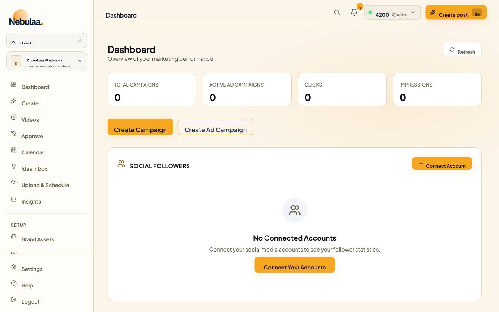 |  | 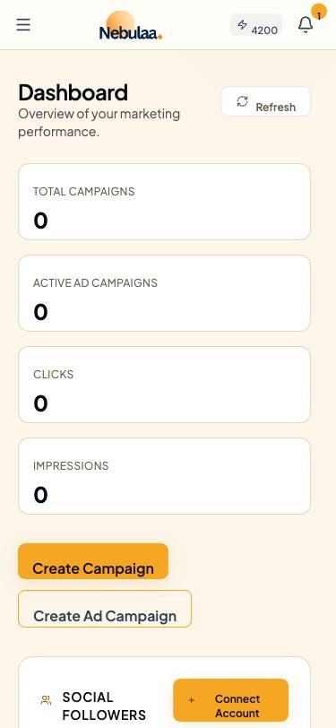 |
| analytics-classic |  | 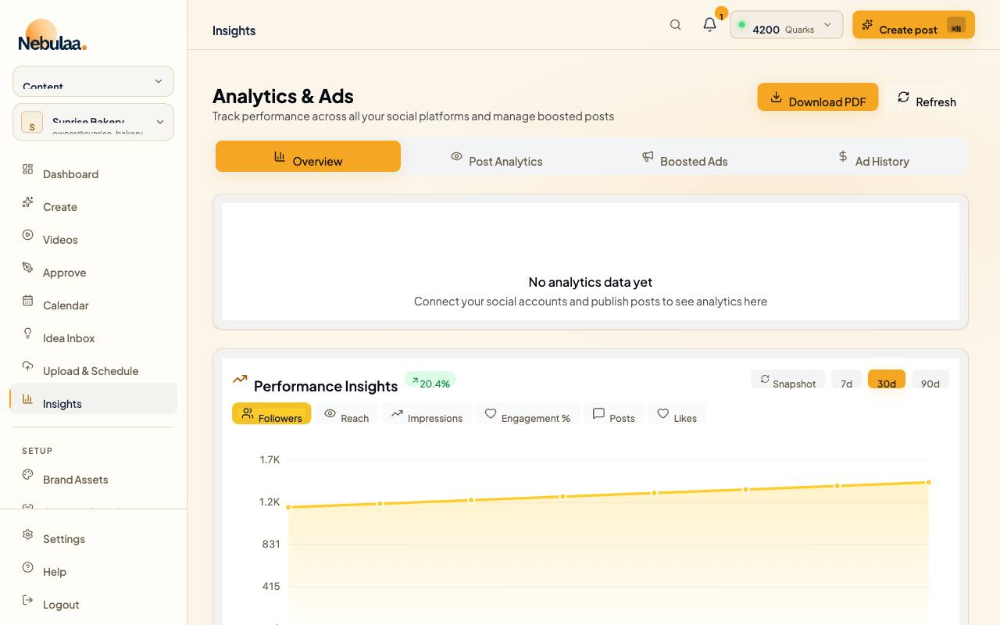 |  | 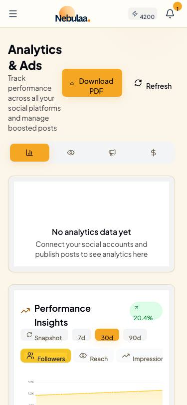 |
| settings-business |  |  |  | 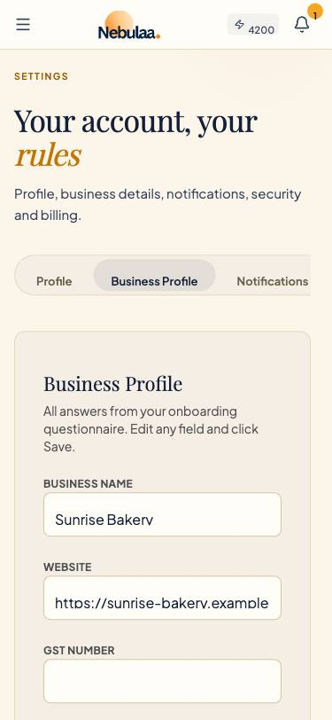 |
| brand-assets-products |  | 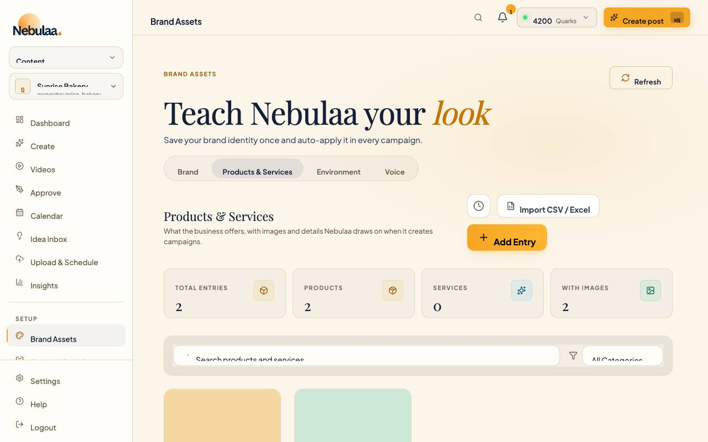 |  |  |
| connect-socials |  | 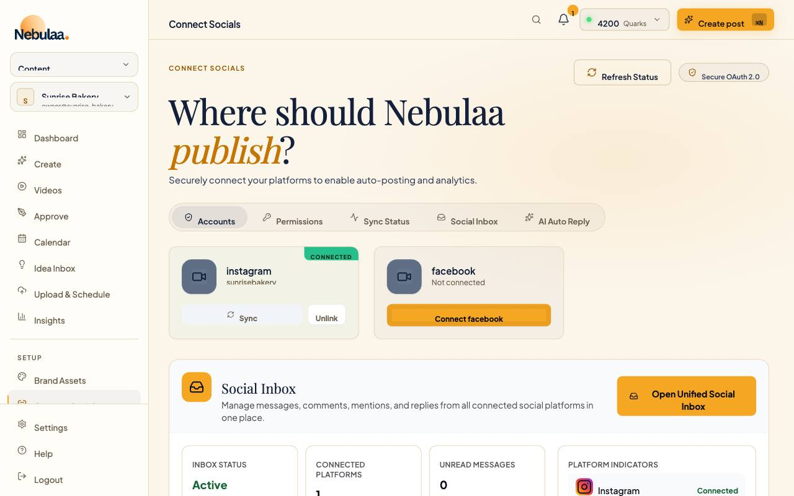 |  |  |
| connect-socials-inbox |  | 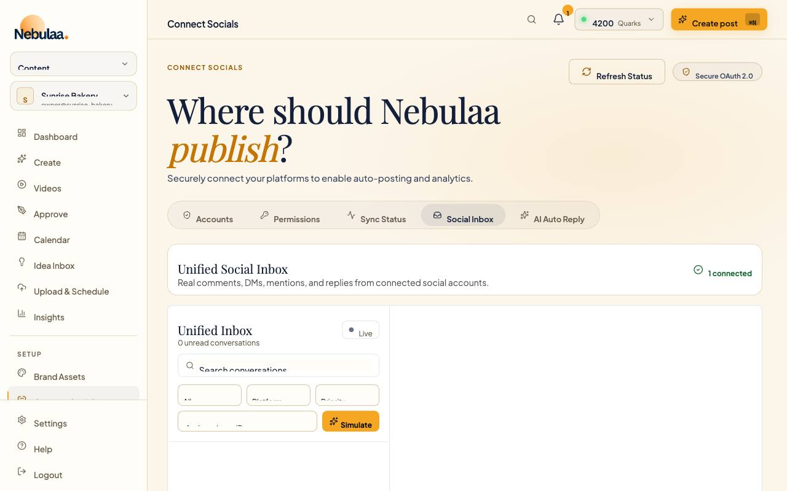 |  |  |
| settings-profile |  |  |  |  |
| brand-assets |  | 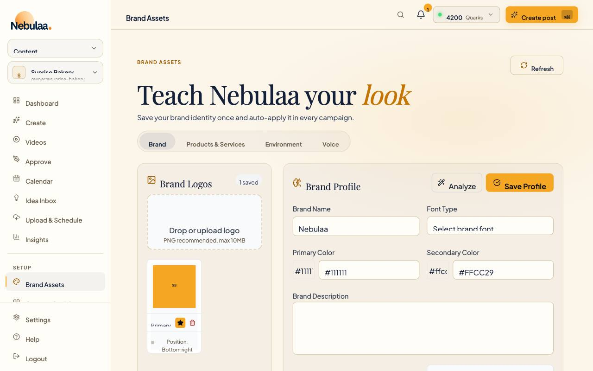 |  |  |
| dashboard (after only) | - | 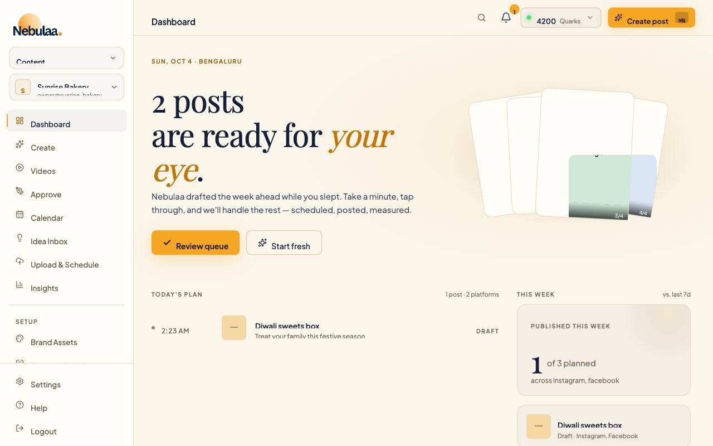 | - | 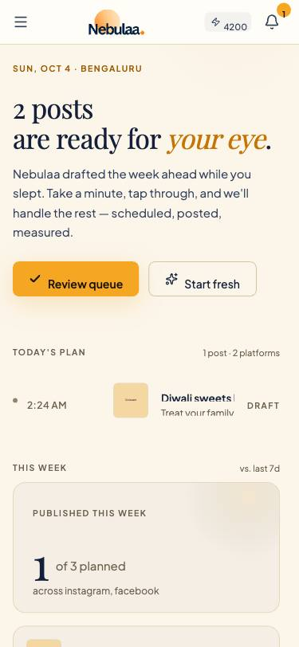 |
| content-calendar Plan (after only) | - |  | - | - |

`summary.json` (next to the screenshots) holds the per-route counts of this run; compare later runs against it with `--compare`.

---

The rest of this file is the generated report (`summarize.mjs`).

Generated 2026-10-03 by `frontend/scripts/visual-audit/summarize.mjs`. Expected: 56 routes.json entries x 1280 and 375 px. Standard: WCAG AA, 4.5:1 normal text, 3:1 large text (>= 24px, or >= 18.66px at 700+).

**GATE: FAIL**

Gate rule (Tasks 7-8): every route in scope (all of routes.json except the pages built in the other session) renders at both 1280 and 375 (no MISSING / STALE / BLANK / EMPTY / ERROR / REDIRECT; a run narrowed to fewer widths is PARTIAL, never PASS), has 0 failures, and every unknown-background item, unparsed colour and gradient-text item is signed off in `frontend/scripts/visual-audit/unknown-signoff.json` after a by-eye check.

## Before / after

| Route | 1280 before | 1280 after | 375 before | 375 after |
|---|---:|---:|---:|---:|
| dashboard | 10 (+3 unk) | 5 (+3 unk) | 4 (+0 unk) | 0 (+0 unk) |
| dashboard-classic | 53 (+0 unk) | 7 (+0 unk) | 21 (+0 unk) | 4 (+0 unk) |
| content-calendar-plan | 11 (+0 unk) | 0 (+0 unk) | 10 (+0 unk) | 0 (+0 unk) |
| content-calendar-schedule | 16 (+0 unk) | 4 (+0 unk) | 15 (+0 unk) | 4 (+0 unk) |
| content-calendar-grid | 14 (+0 unk) | 4 (+0 unk) | 13 (+0 unk) | 4 (+0 unk) |
| content-calendar-classic | 9 (+0 unk) | 0 (+0 unk) | 8 (+0 unk) | 0 (+0 unk) |
| idea-inbox | 15 (+0 unk) | 0 (+0 unk) | 14 (+0 unk) | 0 (+0 unk) |
| campaigns | 12 (+1 unk) | 0 (+3 unk) | 10 (+1 unk) | 0 (+3 unk) |
| campaigns-classic | 10 (+0 unk) | 0 (+0 unk) | 6 (+0 unk) | 0 (+0 unk) |
| drafts-review | 4 (+0 unk) | 0 (+0 unk) | 3 (+0 unk) | 0 (+0 unk) |
| drafts-all | 12 (+0 unk) | 0 (+0 unk) | 11 (+0 unk) | 0 (+0 unk) |
| reels | 8 (+0 unk) | 0 (+0 unk) | 7 (+0 unk) | 0 (+0 unk) |
| reels-hero | 2 (+0 unk) | 0 (+0 unk) | 1 (+0 unk) | 0 (+0 unk) |
| upload | 4 (+0 unk) | 0 (+0 unk) | 3 (+0 unk) | 0 (+0 unk) |
| ad-campaigns | 1 (+0 unk) | 0 (+0 unk) | 0 (+0 unk) | 0 (+0 unk) |
| competitors | 7 (+0 unk) | 0 (+0 unk) | 6 (+0 unk) | 0 (+0 unk) |
| connect-socials | 20 (+0 unk) | 0 (+0 unk) | 19 (+0 unk) | 0 (+0 unk) |
| connect-socials-permissions | 9 (+0 unk) | 0 (+0 unk) | 8 (+0 unk) | 0 (+0 unk) |
| connect-socials-sync | 9 (+0 unk) | 0 (+0 unk) | 8 (+0 unk) | 0 (+0 unk) |
| connect-socials-auto-reply | 13 (+0 unk) | 0 (+0 unk) | 12 (+0 unk) | 0 (+0 unk) |
| connect-socials-inbox | 20 (+0 unk) | 0 (+0 unk) | 17 (+0 unk) | 0 (+0 unk) |
| brand-assets | 18 (+0 unk) | 0 (+0 unk) | 17 (+0 unk) | 0 (+0 unk) |
| brand-assets-products | 21 (+0 unk) | 0 (+0 unk) | 20 (+0 unk) | 0 (+0 unk) |
| brand-assets-environment | 10 (+0 unk) | 0 (+0 unk) | 9 (+0 unk) | 0 (+0 unk) |
| brand-assets-voice | 13 (+0 unk) | 0 (+0 unk) | 12 (+0 unk) | 0 (+0 unk) |
| inventory-redirect | 21 (+0 unk) | 0 (+0 unk) | 20 (+0 unk) | 0 (+0 unk) |
| analytics | 6 (+0 unk) | 0 (+0 unk) | 5 (+0 unk) | 0 (+0 unk) |
| analytics-classic | 30 (+0 unk) | 0 (+0 unk) | 26 (+0 unk) | 0 (+0 unk) |
| seo | 12 (+0 unk) | 0 (+0 unk) | 11 (+0 unk) | 0 (+0 unk) |
| seo-keywords | 4 (+0 unk) | 0 (+0 unk) | 3 (+0 unk) | 0 (+0 unk) |
| seo-metadata | 6 (+0 unk) | 0 (+0 unk) | 5 (+0 unk) | 0 (+0 unk) |
| seo-hashtags | 4 (+0 unk) | 0 (+0 unk) | 3 (+0 unk) | 0 (+0 unk) |
| seo-competitor | 4 (+0 unk) | 0 (+0 unk) | 3 (+0 unk) | 0 (+0 unk) |
| influencer-portal | 6 (+0 unk) | 0 (+0 unk) | 5 (+0 unk) | 0 (+0 unk) |
| influencer-list | 3 (+0 unk) | 0 (+0 unk) | 2 (+0 unk) | 0 (+0 unk) |
| influencer-collaborations | 6 (+0 unk) | 0 (+0 unk) | 5 (+0 unk) | 0 (+0 unk) |
| influencer-submissions | 1 (+0 unk) | 0 (+0 unk) | 0 (+0 unk) | 0 (+0 unk) |
| influencer-analytics | 1 (+0 unk) | 0 (+0 unk) | 0 (+0 unk) | 0 (+0 unk) |
| influencer-profile | 2 (+0 unk) | 0 (+0 unk) | 1 (+0 unk) | 0 (+0 unk) |
| ai-memory | 3 (+0 unk) | 0 (+0 unk) | 2 (+0 unk) | 0 (+0 unk) |
| ai-history | 4 (+0 unk) | 0 (+0 unk) | 3 (+0 unk) | 0 (+0 unk) |
| ai-performance | 4 (+0 unk) | 0 (+0 unk) | 3 (+0 unk) | 0 (+0 unk) |
| settings-profile | 19 (+0 unk) | 0 (+0 unk) | 18 (+0 unk) | 0 (+0 unk) |
| settings-business | 23 (+0 unk) | 0 (+0 unk) | 22 (+0 unk) | 0 (+0 unk) |
| settings-notifications | 8 (+0 unk) | 0 (+0 unk) | 7 (+0 unk) | 0 (+0 unk) |
| settings-security | 12 (+0 unk) | 0 (+0 unk) | 11 (+0 unk) | 0 (+0 unk) |
| settings-billing | 14 (+0 unk) | 0 (+0 unk) | 13 (+0 unk) | 0 (+0 unk) |
| trial-expired | 9 (+1 unk) | 9 (+1 unk) | 9 (+1 unk) | 9 (+1 unk) |
| terms | 12 (+0 unk) | 12 (+0 unk) | 12 (+0 unk) | 12 (+0 unk) |
| privacy-policy | 10 (+0 unk) | 10 (+0 unk) | 10 (+0 unk) | 10 (+0 unk) |
| admin-login | 0 (+0 unk) | 0 (+0 unk) | 0 (+0 unk) | 0 (+0 unk) |
| admin | 29 (+0 unk) | 29 (+0 unk) | 29 (+0 unk) | 29 (+0 unk) |

Totals over routes that rendered in BOTH runs (a route missing or broken in either run is not counted, so it cannot make the total drop):

- 1280px: 52 routes compared, failures 574 -> 80, unknown 5 -> 7; not comparable: 0.
- 375px: 52 routes compared, failures 482 -> 72, unknown 2 -> 4; not comparable: 0.

## Totals (in scope)

| Width | Expected | Rendered ok | Missing / stale | Blank / empty | Error | Redirect | Checked | Failures | Routes with failures | Unknown (unsigned) | Unparsed colours | Gradient text | of which SVG text | over positioned layers | image layers |
|---:|---:|---:|---:|---:|---:|---:|---:|---:|---:|---:|---:|---:|---:|---:|---:|
| 1280 | 51 | 51 | 0 | 0 | 0 | 0 | 2733 | 80 | 8 | 7 (7) | 0 | 3 | 0 | 14 | 14 |
| 375 | 51 | 51 | 0 | 0 | 0 | 0 | 1587 | 72 | 7 | 4 (4) | 0 | 3 | 0 | 9 | 9 |

Missing/Blank/Error/Redirect counts include the redirect route kept out of the failure totals. "of which ..." columns break the failures down: SVG `<text>` labels, text measured against a positioned (non-ancestor) layer, and failures involving an image layer (`image-underlying`: fails on the colour beneath the image; `image-any`: no opaque image could make it pass).

## Per route

| Route | Path | 1280: fail / checked | 375: fail / checked | Worst ratio | Unknown | Unparsed / gradient text |
|---|---|---:|---:|---:|---:|---:|
| dashboard | `/dashboard` | 5 / 56 | 0 / 25 | 1.60 | 3 / 0 | 0/0 ; 0/0 |
| dashboard-classic | `/dashboard-classic` | 7 / 121 | 4 / 62 | 2.80 | 0 / 0 | 0/0 ; 0/0 |
| content-calendar-plan | `/content-calendar` | 0 / 40 | 0 / 17 | - | 0 / 0 | 0/0 ; 0/0 |
| content-calendar-schedule | `/content-calendar` | 4 / 89 | 4 / 60 | 1.73 | 0 / 0 | 0/0 ; 0/0 |
| content-calendar-grid | `/content-calendar-grid` | 4 / 87 | 4 / 58 | 1.73 | 0 / 0 | 0/0 ; 0/0 |
| content-calendar-classic | `/content-calendar-classic` | 0 / 38 | 0 / 15 | - | 0 / 0 | 0/0 ; 0/0 |
| idea-inbox | `/idea-inbox` | 0 / 46 | 0 / 23 | - | 0 / 0 | 0/0 ; 0/0 |
| campaigns | `/campaigns` | 0 / 69 | 0 / 44 | - | 3 / 3 | 0/0 ; 0/0 |
| campaigns-classic | `/campaigns-classic` | 0 / 49 | 0 / 22 | - | 0 / 0 | 0/0 ; 0/0 |
| drafts-review | `/drafts` | 0 / 57 | 0 / 34 | - | 0 / 0 | 0/0 ; 0/0 |
| drafts-all | `/drafts` | 0 / 51 | 0 / 28 | - | 0 / 0 | 0/0 ; 0/0 |
| reels | `/reels` | 0 / 38 | 0 / 15 | - | 0 / 0 | 0/0 ; 0/0 |
| reels-hero | `/reels/hero` | 0 / 30 | 0 / 7 | - | 0 / 0 | 0/0 ; 0/0 |
| upload | `/upload` | 0 / 31 | 0 / 8 | - | 0 / 0 | 0/0 ; 0/0 |
| ad-campaigns | `/ad-campaigns` | 0 / 28 | 0 / 5 | - | 0 / 0 | 0/0 ; 0/0 |
| competitors | `/competitors` | 0 / 37 | 0 / 14 | - | 0 / 0 | 0/0 ; 0/0 |
| connect-socials | `/connect-socials` | 0 / 70 | 0 / 47 | - | 0 / 0 | 0/0 ; 0/0 |
| connect-socials-permissions | `/connect-socials?tab=permissions` | 0 / 46 | 0 / 23 | - | 0 / 0 | 0/0 ; 0/0 |
| connect-socials-sync | `/connect-socials?tab=sync` | 0 / 48 | 0 / 25 | - | 0 / 0 | 0/0 ; 0/0 |
| connect-socials-auto-reply | `/connect-socials?tab=auto-reply` | 0 / 65 | 0 / 42 | - | 0 / 0 | 0/0 ; 0/0 |
| connect-socials-inbox | `/connect-socials/inbox` | 0 / 52 | 0 / 27 | - | 0 / 0 | 0/0 ; 0/0 |
| brand-assets | `/brand-assets` | 0 / 69 | 0 / 46 | - | 0 / 0 | 0/0 ; 0/0 |
| brand-assets-products | `/brand-assets?tab=products` | 0 / 64 | 0 / 41 | - | 0 / 0 | 0/0 ; 0/0 |
| brand-assets-environment | `/brand-assets?tab=environment` | 0 / 40 | 0 / 17 | - | 0 / 0 | 0/0 ; 0/0 |
| brand-assets-voice | `/brand-assets?tab=voice` | 0 / 52 | 0 / 29 | - | 0 / 0 | 0/0 ; 0/0 |
| inventory-redirect (redirect, not in totals) | `/inventory` | 0 / 64 | 0 / 41 | - | 0 / 0 | 0/0 ; 0/0 |
| analytics | `/analytics` | 0 / 45 | 0 / 22 | - | 0 / 0 | 0/0 ; 0/0 |
| analytics-classic | `/analytics-classic` | 0 / 70 | 0 / 43 | - | 0 / 0 | 0/0 ; 0/0 |
| seo | `/seo` | 0 / 49 | 0 / 26 | - | 0 / 0 | 0/0 ; 0/0 |
| seo-keywords | `/seo/keywords` | 0 / 38 | 0 / 13 | - | 0 / 0 | 0/0 ; 0/0 |
| seo-metadata | `/seo/metadata` | 0 / 40 | 0 / 15 | - | 0 / 0 | 0/0 ; 0/0 |
| seo-hashtags | `/seo/hashtags` | 0 / 43 | 0 / 18 | - | 0 / 0 | 0/0 ; 0/0 |
| seo-competitor | `/seo/competitor` | 0 / 38 | 0 / 13 | - | 0 / 0 | 0/0 ; 0/0 |
| influencer-portal | `/influencer-portal` | 0 / 42 | 0 / 17 | - | 0 / 0 | 0/0 ; 0/0 |
| influencer-list | `/influencer-portal/list` | 0 / 40 | 0 / 15 | - | 0 / 0 | 0/0 ; 0/0 |
| influencer-collaborations | `/influencer-portal/collaborations` | 0 / 47 | 0 / 22 | - | 0 / 0 | 0/0 ; 0/0 |
| influencer-submissions | `/influencer-portal/submissions` | 0 / 31 | 0 / 6 | - | 0 / 0 | 0/0 ; 0/0 |
| influencer-analytics | `/influencer-portal/analytics` | 0 / 36 | 0 / 11 | - | 0 / 0 | 0/0 ; 0/0 |
| influencer-profile | `/influencer-portal/profile` | 0 / 32 | 0 / 7 | - | 0 / 0 | 0/0 ; 0/0 |
| ai-memory | `/ai-memory` | 0 / 36 | 0 / 13 | - | 0 / 0 | 0/0 ; 0/0 |
| ai-history | `/ai-history` | 0 / 31 | 0 / 8 | - | 0 / 0 | 0/0 ; 0/0 |
| ai-performance | `/ai-performance` | 0 / 29 | 0 / 6 | - | 0 / 0 | 0/0 ; 0/0 |
| settings-profile | `/settings` | 0 / 49 | 0 / 26 | - | 0 / 0 | 0/0 ; 0/0 |
| settings-business | `/settings?tab=business` | 0 / 86 | 0 / 63 | - | 0 / 0 | 0/0 ; 0/0 |
| settings-notifications | `/settings` | 0 / 35 | 0 / 12 | - | 0 / 0 | 0/0 ; 0/0 |
| settings-security | `/settings` | 0 / 40 | 0 / 17 | - | 0 / 0 | 0/0 ; 0/0 |
| settings-billing | `/settings` | 0 / 48 | 0 / 25 | - | 0 / 0 | 0/0 ; 0/0 |
| trial-expired | `/trial-expired` | 9 / 30 | 9 / 30 | 1.93 | 1 / 1 | 0/3 ; 0/3 |
| terms | `/terms` | 12 / 188 | 12 / 188 | 1.44 | 0 / 0 | 0/0 ; 0/0 |
| privacy-policy | `/privacy-policy` | 10 / 187 | 10 / 187 | 1.44 | 0 / 0 | 0/0 ; 0/0 |
| admin-login | `/admin/login` | 0 / 8 | 0 / 8 | - | 0 / 0 | 0/0 ; 0/0 |
| admin | `/admin` | 29 / 42 | 29 / 42 | 1.80 | 0 / 0 | 0/0 ; 0/0 |

## Failing class patterns

Nearest text-colour class on the element or an ancestor (state variants dropped). Counts are failures across in-scope routes and both widths. Colours are as drawn, i.e. after the `index.html` override layer.

| Text-colour classes | Failures | Routes | Worst | Example (computed colour on background) |
|---|---:|---:|---:|---|
| `text-[#ffcc29]` | 28 | 2 | 1.44 | support@nebulaa.ai: #ffcc29 on #f9fafb |
| `text-white/40` | 28 | 1 | 3.75 | Logout: #6a6b70 on #060810 |
| `text-white/30` | 24 | 1 | 2.57 | demo.nebulaa.ai: #515258 on #060810 |
| `text-[var(--gv-text-muted)]` | 16 | 2 | 1.73 | 28: #c2baac on #f8f2e8 |
| `text-white/80` | 9 | 2 | 1.60 | IN · TUE: #ffffff on #ceccc8 |
| `text-[#ededed]/45` | 8 | 1 | 3.92 | All plans include AI campaign : #6c6d6f on #030507 |
| `text-gray-400` | 8 | 2 | 2.43 | © 2024 Noburo Business Service: #9ca3af on #f9fafb |
| `(no text-colour class)` | 8 | 2 | 2.43 | Privacy Policy: #9ca3af on #f9fafb |
| `text-[#ededed]/35` | 6 | 1 | 2.88 | per month · Auto-renews · Canc: #595b60 on #090d14 |
| `text-[#ededed]/25` | 4 | 1 | 1.93 | Secured by Razorpay · UPI, Car: #3e3f41 on #030507 |
| `text-white` | 3 | 1 | 2.80 | Gandhi Jayanti: #ffffff on #f97316 |
| `text-white/60` | 2 | 1 | 2.15 | 3 / 4: #f5f5f4 on #aaa9a6 |
| `text-[var(--gv-text-primary)]` | 2 | 1 | 4.40 | ❤️: #14203a on #3b82f6 |
| `text-white/20` | 2 | 1 | 1.80 | No users found: #3c3d44 on #0b0d15 |
| `text-white placeholder-white/20` | 2 | 1 | 1.88 | Search by email or company...: #44454b on #15171e |
| `text-red-400/70` | 2 | 1 | 3.94 | Expired: #b35255 on #120b13 |

| Background classes (nearest) | Failures | Routes | Worst |
|---|---:|---:|---:|
| `bg-gray-50` | 26 | 2 | 1.44 |
| `bg-white/[0.03]` | 24 | 1 | 2.66 |
| `bg-white` | 18 | 2 | 1.51 |
| `bg-[var(--gv-surface-1)]` | 16 | 2 | 1.73 |
| `(no bg class)` | 14 | 2 | 1.93 |
| `bg-white/[0.02]` | 14 | 1 | 1.80 |
| `from-[#0d1219]/85 via-[#080c14]/90 to-[#060910]/90` | 8 | 1 | 2.88 |
| `from-black/70 to-transparent` | 5 | 1 | 1.60 |
| `bg-blue-500` | 5 | 1 | 3.68 |
| `from-[#0f1520]/90 via-[#0a0e18]/95 to-[#060910]/95` | 4 | 1 | 2.90 |
| `bg-white/[0.04]` | 4 | 1 | 1.88 |
| `from-[#ffcc29]/10 to-transparent` | 4 | 1 | 3.82 |
| `bg-orange-500` | 3 | 1 | 2.80 |
| `bg-pink-500` | 3 | 1 | 3.53 |
| `bg-[#060810]/80` | 2 | 1 | 2.57 |
| `bg-red-500/5` | 2 | 1 | 3.94 |

| Computed text colour on background | Failures | Routes | Ratio |
|---|---:|---:|---:|
| #ffcc29 on #ffffff | 18 | 2 | 1.51 |
| #c2baac on #f8f2e8 | 16 | 2 | 1.73 |
| #9ca3af on #f9fafb | 16 | 2 | 2.43 |
| #6e6f74 on #0d0f17 | 14 | 1 | 3.81 |
| #54565b on #0b0d15 | 12 | 1 | 2.63 |
| #ffcc29 on #f9fafb | 10 | 2 | 1.44 |
| #56575d on #0d0f17 | 10 | 1 | 2.66 |
| #6a6b70 on #060810 | 8 | 1 | 3.75 |
| #3e3f41 on #030507 | 4 | 1 | 1.93 |
| #595b60 on #090d14 | 4 | 1 | 2.88 |
| #ffffff on #f97316 | 3 | 1 | 2.80 |
| #ffffff on #ec4899 | 3 | 1 | 3.53 |
| #ffffff on #3b82f6 | 3 | 1 | 3.68 |
| #14203a on #3b82f6 | 2 | 1 | 4.40 |
| #5b5d63 on #0c1018 | 2 | 1 | 2.90 |
| #76787b on #14181e | 2 | 1 | 4.01 |
| #72757a on #0e131c | 2 | 1 | 4.03 |
| #3c3d44 on #0b0d15 | 2 | 1 | 1.80 |
| #44454b on #15171e | 2 | 1 | 1.88 |
| #515258 on #060810 | 2 | 1 | 2.57 |

## Worst 10 per route

From the 1280px run. "req" is the AA minimum for that size; kind/failureKind as defined in the README.

### dashboard (`/dashboard`) - 5 failing of 56

| Ratio | req | Text | Colour on background | Kind | Selector | Text class |
|---:|---:|---|---|---|---|---|
| 1.60 | 4.5 | IN · TUE | #ffffff on #ceccc8 | image-underlying, positioned | `iv.absolute.inset-x-0.bottom-0 > span.text-\[9px\].font-semibold.tracking-widest` | `text-white/80` |
| 2.15 | 4.5 | 3 / 4 | #f5f5f4 on #aaa9a6 | image-underlying, positioned | ` div.absolute.inset-x-0.bottom-0 > span.text-\[9px\].text-white\/60.tabular-nums` | `text-white/60` |
| 2.17 | 4.5 | IN · WED | #ffffff on #b1b0ad | image-underlying, positioned | `iv.absolute.inset-x-0.bottom-0 > span.text-\[9px\].font-semibold.tracking-widest` | `text-white/80` |
| 2.61 | 4.5 | IN · THU | #ffffff on #a1a09d | image-underlying, positioned | `iv.absolute.inset-x-0.bottom-0 > span.text-\[9px\].font-semibold.tracking-widest` | `text-white/80` |
| 2.78 | 4.5 | 4 / 4 | #f2f2f2 on #93928f | image-underlying, positioned | ` div.absolute.inset-x-0.bottom-0 > span.text-\[9px\].text-white\/60.tabular-nums` | `text-white/60` |

### dashboard-classic (`/dashboard-classic`) - 7 failing of 121

| Ratio | req | Text | Colour on background | Kind | Selector | Text class |
|---:|---:|---|---|---|---|---|
| 2.80 | 4.5 | Gandhi Jayanti | #ffffff on #f97316 |  | `.left-1.right-1 > div.flex.items-center.gap-1 > p.text-xs.font-semibold.truncate` | `text-white` |
| 2.80 | 4.5 | National | #ffffff on #f97316 |  | `ededed\] > div.absolute.left-1.right-1 > p.text-\[10px\].truncate.text-white\/80` | `text-white/80` |
| 3.53 | 4.5 | Navratri Begins | #ffffff on #ec4899 |  | `.left-1.right-1 > div.flex.items-center.gap-1 > p.text-xs.font-semibold.truncate` | `text-white` |
| 3.53 | 4.5 | Festival | #ffffff on #ec4899 |  | `ededed\] > div.absolute.left-1.right-1 > p.text-\[10px\].truncate.text-white\/80` | `text-white/80` |
| 3.68 | 4.5 | World Heart Day | #ffffff on #3b82f6 |  | `.left-1.right-1 > div.flex.items-center.gap-1 > p.text-xs.font-semibold.truncate` | `text-white` |
| 3.68 | 4.5 | International | #ffffff on #3b82f6 |  | `ededed\] > div.absolute.left-1.right-1 > p.text-\[10px\].truncate.text-white\/80` | `text-white/80` |
| 4.40 | 4.5 | ❤️ | #14203a on #3b82f6 |  | `ded\] > div.absolute.left-1.right-1 > div.flex.items-center.gap-1 > span.text-xs` | `text-[var(--gv-text-primary)]` |

### content-calendar-plan (`/content-calendar`) - 0 failing of 40

No failures.

### content-calendar-schedule (`/content-calendar`, tab "Schedule") - 4 failing of 89

| Ratio | req | Text | Colour on background | Kind | Selector | Text class |
|---:|---:|---|---|---|---|---|
| 1.73 | 4.5 | 28 | #c2baac on #f8f2e8 |  | `.items-baseline.justify-end > span.text-\[14px\].font-serif-display.tabular-nums` | `text-[var(--gv-text-muted)]` |
| 1.73 | 4.5 | 29 | #c2baac on #f8f2e8 |  | `.items-baseline.justify-end > span.text-\[14px\].font-serif-display.tabular-nums` | `text-[var(--gv-text-muted)]` |
| 1.73 | 4.5 | 30 | #c2baac on #f8f2e8 |  | `.items-baseline.justify-end > span.text-\[14px\].font-serif-display.tabular-nums` | `text-[var(--gv-text-muted)]` |
| 1.73 | 4.5 | 1 | #c2baac on #f8f2e8 |  | `.items-baseline.justify-end > span.text-\[14px\].font-serif-display.tabular-nums` | `text-[var(--gv-text-muted)]` |

### content-calendar-grid (`/content-calendar-grid`) - 4 failing of 87

| Ratio | req | Text | Colour on background | Kind | Selector | Text class |
|---:|---:|---|---|---|---|---|
| 1.73 | 4.5 | 28 | #c2baac on #f8f2e8 |  | `.items-baseline.justify-end > span.text-\[14px\].font-serif-display.tabular-nums` | `text-[var(--gv-text-muted)]` |
| 1.73 | 4.5 | 29 | #c2baac on #f8f2e8 |  | `.items-baseline.justify-end > span.text-\[14px\].font-serif-display.tabular-nums` | `text-[var(--gv-text-muted)]` |
| 1.73 | 4.5 | 30 | #c2baac on #f8f2e8 |  | `.items-baseline.justify-end > span.text-\[14px\].font-serif-display.tabular-nums` | `text-[var(--gv-text-muted)]` |
| 1.73 | 4.5 | 1 | #c2baac on #f8f2e8 |  | `.items-baseline.justify-end > span.text-\[14px\].font-serif-display.tabular-nums` | `text-[var(--gv-text-muted)]` |

### content-calendar-classic (`/content-calendar-classic`) - 0 failing of 38

No failures.

### idea-inbox (`/idea-inbox`) - 0 failing of 46

No failures.

### campaigns (`/campaigns`) - 0 failing of 69

No failures.

### campaigns-classic (`/campaigns-classic`) - 0 failing of 49

No failures.

### drafts-review (`/drafts`) - 0 failing of 57

No failures.

### drafts-all (`/drafts`, tab "All") - 0 failing of 51

No failures.

### reels (`/reels`) - 0 failing of 38

No failures.

### reels-hero (`/reels/hero`) - 0 failing of 30

No failures.

### upload (`/upload`) - 0 failing of 31

No failures.

### ad-campaigns (`/ad-campaigns`) - 0 failing of 28

No failures.

### competitors (`/competitors`) - 0 failing of 37

No failures.

### connect-socials (`/connect-socials`) - 0 failing of 70

No failures.

### connect-socials-permissions (`/connect-socials?tab=permissions`) - 0 failing of 46

No failures.

### connect-socials-sync (`/connect-socials?tab=sync`) - 0 failing of 48

No failures.

### connect-socials-auto-reply (`/connect-socials?tab=auto-reply`) - 0 failing of 65

No failures.

### connect-socials-inbox (`/connect-socials/inbox`) - 0 failing of 52

No failures.

### brand-assets (`/brand-assets`) - 0 failing of 69

No failures.

### brand-assets-products (`/brand-assets?tab=products`) - 0 failing of 64

No failures.

### brand-assets-environment (`/brand-assets?tab=environment`) - 0 failing of 40

No failures.

### brand-assets-voice (`/brand-assets?tab=voice`) - 0 failing of 52

No failures.

### analytics (`/analytics`) - 0 failing of 45

No failures.

### analytics-classic (`/analytics-classic`) - 0 failing of 70

No failures.

### seo (`/seo`) - 0 failing of 49

No failures.

### seo-keywords (`/seo/keywords`) - 0 failing of 38

No failures.

### seo-metadata (`/seo/metadata`) - 0 failing of 40

No failures.

### seo-hashtags (`/seo/hashtags`) - 0 failing of 43

No failures.

### seo-competitor (`/seo/competitor`) - 0 failing of 38

No failures.

### influencer-portal (`/influencer-portal`) - 0 failing of 42

No failures.

### influencer-list (`/influencer-portal/list`) - 0 failing of 40

No failures.

### influencer-collaborations (`/influencer-portal/collaborations`) - 0 failing of 47

No failures.

### influencer-submissions (`/influencer-portal/submissions`) - 0 failing of 31

No failures.

### influencer-analytics (`/influencer-portal/analytics`) - 0 failing of 36

No failures.

### influencer-profile (`/influencer-portal/profile`) - 0 failing of 32

No failures.

### ai-memory (`/ai-memory`) - 0 failing of 36

No failures.

### ai-history (`/ai-history`) - 0 failing of 31

No failures.

### ai-performance (`/ai-performance`) - 0 failing of 29

No failures.

### settings-profile (`/settings`) - 0 failing of 49

No failures.

### settings-business (`/settings?tab=business`) - 0 failing of 86

No failures.

### settings-notifications (`/settings`, tab "Notifications") - 0 failing of 35

No failures.

### settings-security (`/settings`, tab "Security") - 0 failing of 40

No failures.

### settings-billing (`/settings`, tab "Billing") - 0 failing of 48

No failures.

### trial-expired (`/trial-expired`) - 9 failing of 30

| Ratio | req | Text | Colour on background | Kind | Selector | Text class |
|---:|---:|---|---|---|---|---|
| 1.93 | 4.5 | Secured by Razorpay · UPI, Cards, Net Ba | #3e3f41 on #030507 | image-underlying, positioned | ` > div.text-center.mt-10.space-y-3 > div.flex.items-center.justify-center > span` | `text-[#ededed]/25` |
| 1.93 | 4.5 | Log out | #3e3f41 on #030507 | image-underlying, positioned | `10.space-y-3 > button.text-\[\#ededed\]\/25.hover\:text-\[\#ededed\]\/50.text-sm` | `text-[#ededed]/25` |
| 2.88 | 4.5 | per month · Auto-renews · Cancel anytime | #595b60 on #090d14 | image-underlying, positioned | `nt-to-b > div.p-7.md\:p-8.flex > div.mb-6 > p.text-\[\#ededed\]\/35.text-xs.mt-2` | `text-[#ededed]/35` |
| 2.88 | 4.5 | per month · Auto-renews · Cancel anytime | #595b60 on #090d14 | image-underlying, positioned | `nt-to-b > div.p-7.md\:p-8.flex > div.mb-6 > p.text-\[\#ededed\]\/35.text-xs.mt-2` | `text-[#ededed]/35` |
| 2.90 | 4.5 | per month · Auto-renews · Cancel anytime | #5b5d63 on #0c1018 | image-underlying, positioned | `nt-to-b > div.p-7.md\:p-8.flex > div.mb-6 > p.text-\[\#ededed\]\/35.text-xs.mt-2` | `text-[#ededed]/35` |
| 3.96 | 4.5 | All plans include AI campaign generation | #6c6d6f on #030507 | image-underlying, positioned | `l.w-full > div.text-center.mb-10 > p.text-\[\#ededed\]\/45.text-base.md\:text-lg` | `text-[#ededed]/45` |
| 4.01 | 4.5 | Audit placeholder plan. | #76787b on #14181e | image-underlying, positioned | `iv.p-7.md\:p-8.flex > div.mb-5 > p.text-\[\#ededed\]\/45.text-sm.leading-relaxed` | `text-[#ededed]/45` |
| 4.03 | 4.5 | Audit placeholder plan. | #72757a on #0e131c | image-underlying, positioned | `iv.p-7.md\:p-8.flex > div.mb-5 > p.text-\[\#ededed\]\/45.text-sm.leading-relaxed` | `text-[#ededed]/45` |
| 4.03 | 4.5 | Audit placeholder plan. | #73757a on #0f141b | image-underlying, positioned | `iv.p-7.md\:p-8.flex > div.mb-5 > p.text-\[\#ededed\]\/45.text-sm.leading-relaxed` | `text-[#ededed]/45` |

### terms (`/terms`) - 12 failing of 188

| Ratio | req | Text | Colour on background | Kind | Selector | Text class |
|---:|---:|---|---|---|---|---|
| 1.44 | 4.5 | support@nebulaa.ai | #ffcc29 on #f9fafb |  | `ection > div.rounded-lg.p-5.space-y-1 > p > a.text-\[\#ffcc29\].hover\:underline` | `text-[#ffcc29]` |
| 1.44 | 4.5 | https://www.nebulaa.ai | #ffcc29 on #f9fafb |  | `ection > div.rounded-lg.p-5.space-y-1 > p > a.text-\[\#ffcc29\].hover\:underline` | `text-[#ffcc29]` |
| 1.51 | 3 | Terms & Conditions of Service | #ffcc29 on #ffffff |  | `v.rounded-2xl.p-8.md\:p-12 > div.mb-10 > h2.text-2xl.font-bold.text-\[\#ffcc29\]` | `text-[#ffcc29]` |
| 1.51 | 4.5 | support@nebulaa.ai | #ffcc29 on #ffffff |  | `-relaxed.text-gray-600 > section > p.mb-3 > a.text-\[\#ffcc29\].hover\:underline` | `text-[#ffcc29]` |
| 1.51 | 4.5 | support@nebulaa.ai | #ffcc29 on #ffffff |  | `-relaxed.text-gray-600 > section > p.mb-3 > a.text-\[\#ffcc29\].hover\:underline` | `text-[#ffcc29]` |
| 1.51 | 4.5 | Privacy Policy | #ffcc29 on #ffffff |  | `-relaxed.text-gray-600 > section > p.mb-3 > a.text-\[\#ffcc29\].hover\:underline` | `text-[#ffcc29]` |
| 1.51 | 4.5 | support@nebulaa.ai | #ffcc29 on #ffffff |  | `-relaxed.text-gray-600 > section > p.mb-3 > a.text-\[\#ffcc29\].hover\:underline` | `text-[#ffcc29]` |
| 1.51 | 4.5 | legal@nebulaa.ai | #ffcc29 on #ffffff |  | `-relaxed.text-gray-600 > section > p.mb-4 > a.text-\[\#ffcc29\].hover\:underline` | `text-[#ffcc29]` |
| 2.43 | 4.5 | © 2024 Noburo Business Services LLP. All | #9ca3af on #f9fafb |  | `v.max-w-4xl.mx-auto.px-6 > div.text-center.mt-10.pb-10 > p.text-sm.text-gray-400` | `text-gray-400` |
| 2.43 | 4.5 | Privacy Policy | #9ca3af on #f9fafb |  | `b-10 > div.mt-3.flex.items-center > a.hover\:text-\[\#ffcc29\].transition-colors` |  |

### privacy-policy (`/privacy-policy`) - 10 failing of 187

| Ratio | req | Text | Colour on background | Kind | Selector | Text class |
|---:|---:|---|---|---|---|---|
| 1.44 | 4.5 | support@nebulaa.ai | #ffcc29 on #f9fafb |  | `ection > div.rounded-lg.p-5.space-y-1 > p > a.text-\[\#ffcc29\].hover\:underline` | `text-[#ffcc29]` |
| 1.44 | 4.5 | support@nebulaa.ai | #ffcc29 on #f9fafb |  | `ection > div.rounded-lg.p-5.space-y-1 > p > a.text-\[\#ffcc29\].hover\:underline` | `text-[#ffcc29]` |
| 1.44 | 4.5 | support@nebulaa.ai | #ffcc29 on #f9fafb |  | `ection > div.rounded-lg.p-5.space-y-1 > p > a.text-\[\#ffcc29\].hover\:underline` | `text-[#ffcc29]` |
| 1.51 | 3 | Privacy Policy | #ffcc29 on #ffffff |  | `v.rounded-2xl.p-8.md\:p-12 > div.mb-10 > h2.text-2xl.font-bold.text-\[\#ffcc29\]` | `text-[#ffcc29]` |
| 1.51 | 4.5 | privacy@nebulaa.ai | #ffcc29 on #ffffff |  | `ading-relaxed.text-gray-600 > section > p > a.text-\[\#ffcc29\].hover\:underline` | `text-[#ffcc29]` |
| 1.51 | 4.5 | privacy@nebulaa.ai | #ffcc29 on #ffffff |  | `ading-relaxed.text-gray-600 > section > p > a.text-\[\#ffcc29\].hover\:underline` | `text-[#ffcc29]` |
| 2.43 | 4.5 | © 2024 Noburo Business Services LLP. All | #9ca3af on #f9fafb |  | `v.max-w-4xl.mx-auto.px-6 > div.text-center.mt-10.pb-10 > p.text-sm.text-gray-400` | `text-gray-400` |
| 2.43 | 4.5 | Terms & Conditions | #9ca3af on #f9fafb |  | `b-10 > div.mt-3.flex.items-center > a.hover\:text-\[\#ffcc29\].transition-colors` |  |
| 2.43 | 4.5 | \| | #9ca3af on #f9fafb |  | `l.mx-auto.px-6 > div.text-center.mt-10.pb-10 > div.mt-3.flex.items-center > span` | `text-gray-400` |
| 2.43 | 4.5 | nebulaa.ai | #9ca3af on #f9fafb |  | `b-10 > div.mt-3.flex.items-center > a.hover\:text-\[\#ffcc29\].transition-colors` |  |

### admin-login (`/admin/login`) - 0 failing of 8

No failures.

### admin (`/admin`) - 29 failing of 42

| Ratio | req | Text | Colour on background | Kind | Selector | Text class |
|---:|---:|---|---|---|---|---|
| 1.80 | 4.5 | No users found | #3c3d44 on #0b0d15 |  | `body.divide-y.divide-white\/\[0\.03\] > tr > td.text-center.text-white\/20.py-12` | `text-white/20` |
| 1.88 | 4.5 | Search by email or company... | #44454b on #15171e | placeholder | `ems-center.gap-3 > div.relative.flex-1 > input.w-full.bg-white\/\[0\.04\].border` | `text-white placeholder-white/20` |
| 2.57 | 4.5 | demo.nebulaa.ai | #515258 on #060810 |  | `y-between > div.flex.items-center.gap-3 > div > p.text-white\/30.text-xs.mt-0\.5` | `text-white/30` |
| 2.63 | 4.5 | User | #54565b on #0b0d15 |  | `head > tr.border-b.border-white\/\[0\.04\] > th.text-left.text-white\/30.text-xs` | `text-white/30` |
| 2.63 | 4.5 | Credits | #54565b on #0b0d15 |  | `head > tr.border-b.border-white\/\[0\.04\] > th.text-left.text-white\/30.text-xs` | `text-white/30` |
| 2.63 | 4.5 | Activity | #54565b on #0b0d15 |  | `head > tr.border-b.border-white\/\[0\.04\] > th.text-left.text-white\/30.text-xs` | `text-white/30` |
| 2.63 | 4.5 | Trial | #54565b on #0b0d15 |  | `head > tr.border-b.border-white\/\[0\.04\] > th.text-left.text-white\/30.text-xs` | `text-white/30` |
| 2.63 | 4.5 | Last Login | #54565b on #0b0d15 |  | `head > tr.border-b.border-white\/\[0\.04\] > th.text-left.text-white\/30.text-xs` | `text-white/30` |
| 2.63 | 4.5 | Status | #54565b on #0b0d15 |  | `head > tr.border-b.border-white\/\[0\.04\] > th.text-left.text-white\/30.text-xs` | `text-white/30` |
| 2.66 | 4.5 | Active today | #56575d on #0d0f17 |  | `-white\/\[0\.03\].border.border-white\/\[0\.06\] > p.text-white\/30.text-xs.mt-1` | `text-white/30` |

## Unknown, unparsed and gradient-text items (gated unless signed off)

| Route | Width | Type | Text | Reason / detail | Signed off |
|---|---:|---|---|---|---|
| dashboard | 1280 | unknown | 1 / 4 | covered at every sample point (5) | **no** |
| dashboard | 1280 | unknown | 2 / 4 | covered at every sample point (5) | **no** |
| dashboard | 1280 | unknown | IN · TUE | covered at every sample point (3) | **no** |
| campaigns | 1280 | unknown | Campaign | over background-image (black 3.45, white 4.85, beneath 4.76) | **no** |
| campaigns | 1280 | unknown | Monsoon menu launch | over background-image (black 3.16, white 5.28, beneath 5.21) | **no** |
| campaigns | 1280 | unknown | e.g. Launch our monsoon menu o | over background-image (black 3.17, white 5.47, beneath 5.39) | **no** |
| campaigns | 375 | unknown | Campaign | over background-image (black 3.45, white 4.85, beneath 4.76) | **no** |
| campaigns | 375 | unknown | Monsoon menu launch | over background-image (black 3.16, white 5.28, beneath 5.21) | **no** |
| campaigns | 375 | unknown | e.g. Launch our monsoon menu o | over background-image (black 3.17, white 5.47, beneath 5.39) | **no** |
| trial-expired | 1280 | unknown | Your Free Trial Has Ended | over canvas (black 20.43, white 1.1, beneath 17.64) | **no** |
| trial-expired | 1280 | gradientText | ₹ 1,000 | linear-gradient(rgb(255, 255, 255) 0%, rgb(212, 212, 212) 50%, rgb(160, 160, 160) 100%) | **no** |
| trial-expired | 1280 | gradientText | ₹ 2,000 | linear-gradient(rgb(255, 255, 255) 0%, rgb(212, 212, 212) 50%, rgb(160, 160, 160) 100%) | **no** |
| trial-expired | 1280 | gradientText | ₹ 3,000 | linear-gradient(rgb(255, 255, 255) 0%, rgb(212, 212, 212) 50%, rgb(160, 160, 160) 100%) | **no** |
| trial-expired | 375 | unknown | Your Free Trial Has Ended | over canvas (black 20.43, white 1.1, beneath 17.64) | **no** |
| trial-expired | 375 | gradientText | ₹ 1,000 | linear-gradient(rgb(255, 255, 255) 0%, rgb(212, 212, 212) 50%, rgb(160, 160, 160) 100%) | **no** |
| trial-expired | 375 | gradientText | ₹ 2,000 | linear-gradient(rgb(255, 255, 255) 0%, rgb(212, 212, 212) 50%, rgb(160, 160, 160) 100%) | **no** |
| trial-expired | 375 | gradientText | ₹ 3,000 | linear-gradient(rgb(255, 255, 255) 0%, rgb(212, 212, 212) 50%, rgb(160, 160, 160) 100%) | **no** |

Pending by-eye checks listed in the sign-off file:

- trial-expired: Text sits over the animated starfield <canvas> on a dark radial gradient; measured against absent/black/white the result depends on the canvas pixels. Check the plan cards and the '/35'-'/45' alpha lines by eye, then sign off or fix.

## Disabled controls below AA (reported, exempt)

| Route | Width | Count | Examples |
|---|---:|---:|---|
| idea-inbox | 1280 | 1 | "Add idea" 2.22 |
| idea-inbox | 375 | 1 | "Add idea" 2.22 |
| competitors | 1280 | 1 | "Add" 2.79 |
| competitors | 375 | 1 | "Add" 2.79 |

## Placeholders below AA (also counted in failures)

| Route | Width | Failing | Examples |
|---|---:|---:|---|
| admin | 1280 | 1 | "Search by email or compa" 1.88 |
| admin | 375 | 1 | "Search by email or compa" 1.88 |

## Built in the other session (read-only, will be replaced by that branch's version)

Landing, sign-in/sign-up and onboarding were redesigned in a separate session (branches rebrand-on-prod / rebrand-nebulaa-landing) and will be brought in as-is. Audited for information only: not fixed in Tasks 7-8, not counted in any total, not part of the gate.

| Route | Path | Width | Failures / checked | Unknown | Worst 3 |
|---|---|---:|---:|---:|---|
| landing | `/` | 1280 | 6 / 60 | 0 | "01" 1.24 (#e5e7eb on #ffffff); "02" 1.24 (#e5e7eb on #ffffff); "03" 1.24 (#e5e7eb on #ffffff) |
| landing | `/` | 375 | 6 / 57 | 0 | "01" 1.24 (#e5e7eb on #ffffff); "02" 1.24 (#e5e7eb on #ffffff); "03" 1.24 (#e5e7eb on #ffffff) |
| login | `/login` | 1280 | 5 / 11 | 0 | "you@company.com" 2.43 (#9ca3af on #f9fafb); "••••••••" 2.43 (#9ca3af on #f9fafb); "Email Address" 2.5 (#4b5563 on #111111) |
| login | `/login` | 375 | 5 / 11 | 0 | "you@company.com" 2.43 (#9ca3af on #f9fafb); "••••••••" 2.43 (#9ca3af on #f9fafb); "Email Address" 2.5 (#4b5563 on #111111) |
| signup | `/login?mode=signup` | 1280 | 12 / 22 | 0 | "Password Requirements:" 1.94 (#f5a623 on #f9fafb); "Jane" 2.43 (#9ca3af on #f9fafb); "Acme Inc." 2.43 (#9ca3af on #f9fafb) |
| signup | `/login?mode=signup` | 375 | 12 / 22 | 0 | "Password Requirements:" 1.94 (#f5a623 on #f9fafb); "Jane" 2.43 (#9ca3af on #f9fafb); "Acme Inc." 2.43 (#9ca3af on #f9fafb) |
| onboarding | `/onboarding` | 1280 | 41 / 61 | 0 | "Business Essentials" 1.06 (#111827 on #111111); "Business to Business" 1.82 (#3a414a on #111111); "Business to Consumer" 1.82 (#3a414a on #111111) |
| onboarding | `/onboarding` | 375 | 41 / 61 | 0 | "Business Essentials" 1.06 (#111827 on #111111); "Business to Business" 1.82 (#3a414a on #111111); "Business to Consumer" 1.82 (#3a414a on #111111) |

