# Nebulaa contrast baseline (legibility pass, Task 6)

Date: 2026-10-03. Branch `nebulaa-redesign` at `f7d11b3` (before any Task 7-8 fix). This is the measurement the legibility fixes start from; nothing in the app was changed for it.

## How it was measured

- Tool: `frontend/scripts/visual-audit/` (see its `README.md` to rerun), revised in fix round 1. `contrast-audit.js` checks every visible element with its own text (plus input values, placeholders and SVG `<text>`/`<tspan>`). At 5 points of the text box it reads the real paint stack with `document.elementsFromPoint`, so positioned overlays, cards and SVG shapes under the text count in paint order, with `opacity` as a group over the real backdrop and linear gradients sampled where the text sits. Images of unknown colour (url() backgrounds, img/video/canvas) are measured with the image left out, as black and as white: failing on the colour beneath or at both extremes is a failure, otherwise it is "unknown" and must be signed off by eye. The maths (`contrast-math.mjs`, including the compositing) is unit tested (`frontend/tests/contrast-math.test.mjs`, 32 tests).
- Session: fake signed-in user "Sunrise Bakery" with a business profile, a primary logo, brand colours, 4 drafts (draft, calendar, scheduled, published), a 10-item content plan, 8 analytics snapshots (so the classic Insights chart renders), 3 campaigns (draft, scheduled, posted), 3 ideas, 2 products, 1 competitor, 1 notification, Instagram connected, 4200 Quarks. Lists without canned data (influencers, ads, SEO, analytics, inbox) are empty, so those pages show their empty states.
- All 56 entries of `routes.json` (every route in `frontend/App.tsx`, plus tab states: Calendar Plan/Schedule, Approve review/All, Connect Socials tabs, Brand Assets tabs, Settings tabs, sign-up mode) at 1280x800 and at 375x812 (phone emulation) in the Browser pane (Chromium). Only the first screen state of each page/tab: no modals, no hover, no scrolled-in lazy content.
- Safety: frontend dev server only, `vite --config scripts/visual-audit/vite.audit.config.mjs` on 127.0.0.1:3100 (any other Host header gets 403; no `.env` read, API keys defined empty) with the backend proxy removed (the server answers `/api` with 503 as a backstop) and the fetch/XHR/WebSocket/EventSource/sendBeacon stub inlined as the first `<head>` script (it refuses to boot on `localhost`). Evidence for this run: the stub answered every API call (`unmatched` empty); `read_network_requests` filtered on `5000`, `localhost` and `/api/` returned nothing; the backstop logged one refused `/api/auth/me`, which was my own `curl` check at startup. Other hosts are the app's own `<script>`/`<link>` tags: `cdn.tailwindcss.com`, Google Fonts, Razorpay `checkout.js` (+ `api.razorpay.com`/`cdn.razorpay.com`; its `sendBeacon` was blocked). Ports 3000 and 5000 were never used; no backend, database, `.env` or real credential.

## Headline findings

**GATE: FAIL** (expected for a baseline). In scope (all routes except the pages built in the other session; `/inventory` redirect not double counted): **553 failing text elements at 1280 and 462 at 375, on 50 and 47 of 51 routes; 5 and 2 unknown items, 3 gradient-text items per width, 0 unparsed colours, 0 missing/blank/error/redirect routes.** Of the failures, 13 per width are SVG chart labels, 28 / 19 are measured against a positioned (non-ancestor) layer and 16 / 11 involve an image layer.

Compared with the first version of this baseline (same commit, earlier tool): 512 -> 553 at 1280 and 432 -> 462 at 375; unknown 40 -> 5 and 32 -> 2. The difference is what the earlier tool could not see: SVG axis labels on the classic Insights chart (`fill #94a3b8` at 10px, 2.56:1), labels on the Home photo stack measured over their scrim and image instead of being "unknown", text over url() backgrounds measured on the colour beneath, and the starfield page (`/trial-expired`) now measured against its dark background (9 failures) instead of being all unknown.

- The most common failure is still near-white on cream: `#f5f4f1` text on `#fbf5eb`/`#fbf5ea` (1.01-1.02:1), from the GRAVITY OVERRIDE LAYER in `frontend/index.html` turning `text-white`, `text-white/55`, `text-[#F5F4F1]`, `text-slate-900`, `text-gray-900` and inputs into near-white on cream.
- **Override layer, confirmed by the computed colours:** `text-slate-900` / `text-gray-900` (dark classes) are drawn `#f5f4f1`; `text-slate-400/500` and `text-gray-500` are drawn `#ffffff`/`#fcfcfd` on white; `bg-white` inputs are drawn white 3% (so `bg-white` is the most common background class among failures, 240). Fixing the layer (Task 7) should clear the bulk.
- **Token-level failures that hit every page through the shell or the page header:** the italic accent word in page headlines (`text-[var(--gv-accent-display)]`, `#d07a00` on cream, 2.99:1 at headline size, needs 3; 56 cases on 28 routes); `--gv-text-muted` (`#8F836E`, 3.43:1) used for normal-size text (96 cases, it is only valid for large text / 3:1 uses); the "⌘N" key hint inside the gold Create post button (`text-[#1A1208]/70` on `bg-[#1A1208]/20` over gold, 3.80:1; 46 cases, one per page).
- **Legacy hard-coded light-theme colours that fail on white regardless of the layer:** `text-[#ffcc29]` gold text on white/grey (1.44-1.51:1; Terms, Privacy, calendar day labels), `text-[#070A12]/50` on `#f5f5f5` (3.65:1, Competitors and similar), `text-green-400` "Connected" on near-white (1.41:1), `text-[#F5A623]` hashtags on slate-100 (1.85:1).
- **White text on saturated fills that fails** (Classic dashboard calendar event chips, 10-12px; keep the text white per the plan's rule and darken the fill or enlarge the text): near-white (`#f5f4f1`, the override's white) on `amber-500` 1.95:1, `orange-500` 2.55, `pink-500` 3.21, `blue-500` 3.34.
- **SVG chart labels**: the classic Insights chart axis labels (`Analytics.tsx`, `fill="#94a3b8"`, 10px) are 2.56:1 on white (13 per width).
- **Worst pages** (failures at 1280): dashboard-classic 53, analytics-classic 30, admin 29 (internal, dark by design, but its text still fails), settings-business 23, brand-assets-products 21, connect-socials 20, connect-socials-inbox 20, settings-profile 19 (brand-assets 18 is ninth). Screenshots below.
- **Unknown items to check by eye** (gated until signed off in `frontend/scripts/visual-audit/unknown-signoff.json`, which starts empty): Home photo stack labels "1 / 4", "2 / 4", "IN · MON" (covered by the front card at every sample point, 1280 only); `/campaigns` "Campaign" over a url() background (passes on the colour beneath, 4.76, but 3.45 if the image were black); `/trial-expired` heading over the starfield canvas (listed in the sign-off file as needing a by-eye check); the three gradient-text prices on `/trial-expired`.
- **Placeholders:** inputs styled `placeholder-white/30` etc. are invisible (1.02:1, Idea Inbox, Calendar plan notes); grey-400 placeholders are 2.35-2.54:1.

## Pages that crashed or rendered blank under the stub

None in the final run: every route rendered. Four pages crashed (whole app unmounted, white screen) while the stub still answered unknown endpoints with a generic `{ success: true, data: [] }`, which shows how they depend on exact response shapes; each was fixed by adding canned data to the mock, not by changing the page:

| Route | Crash under the generic answer | Canned data added |
|---|---|---|
| `/dashboard-classic` | `Cannot read properties of undefined (reading 'clicks')`: `adSummary.metrics.clicks` after `setAdSummary(res.summary)` with a summary that has no `metrics` | `/ad-campaigns/summary` with `totalAdCampaigns`, `activeAdCampaigns`, `metrics` |
| `/brand-assets?tab=products` (and `/inventory`) | `Cannot read properties of undefined (reading 'map')`: `setProducts(response.data)` when `data` is missing | `/products` with `data` |
| `/trial-expired` | `Cannot read properties of undefined (reading 'cycles')`: `plans[tier].cycles` when `plans` is not keyed by tier | `/payment/plans` keyed `pro` / `growth` / `scale` |
| `/admin` | `Cannot read properties of undefined (reading 'toLocaleString')` on the overview numbers | `/admin/*` overview, users, content stats, coupons (and an `admin` session mode with a fake `adminToken`) |

Other route notes: `/admin` without an admin token redirects to `/admin/login` (hence the `admin` mode); `/inventory` redirects to `/brand-assets?tab=products` as intended; `/trial-expired` sits over an animated starfield `<canvas>`; most of its text is now measured against the dark gradient beneath (9 failures, mostly the `text-[#ededed]/35`-`/45` lines) and its heading is unknown (depends on the canvas); at 375 the admin dashboard overflows sideways (layout width 403px).

## Screenshots (8 worst pages, both widths, plus brand-assets from the first version)

Taken in the page with html2canvas (`__auditShot`), so text baselines are a pixel or two off; colours are as rendered.

| Page | 1280 | 375 |
|---|---|---|
| dashboard-classic | 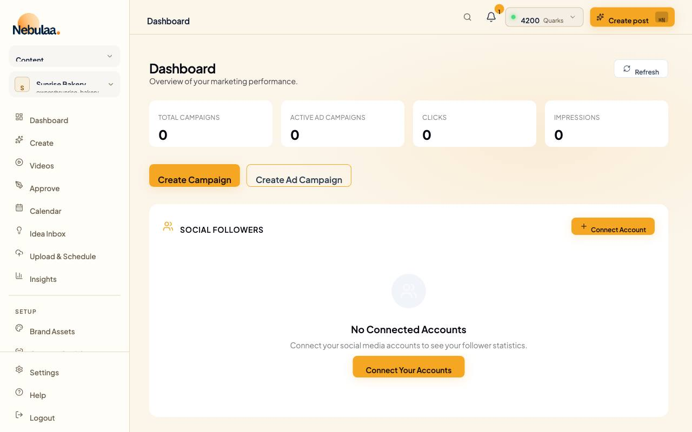 | 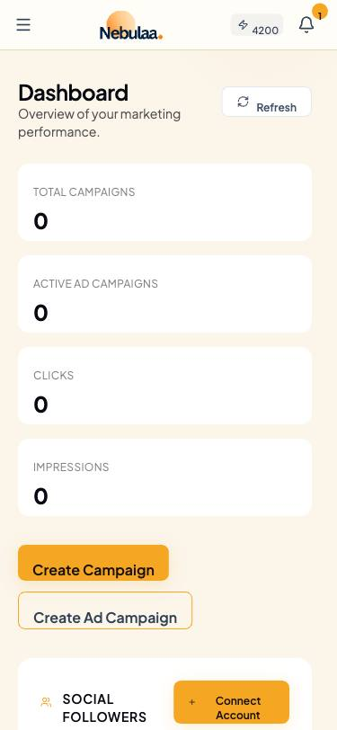 |
| analytics-classic | 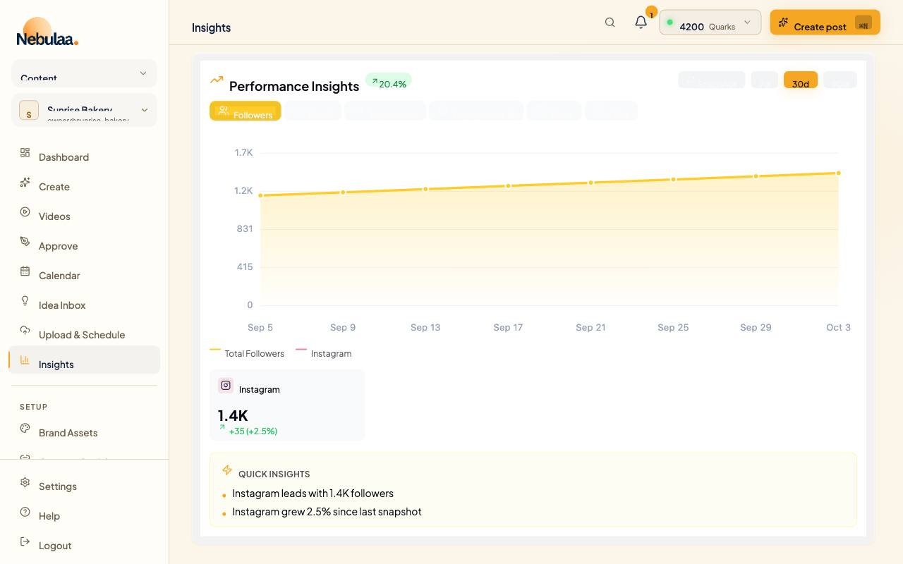 | 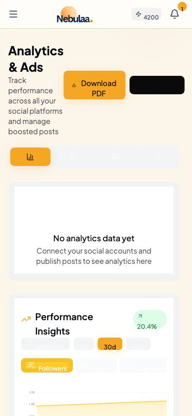 |
| admin | 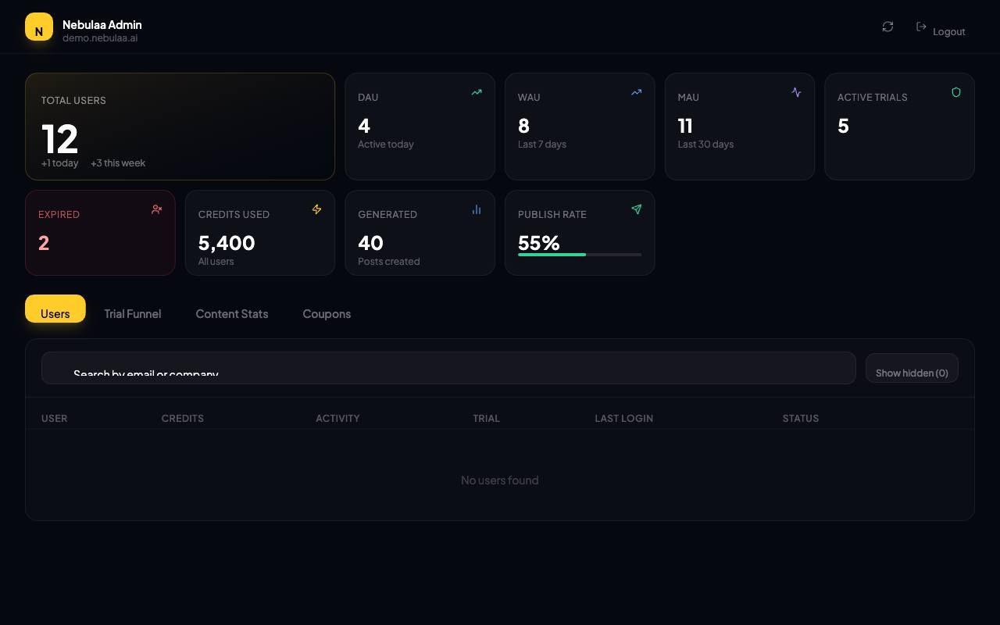 | 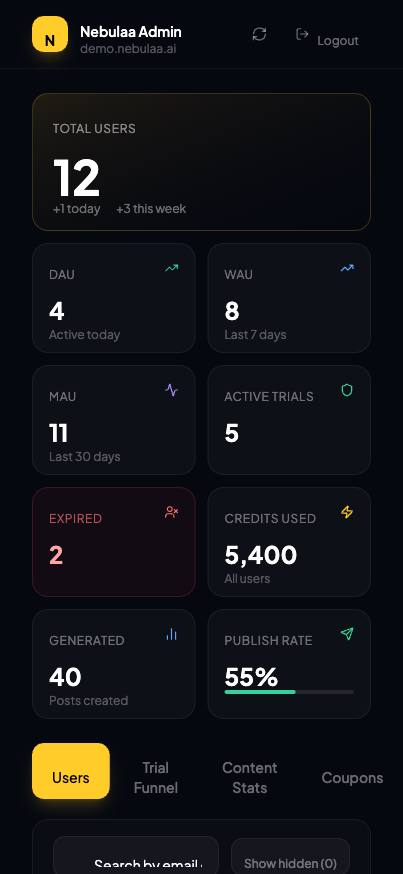 |
| settings-business |  |  |
| brand-assets-products | 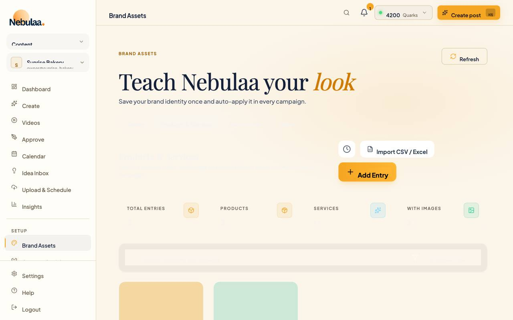 |  |
| connect-socials | 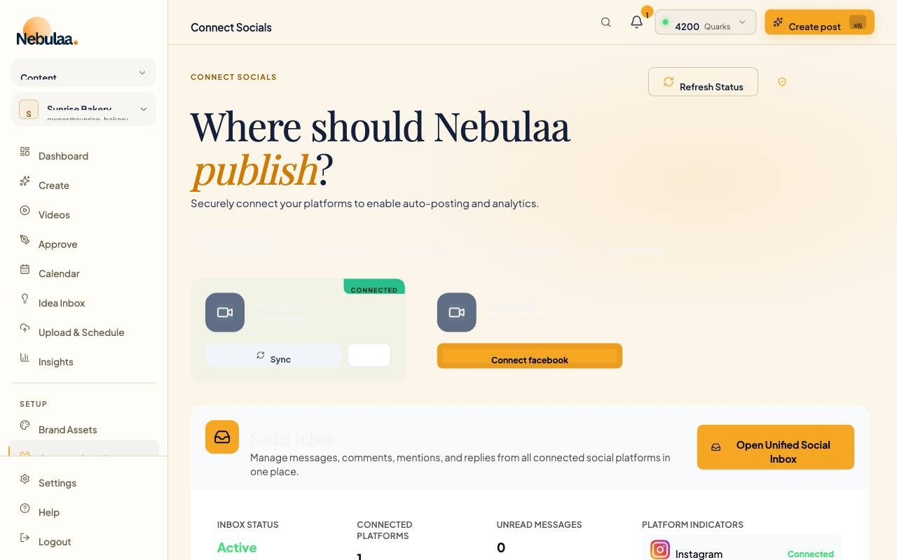 |  |
| connect-socials-inbox | 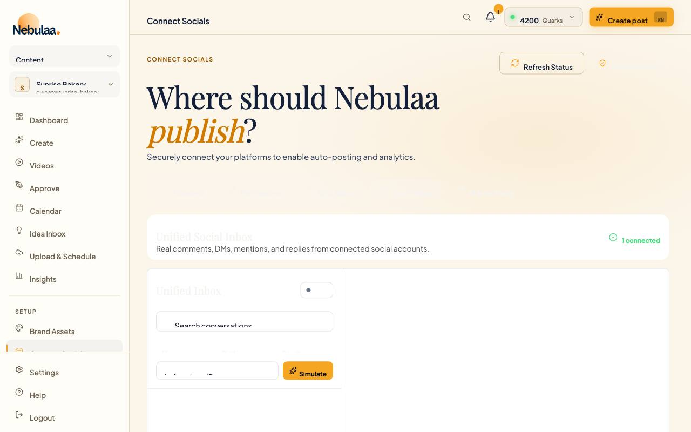 |  |
| settings-profile |  |  |
| brand-assets | 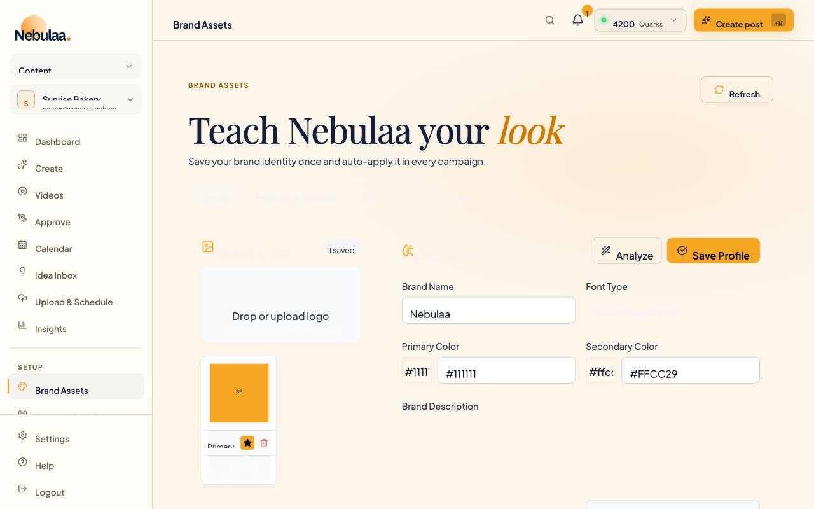 | 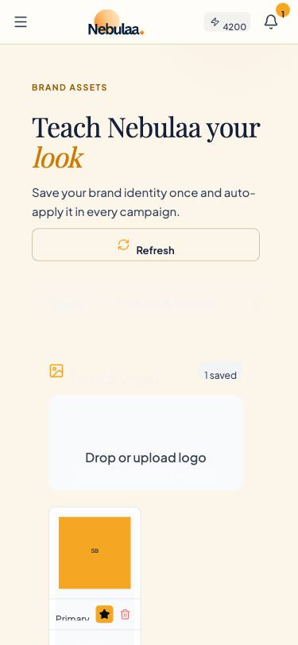 |

## For Tasks 7-8

Target: `GATE: PASS`. That means every in-scope route at 1280 and 375 renders (no MISSING / BLANK / ERROR / REDIRECT), 0 failures, and every remaining unknown, unparsed-colour or gradient-text item is either fixed or signed off by eye in `frontend/scripts/visual-audit/unknown-signoff.json` (route, text/selector, reason, who verified and how). The pages built in the other session are out of scope. Rerun and compare with
`node scripts/visual-audit/summarize.mjs --results <dir> --md <out.md> --json <out.json> --compare ../docs/superpowers/specs/assets/nebulaa-contrast-baseline/summary.json`
(it exits 1 while the gate fails; `--compare` totals only routes that rendered in both runs). `summary.json` (next to this file) holds the per-route counts, statuses and each route's 10 worst items.

---

The rest of this file is the generated report (`summarize.mjs`).

Generated 2026-10-03 by `frontend/scripts/visual-audit/summarize.mjs`. Expected: 56 routes.json entries x 1280 and 375 px. Standard: WCAG AA, 4.5:1 normal text, 3:1 large text (>= 24px, or >= 18.66px at 700+).

**GATE: FAIL**

Gate rule (Tasks 7-8): every route in scope (all of routes.json except the pages built in the other session) renders at every width (no MISSING / BLANK / ERROR / REDIRECT), has 0 failures, and every unknown-background item, unparsed colour and gradient-text item is signed off in `frontend/scripts/visual-audit/unknown-signoff.json` after a by-eye check.

## Totals (in scope)

| Width | Expected | Rendered ok | Missing | Blank | Error | Redirect | Checked | Failures | Routes with failures | Unknown (unsigned) | Unparsed colours | Gradient text | of which SVG text | over positioned layers | image layers |
|---:|---:|---:|---:|---:|---:|---:|---:|---:|---:|---:|---:|---:|---:|---:|---:|
| 1280 | 51 | 51 | 0 | 0 | 0 | 0 | 2735 | 553 | 50 | 5 (5) | 0 | 3 | 13 | 28 | 16 |
| 375 | 51 | 51 | 0 | 0 | 0 | 0 | 1589 | 462 | 47 | 2 (2) | 0 | 3 | 13 | 19 | 11 |

Missing/Blank/Error/Redirect counts include the redirect route kept out of the failure totals. "of which ..." columns break the failures down: SVG `<text>` labels, text measured against a positioned (non-ancestor) layer, and failures involving an image layer (`image-underlying`: fails on the colour beneath the image; `image-any`: no opaque image could make it pass).

## Per route

| Route | Path | 1280: fail / checked | 375: fail / checked | Worst ratio | Unknown | Unparsed / gradient text |
|---|---|---:|---:|---:|---:|---:|
| dashboard | `/dashboard` | 10 / 56 | 4 / 25 | 1.46 | 3 / 0 | 0/0 ; 0/0 |
| dashboard-classic | `/dashboard-classic` | 53 / 123 | 21 / 64 | 1.00 | 0 / 0 | 0/0 ; 0/0 |
| content-calendar-plan | `/content-calendar` | 11 / 40 | 10 / 17 | 1.02 | 0 / 0 | 0/0 ; 0/0 |
| content-calendar-schedule | `/content-calendar` | 16 / 89 | 15 / 60 | 1.02 | 0 / 0 | 0/0 ; 0/0 |
| content-calendar-grid | `/content-calendar-grid` | 14 / 87 | 13 / 58 | 1.50 | 0 / 0 | 0/0 ; 0/0 |
| content-calendar-classic | `/content-calendar-classic` | 9 / 38 | 8 / 15 | 1.02 | 0 / 0 | 0/0 ; 0/0 |
| idea-inbox | `/idea-inbox` | 15 / 46 | 14 / 23 | 1.02 | 0 / 0 | 0/0 ; 0/0 |
| campaigns | `/campaigns` | 12 / 69 | 10 / 44 | 2.99 | 1 / 1 | 0/0 ; 0/0 |
| campaigns-classic | `/campaigns-classic` | 10 / 49 | 6 / 22 | 1.87 | 0 / 0 | 0/0 ; 0/0 |
| drafts-review | `/drafts` | 4 / 57 | 3 / 34 | 2.99 | 0 / 0 | 0/0 ; 0/0 |
| drafts-all | `/drafts` | 12 / 51 | 11 / 28 | 1.34 | 0 / 0 | 0/0 ; 0/0 |
| reels | `/reels` | 8 / 38 | 7 / 15 | 1.05 | 0 / 0 | 0/0 ; 0/0 |
| reels-hero | `/reels/hero` | 2 / 30 | 1 / 7 | 2.99 | 0 / 0 | 0/0 ; 0/0 |
| upload | `/upload` | 4 / 31 | 3 / 8 | 1.02 | 0 / 0 | 0/0 ; 0/0 |
| ad-campaigns | `/ad-campaigns` | 1 / 28 | 0 / 5 | 3.80 | 0 / 0 | 0/0 ; 0/0 |
| competitors | `/competitors` | 7 / 37 | 6 / 14 | 1.02 | 0 / 0 | 0/0 ; 0/0 |
| connect-socials | `/connect-socials` | 20 / 70 | 19 / 47 | 1.00 | 0 / 0 | 0/0 ; 0/0 |
| connect-socials-permissions | `/connect-socials?tab=permissions` | 9 / 46 | 8 / 23 | 1.02 | 0 / 0 | 0/0 ; 0/0 |
| connect-socials-sync | `/connect-socials?tab=sync` | 9 / 48 | 8 / 25 | 1.02 | 0 / 0 | 0/0 ; 0/0 |
| connect-socials-auto-reply | `/connect-socials?tab=auto-reply` | 13 / 65 | 12 / 42 | 1.02 | 0 / 0 | 0/0 ; 0/0 |
| connect-socials-inbox | `/connect-socials/inbox` | 20 / 52 | 17 / 27 | 1.00 | 0 / 0 | 0/0 ; 0/0 |
| brand-assets | `/brand-assets` | 18 / 69 | 17 / 46 | 1.02 | 0 / 0 | 0/0 ; 0/0 |
| brand-assets-products | `/brand-assets?tab=products` | 21 / 64 | 20 / 41 | 1.01 | 0 / 0 | 0/0 ; 0/0 |
| brand-assets-environment | `/brand-assets?tab=environment` | 10 / 40 | 9 / 17 | 1.02 | 0 / 0 | 0/0 ; 0/0 |
| brand-assets-voice | `/brand-assets?tab=voice` | 13 / 52 | 12 / 29 | 1.02 | 0 / 0 | 0/0 ; 0/0 |
| inventory-redirect (redirect, not in totals) | `/inventory` | 21 / 64 | 20 / 41 | 1.01 | 0 / 0 | 0/0 ; 0/0 |
| analytics | `/analytics` | 6 / 45 | 5 / 22 | 1.52 | 0 / 0 | 0/0 ; 0/0 |
| analytics-classic | `/analytics-classic` | 30 / 70 | 26 / 43 | 1.00 | 0 / 0 | 0/0 ; 0/0 |
| seo | `/seo` | 12 / 49 | 11 / 26 | 1.00 | 0 / 0 | 0/0 ; 0/0 |
| seo-keywords | `/seo/keywords` | 4 / 38 | 3 / 13 | 1.00 | 0 / 0 | 0/0 ; 0/0 |
| seo-metadata | `/seo/metadata` | 6 / 40 | 5 / 15 | 1.00 | 0 / 0 | 0/0 ; 0/0 |
| seo-hashtags | `/seo/hashtags` | 4 / 43 | 3 / 18 | 1.00 | 0 / 0 | 0/0 ; 0/0 |
| seo-competitor | `/seo/competitor` | 4 / 38 | 3 / 13 | 1.00 | 0 / 0 | 0/0 ; 0/0 |
| influencer-portal | `/influencer-portal` | 6 / 42 | 5 / 17 | 1.00 | 0 / 0 | 0/0 ; 0/0 |
| influencer-list | `/influencer-portal/list` | 3 / 40 | 2 / 15 | 1.00 | 0 / 0 | 0/0 ; 0/0 |
| influencer-collaborations | `/influencer-portal/collaborations` | 6 / 47 | 5 / 22 | 1.00 | 0 / 0 | 0/0 ; 0/0 |
| influencer-submissions | `/influencer-portal/submissions` | 1 / 31 | 0 / 6 | 3.80 | 0 / 0 | 0/0 ; 0/0 |
| influencer-analytics | `/influencer-portal/analytics` | 1 / 36 | 0 / 11 | 3.80 | 0 / 0 | 0/0 ; 0/0 |
| influencer-profile | `/influencer-portal/profile` | 2 / 32 | 1 / 7 | 1.00 | 0 / 0 | 0/0 ; 0/0 |
| ai-memory | `/ai-memory` | 3 / 36 | 2 / 13 | 2.99 | 0 / 0 | 0/0 ; 0/0 |
| ai-history | `/ai-history` | 4 / 31 | 3 / 8 | 1.10 | 0 / 0 | 0/0 ; 0/0 |
| ai-performance | `/ai-performance` | 4 / 29 | 3 / 6 | 1.02 | 0 / 0 | 0/0 ; 0/0 |
| settings-profile | `/settings` | 19 / 49 | 18 / 26 | 1.02 | 0 / 0 | 0/0 ; 0/0 |
| settings-business | `/settings?tab=business` | 23 / 86 | 22 / 63 | 1.02 | 0 / 0 | 0/0 ; 0/0 |
| settings-notifications | `/settings` | 8 / 35 | 7 / 12 | 1.02 | 0 / 0 | 0/0 ; 0/0 |
| settings-security | `/settings` | 12 / 40 | 11 / 17 | 1.02 | 0 / 0 | 0/0 ; 0/0 |
| settings-billing | `/settings` | 14 / 48 | 13 / 25 | 1.02 | 0 / 0 | 0/0 ; 0/0 |
| trial-expired | `/trial-expired` | 9 / 30 | 9 / 30 | 1.93 | 1 / 1 | 0/3 ; 0/3 |
| terms | `/terms` | 12 / 188 | 12 / 188 | 1.44 | 0 / 0 | 0/0 ; 0/0 |
| privacy-policy | `/privacy-policy` | 10 / 187 | 10 / 187 | 1.44 | 0 / 0 | 0/0 ; 0/0 |
| admin-login | `/admin/login` | 0 / 8 | 0 / 8 | - | 0 / 0 | 0/0 ; 0/0 |
| admin | `/admin` | 29 / 42 | 29 / 42 | 1.80 | 0 / 0 | 0/0 ; 0/0 |

## Failing class patterns

Nearest text-colour class on the element or an ancestor (state variants dropped). Counts are failures across in-scope routes and both widths. Colours are as drawn, i.e. after the `index.html` override layer.

| Text-colour classes | Failures | Routes | Worst | Example (computed colour on background) |
|---|---:|---:|---:|---|
| `text-white/55` | 120 | 17 | 1.02 | Schedule: #f5f4f1 on #fbf5eb |
| `text-[#F5F4F1]` | 106 | 21 | 1.01 | Plan: #f5f4f1 on #fcf6ed |
| `text-[var(--gv-text-muted)]` | 96 | 9 | 1.50 | 1 post · 2 platform s: #8f836e on #fbf5ea |
| `text-[#070A12]/50` | 69 | 9 | 3.65 | Add competitors to track their: #7e8084 on #f5f5f5 |
| `text-[var(--gv-accent-display)]` | 56 | 28 | 2.99 | your eye: #d07a00 on #fbf5ea |
| `text-slate-900` | 54 | 5 | 1.02 | All: #f5f4f1 on #ffffff |
| `text-slate-500` | 48 | 6 | 1.00 | 0 unread conversations: #ffffff on #ffffff |
| `text-[#ffcc29]` | 47 | 6 | 1.00 | Sat: #f5a623 on #f5a623 |
| `text-[#1A1208]/70` | 46 | 46 | 3.80 | ⌘N: #4f360e on #c9881e |
| `text-slate-400` | 42 | 6 | 1.00 | Unlink: #ffffff on #ffffff |
| `text-white/40` | 36 | 5 | 1.02 | Off: #f5f4f1 on #fbf5ea |
| `text-[var(--gv-text-primary)]` | 30 | 3 | 2.56 | ❤️: #14203a on #3b82f6 |
| `text-gray-500` | 29 | 3 | 1.02 | PNG recommended, max 10MB: #fcfcfd on #f9fafb |
| `text-[#070A12]` | 26 | 9 | 1.00 | All Campaigns: #f5a623 on #fbf5ea |
| `text-white/30` | 24 | 1 | 2.57 | demo.nebulaa.ai: #515258 on #060810 |
| `text-[#070A12] placeholder-[#070A12]/50` | 20 | 5 | 1.05 | 3: #f5f4f1 on #f8fafc |
| `text-white/60` | 18 | 7 | 1.02 | 3 / 4: #f5f4f1 on #aaa9a6 |
| `text-white/45` | 16 | 6 | 1.01 | english: #f5f4f1 on #fbf6eb |
| `text-gray-900` | 14 | 2 | 1.02 | Select brand font: #f5f4f1 on #fbf5eb |
| `text-[#F5A623]` | 14 | 1 | 1.85 | # bestseller: #f5a623 on #f1f5f9 |
| `text-white/80` | 11 | 2 | 1.46 | IN · MON: #f5f4f1 on #ceccc8 |
| `text-green-400` | 8 | 3 | 1.41 | Connected: #4ade80 on #f8fafc |
| `text-[#ededed]/45` | 8 | 1 | 3.92 | All plans include AI campaign : #6c6d6f on #030507 |
| `text-gray-400` | 8 | 2 | 2.43 | © 2024 Noburo Business Service: #9ca3af on #f9fafb |
| `(no text-colour class)` | 8 | 2 | 2.43 | Privacy Policy: #9ca3af on #f9fafb |
| `text-white` | 7 | 2 | 1.37 | Diwali sweets box: #f5f4f1 on #f59e0b |
| `text-white/70` | 6 | 1 | 1.02 | Attach image: #f5f4f1 on #fbf5ea |
| `text-gray-900 placeholder-gray-400` | 6 | 2 | 2.35 | Describe your brand values, au: #9ca3af on #fbf5eb |
| `text-[#ededed]/35` | 6 | 1 | 2.88 | per month · Auto-renews · Canc: #595b60 on #090d14 |
| `text-white/50` | 4 | 2 | 1.02 | Business Plan: #f5f4f1 on #fbf5ea |

| Background classes (nearest) | Failures | Routes | Worst |
|---|---:|---:|---:|
| `bg-white` | 240 | 26 | 1.00 |
| `(no bg class)` | 167 | 40 | 1.00 |
| `bg-white/[0.03]` | 154 | 19 | 1.02 |
| `bg-white/[0.02]` | 98 | 14 | 1.02 |
| `bg-[var(--gv-surface-1)]` | 54 | 7 | 1.50 |
| `bg-[#1A1208]/20` | 46 | 46 | 3.80 |
| `bg-gray-50` | 44 | 5 | 1.02 |
| `bg-white/[0.10]` | 34 | 17 | 1.02 |
| `bg-slate-50` | 32 | 5 | 1.02 |
| `bg-[#f5f5f5]` | 26 | 1 | 3.65 |
| `bg-white/[0.04]` | 20 | 3 | 1.02 |
| `bg-transparent` | 12 | 5 | 1.02 |
| `bg-[#f5f5f5]/50` | 9 | 1 | 3.68 |
| `from-[#0d1219]/85 via-[#080c14]/90 to-[#060910]/90` | 8 | 1 | 2.88 |
| `bg-gray-100` | 6 | 1 | 1.04 |
| `from-black/70 to-transparent` | 5 | 1 | 1.46 |
| `from-blue-50 to-indigo-100` | 5 | 1 | 1.72 |
| `bg-blue-500` | 5 | 1 | 3.34 |
| `bg-amber-500` | 4 | 1 | 1.95 |
| `bg-emerald-500/[0.04]` | 4 | 1 | 1.02 |
| `bg-[#F5A623]/10` | 4 | 1 | 1.89 |
| `bg-yellow-50/50` | 4 | 1 | 1.99 |
| `from-[#0f1520]/90 via-[#0a0e18]/95 to-[#060910]/95` | 4 | 1 | 2.90 |
| `from-[#ffcc29]/10 to-transparent` | 4 | 1 | 3.82 |
| `bg-orange-500` | 3 | 1 | 2.55 |

| Computed text colour on background | Failures | Routes | Ratio |
|---|---:|---:|---:|
| #f5f4f1 on #fbf5eb | 176 | 18 | 1.02 |
| #f5f4f1 on #fbf5ea | 78 | 13 | 1.01 |
| #d07a00 on #fbf5ea | 56 | 28 | 2.99 |
| #8f836e on #fbf5ea | 46 | 6 | 3.43 |
| #4f360e on #c9881e | 46 | 46 | 3.80 |
| #ffffff on #ffffff | 46 | 7 | 1.00 |
| #838589 on #ffffff | 34 | 6 | 3.72 |
| #8f836e on #f4efe5 | 34 | 4 | 3.24 |
| #f5f4f1 on #fcf6ed | 32 | 16 | 1.02 |
| #f5f4f1 on #ffffff | 28 | 7 | 1.10 |
| #7e8084 on #f5f5f5 | 26 | 1 | 3.65 |
| #94a3b8 on #ffffff | 26 | 1 | 2.56 |
| #fdfbf6 on #fbf5ea | 20 | 3 | 1.05 |
| #fcfdfe on #f8fafc | 18 | 3 | 1.03 |
| #fcfcfd on #f9fafb | 18 | 3 | 1.02 |
| #ffcc29 on #ffffff | 18 | 2 | 1.51 |
| #d0c7b8 on #f8f2e8 | 16 | 2 | 1.50 |
| #f5f4f1 on #f8fafc | 16 | 3 | 1.05 |
| #9ca3af on #f9fafb | 16 | 2 | 2.43 |
| #6e6f74 on #0d0f17 | 14 | 1 | 3.81 |

## Worst 10 per route

From the 1280px run. "req" is the AA minimum for that size; kind/failureKind as defined in the README.

### dashboard (`/dashboard`) - 10 failing of 56

| Ratio | req | Text | Colour on background | Kind | Selector | Text class |
|---:|---:|---|---|---|---|---|
| 1.46 | 4.5 | IN · MON | #f5f4f1 on #ceccc8 | image-underlying, positioned | `iv.absolute.inset-x-0.bottom-0 > span.text-\[9px\].font-semibold.tracking-widest` | `text-white/80` |
| 2.00 | 4.5 | IN · TUE | #f5f4f1 on #b0afab | image-underlying, positioned | `iv.absolute.inset-x-0.bottom-0 > span.text-\[9px\].font-semibold.tracking-widest` | `text-white/80` |
| 2.13 | 4.5 | 3 / 4 | #f5f4f1 on #aaa9a6 | image-underlying, positioned | ` div.absolute.inset-x-0.bottom-0 > span.text-\[9px\].text-white\/60.tabular-nums` | `text-white/60` |
| 2.32 | 4.5 | IN · WED | #f5f4f1 on #a3a29f | image-underlying, positioned | `iv.absolute.inset-x-0.bottom-0 > span.text-\[9px\].font-semibold.tracking-widest` | `text-white/80` |
| 2.83 | 4.5 | 4 / 4 | #f5f4f1 on #93928f | image-underlying, positioned | ` div.absolute.inset-x-0.bottom-0 > span.text-\[9px\].text-white\/60.tabular-nums` | `text-white/60` |
| 2.99 | 3 | your eye | #d07a00 on #fbf5ea |  | `\[1\.1\].tracking-\[-0\.02em\] > span.italic.text-\[var\(--gv-accent-display\)\]` | `text-[var(--gv-accent-display)]` |
| 3.43 | 4.5 | 1 post · 2 platform s | #8f836e on #fbf5ea |  | `items-center.justify-between > div.text-\[11px\].text-\[var\(--gv-text-muted\)\]` | `text-[var(--gv-text-muted)]` |
| 3.43 | 4.5 | draft | #8f836e on #fbf5ea |  | `\] > div.flex.items-center.gap-4 > span.text-\[10\.5px\].font-semibold.uppercase` | `text-[var(--gv-text-muted)]` |
| 3.43 | 4.5 | vs. last 7d | #8f836e on #fbf5ea |  | `items-center.justify-between > div.text-\[11px\].text-\[var\(--gv-text-muted\)\]` | `text-[var(--gv-text-muted)]` |
| 3.80 | 4.5 | ⌘N | #4f360e on #c9881e |  | `.items-center.gap-2 > a.ml-1.flex.items-center > kbd.ml-1.hidden.lg\:inline-flex` | `text-[#1A1208]/70` |

### dashboard-classic (`/dashboard-classic`) - 53 failing of 123

| Ratio | req | Text | Colour on background | Kind | Selector | Text class |
|---:|---:|---|---|---|---|---|
| 1.00 | 4.5 | Sat | #f5a623 on #f5a623 |  | `lex-shrink-0 > div.flex-1.h-12.flex > span.text-xs.font-medium.text-\[\#ffcc29\]` | `text-[#ffcc29]` |
| 1.67 | 4.5 | Content Strategist | #f5a623 on #fee5d1 |  | `between.items-center > span.text-\[10px\].bg-gradient-to-r.from-\[\#ffcc29\]\/20` | `text-[#ffcc29]` |
| 1.72 | 4.5 | i | #f5a623 on #e5ecff | positioned | `ems-center.gap-1 > div.relative > button.group.relative.w-6 > span.relative.z-10` | `text-[#ffcc29]` |
| 1.72 | 4.5 | i | #f5a623 on #e5ecff | positioned | `ems-center.gap-1 > div.relative > button.group.relative.w-6 > span.relative.z-10` | `text-[#ffcc29]` |
| 1.72 | 4.5 | i | #f5a623 on #e5ecff | positioned | `ems-center.gap-1 > div.relative > button.group.relative.w-6 > span.relative.z-10` | `text-[#ffcc29]` |
| 1.95 | 4.5 | Diwali sweets box | #f5f4f1 on #f59e0b | positioned | `.left-1.right-1 > div.flex.items-center.gap-1 > p.text-xs.font-semibold.truncate` | `text-white` |
| 1.95 | 4.5 | 09:00 • instagram | #f5f4f1 on #f59e0b | positioned | `ededed\] > div.absolute.left-1.right-1 > p.text-\[10px\].truncate.text-white\/80` | `text-white/80` |
| 2.03 | 4.5 | week | #f5a623 on #ffffff |  | `nter.gap-2 > div.flex.items-center.bg-\[\#ededed\] > button.px-3.py-1\.5.text-xs` | `text-[#ffcc29]` |
| 2.55 | 4.5 | Gandhi Jayanti | #f5f4f1 on #f97316 | positioned | `.left-1.right-1 > div.flex.items-center.gap-1 > p.text-xs.font-semibold.truncate` | `text-white` |
| 2.55 | 4.5 | National | #f5f4f1 on #f97316 | positioned | `ededed\] > div.absolute.left-1.right-1 > p.text-\[10px\].truncate.text-white\/80` | `text-white/80` |

### content-calendar-plan (`/content-calendar`) - 11 failing of 40

| Ratio | req | Text | Colour on background | Kind | Selector | Text class |
|---:|---:|---|---|---|---|---|
| 1.02 | 4.5 | Plan | #f5f4f1 on #fcf6ed |  | `-x-auto > div.inline-flex.items-center.gap-1 > button.whitespace-nowrap.h-9.px-5` | `text-[#F5F4F1]` |
| 1.02 | 4.5 | Schedule | #f5f4f1 on #fbf5eb |  | `-x-auto > div.inline-flex.items-center.gap-1 > button.whitespace-nowrap.h-9.px-5` | `text-white/55` |
| 1.02 | 4.5 | My default language | #f5f4f1 on #fbf5eb |  | `-col.items-stretch > div.flex.items-center.gap-2 > select.gravity-bare.px-3.py-2` | `text-[#F5F4F1]` |
| 1.02 | 4.5 | 10 | #f5f4f1 on #fbf5ea |  | `.relative > div.p-5.pt-4 > h3.font-serif-display.text-\[20px\].text-\[\#F5F4F1\]` | `text-[#F5F4F1]` |
| 1.02 | 4.5 | Business Plan | #f5f4f1 on #fbf5ea |  | `rsor-pointer.group.relative > div.p-5.pt-4 > p.text-\[13px\].text-white\/50.mb-3` | `text-white/50` |
| 1.02 | 4.5 | english | #f5f4f1 on #fbf6eb |  | `elative > div.p-5.pt-4 > div.flex.items-center.gap-2 > span.px-2.py-1.rounded-md` | `text-white/45` |
| 1.02 | 4.5 | 0 Weeks | #f5f4f1 on #fbf6eb |  | `elative > div.p-5.pt-4 > div.flex.items-center.gap-2 > span.px-2.py-1.rounded-md` | `text-white/45` |
| 1.02 | 4.5 | Off | #f5f4f1 on #fbf5ea |  | `-center.justify-between > div.min-w-0 > div.text-\[12px\].mt-0\.5.text-white\/40` | `text-white/40` |
| 1.03 | 4.5 | Anything specific to focus on this month | #fcf8f0 on #fbf5ea | placeholder | `-4 > div.flex.flex-col.items-stretch > input.gravity-bare.w-full.sm\:w-\[360px\]` | `text-[#F5F4F1]` |
| 2.99 | 3 | planned | #d07a00 on #fbf5ea |  | `\[1\.1\].tracking-\[-0\.02em\] > span.italic.text-\[var\(--gv-accent-display\)\]` | `text-[var(--gv-accent-display)]` |

### content-calendar-schedule (`/content-calendar`, tab "Schedule") - 16 failing of 89

| Ratio | req | Text | Colour on background | Kind | Selector | Text class |
|---:|---:|---|---|---|---|---|
| 1.02 | 4.5 | Plan | #f5f4f1 on #fbf5eb |  | `-x-auto > div.inline-flex.items-center.gap-1 > button.whitespace-nowrap.h-9.px-5` | `text-white/55` |
| 1.02 | 4.5 | Schedule | #f5f4f1 on #fcf6ed |  | `-x-auto > div.inline-flex.items-center.gap-1 > button.whitespace-nowrap.h-9.px-5` | `text-[#F5F4F1]` |
| 1.50 | 4.5 | 28 | #d0c7b8 on #f8f2e8 |  | `.items-baseline.justify-end > span.text-\[14px\].font-serif-display.tabular-nums` | `text-[var(--gv-text-muted)]` |
| 1.50 | 4.5 | 29 | #d0c7b8 on #f8f2e8 |  | `.items-baseline.justify-end > span.text-\[14px\].font-serif-display.tabular-nums` | `text-[var(--gv-text-muted)]` |
| 1.50 | 4.5 | 30 | #d0c7b8 on #f8f2e8 |  | `.items-baseline.justify-end > span.text-\[14px\].font-serif-display.tabular-nums` | `text-[var(--gv-text-muted)]` |
| 1.50 | 4.5 | 1 | #d0c7b8 on #f8f2e8 |  | `.items-baseline.justify-end > span.text-\[14px\].font-serif-display.tabular-nums` | `text-[var(--gv-text-muted)]` |
| 2.99 | 3 | 2026 | #d07a00 on #fbf5ea |  | `\[1\.1\].tracking-\[-0\.02em\] > span.italic.text-\[var\(--gv-accent-display\)\]` | `text-[var(--gv-accent-display)]` |
| 3.43 | 4.5 | · | #8f836e on #fbf5ea |  | `].text-\[var\(--gv-text-tertiary\)\] > span.mx-2.text-\[var\(--gv-text-muted\)\]` | `text-[var(--gv-text-muted)]` |
| 3.43 | 4.5 | MON | #8f836e on #fbf5ea |  | `o.pb-16 > div.grid.grid-cols-7.gap-3 > div.text-\[10px\].font-semibold.uppercase` | `text-[var(--gv-text-muted)]` |
| 3.43 | 4.5 | TUE | #8f836e on #fbf5ea |  | `o.pb-16 > div.grid.grid-cols-7.gap-3 > div.text-\[10px\].font-semibold.uppercase` | `text-[var(--gv-text-muted)]` |

### content-calendar-grid (`/content-calendar-grid`) - 14 failing of 87

| Ratio | req | Text | Colour on background | Kind | Selector | Text class |
|---:|---:|---|---|---|---|---|
| 1.50 | 4.5 | 28 | #d0c7b8 on #f8f2e8 |  | `.items-baseline.justify-end > span.text-\[14px\].font-serif-display.tabular-nums` | `text-[var(--gv-text-muted)]` |
| 1.50 | 4.5 | 29 | #d0c7b8 on #f8f2e8 |  | `.items-baseline.justify-end > span.text-\[14px\].font-serif-display.tabular-nums` | `text-[var(--gv-text-muted)]` |
| 1.50 | 4.5 | 30 | #d0c7b8 on #f8f2e8 |  | `.items-baseline.justify-end > span.text-\[14px\].font-serif-display.tabular-nums` | `text-[var(--gv-text-muted)]` |
| 1.50 | 4.5 | 1 | #d0c7b8 on #f8f2e8 |  | `.items-baseline.justify-end > span.text-\[14px\].font-serif-display.tabular-nums` | `text-[var(--gv-text-muted)]` |
| 2.99 | 3 | 2026 | #d07a00 on #fbf5ea |  | `\[1\.1\].tracking-\[-0\.02em\] > span.italic.text-\[var\(--gv-accent-display\)\]` | `text-[var(--gv-accent-display)]` |
| 3.43 | 4.5 | · | #8f836e on #fbf5ea |  | `].text-\[var\(--gv-text-tertiary\)\] > span.mx-2.text-\[var\(--gv-text-muted\)\]` | `text-[var(--gv-text-muted)]` |
| 3.43 | 4.5 | MON | #8f836e on #fbf5ea |  | `o.pb-16 > div.grid.grid-cols-7.gap-3 > div.text-\[10px\].font-semibold.uppercase` | `text-[var(--gv-text-muted)]` |
| 3.43 | 4.5 | TUE | #8f836e on #fbf5ea |  | `o.pb-16 > div.grid.grid-cols-7.gap-3 > div.text-\[10px\].font-semibold.uppercase` | `text-[var(--gv-text-muted)]` |
| 3.43 | 4.5 | WED | #8f836e on #fbf5ea |  | `o.pb-16 > div.grid.grid-cols-7.gap-3 > div.text-\[10px\].font-semibold.uppercase` | `text-[var(--gv-text-muted)]` |
| 3.43 | 4.5 | THU | #8f836e on #fbf5ea |  | `o.pb-16 > div.grid.grid-cols-7.gap-3 > div.text-\[10px\].font-semibold.uppercase` | `text-[var(--gv-text-muted)]` |

### content-calendar-classic (`/content-calendar-classic`) - 9 failing of 38

| Ratio | req | Text | Colour on background | Kind | Selector | Text class |
|---:|---:|---|---|---|---|---|
| 1.02 | 4.5 | My default language | #f5f4f1 on #fbf5eb |  | `-col.items-stretch > div.flex.items-center.gap-2 > select.gravity-bare.px-3.py-2` | `text-[#F5F4F1]` |
| 1.02 | 4.5 | 10 | #f5f4f1 on #fbf5ea |  | `.relative > div.p-5.pt-4 > h3.font-serif-display.text-\[20px\].text-\[\#F5F4F1\]` | `text-[#F5F4F1]` |
| 1.02 | 4.5 | Business Plan | #f5f4f1 on #fbf5ea |  | `rsor-pointer.group.relative > div.p-5.pt-4 > p.text-\[13px\].text-white\/50.mb-3` | `text-white/50` |
| 1.02 | 4.5 | english | #f5f4f1 on #fbf6eb |  | `elative > div.p-5.pt-4 > div.flex.items-center.gap-2 > span.px-2.py-1.rounded-md` | `text-white/45` |
| 1.02 | 4.5 | 0 Weeks | #f5f4f1 on #fbf6eb |  | `elative > div.p-5.pt-4 > div.flex.items-center.gap-2 > span.px-2.py-1.rounded-md` | `text-white/45` |
| 1.02 | 4.5 | Off | #f5f4f1 on #fbf5ea |  | `-center.justify-between > div.min-w-0 > div.text-\[12px\].mt-0\.5.text-white\/40` | `text-white/40` |
| 1.03 | 4.5 | Anything specific to focus on this month | #fcf8f0 on #fbf5ea | placeholder | `-4 > div.flex.flex-col.items-stretch > input.gravity-bare.w-full.sm\:w-\[360px\]` | `text-[#F5F4F1]` |
| 2.99 | 3 | planned | #d07a00 on #fbf5ea |  | `\[1\.1\].tracking-\[-0\.02em\] > span.italic.text-\[var\(--gv-accent-display\)\]` | `text-[var(--gv-accent-display)]` |
| 3.80 | 4.5 | ⌘N | #4f360e on #c9881e |  | `.items-center.gap-2 > a.ml-1.flex.items-center > kbd.ml-1.hidden.lg\:inline-flex` | `text-[#1A1208]/70` |

### idea-inbox (`/idea-inbox`) - 15 failing of 46

| Ratio | req | Text | Colour on background | Kind | Selector | Text class |
|---:|---:|---|---|---|---|---|
| 1.02 | 4.5 | Saw a great ad about founder burnout — w | #fcf8f1 on #fbf5eb | placeholder | `xl.border.border-white\/\[0\.08\] > textarea.w-full.bg-transparent.text-\[14px\]` | `text-[#F5F4F1] placeholder-white/30` |
| 1.02 | 4.5 | Attach image | #f5f4f1 on #fbf5ea |  | `0\.08\] > div.flex.flex-wrap.items-center > label.inline-flex.items-center.gap-2` | `text-white/70` |
| 1.02 | 4.5 | Link (optional) | #fcf8f1 on #fbf5eb | placeholder | `/\[0\.08\] > div.flex.flex-wrap.items-center > input.flex-1.min-w-\[140px\].px-3` | `text-white/80 placeholder-white/30` |
| 1.02 | 4.5 | Have a list already? | #f5f4f1 on #fbf5ea |  | `ter.justify-between > div > div.text-\[13\.5px\].font-semibold.text-\[\#F5F4F1\]` | `text-[#F5F4F1]` |
| 1.02 | 4.5 | Paste rows, or upload a spreadsheet — on | #f5f4f1 on #fbf5ea |  | `> div.flex.items-center.justify-between > div > div.text-\[12px\].text-white\/45` | `text-white/45` |
| 1.02 | 4.5 | Upload file | #f5f4f1 on #fbf5ea |  | `ify-between > div.flex.items-center.gap-2 > label.inline-flex.items-center.gap-2` | `text-white/70` |
| 1.02 | 4.5 | Paste a list | #f5f4f1 on #fbf5ea |  | `nter.justify-between > div.flex.items-center.gap-2 > button.px-3.py-2.rounded-lg` | `text-white/70` |
| 1.02 | 4.5 | Show the 5am bake in a reel | #f5f4f1 on #fbf5ea |  | `8\] > div.p-4.flex-1.flex > p.text-\[13\.5px\].text-\[\#F5F4F1\].leading-relaxed` | `text-[#F5F4F1]` |
| 1.02 | 4.5 | Dismiss | #f5f4f1 on #fbf5ea |  | `v.p-4.flex-1.flex > div.flex.items-center.gap-2 > button.px-2\.5.py-2.rounded-lg` | `text-white/60` |
| 1.02 | 4.5 | Customer birthday cake gallery | #f5f4f1 on #fbf5ea |  | `8\] > div.p-4.flex-1.flex > p.text-\[13\.5px\].text-\[\#F5F4F1\].leading-relaxed` | `text-[#F5F4F1]` |

### campaigns (`/campaigns`) - 12 failing of 69

| Ratio | req | Text | Colour on background | Kind | Selector | Text class |
|---:|---:|---|---|---|---|---|
| 2.99 | 3 | working on | #d07a00 on #fbf5ea |  | `\[1\.1\].tracking-\[-0\.02em\] > span.italic.text-\[var\(--gv-accent-display\)\]` | `text-[var(--gv-accent-display)]` |
| 3.24 | 4.5 | Monsoon menu launch | #8f836e on #f7eedf | placeholder, image-underlying, positioned | `ative > div.flex.items-baseline.gap-4 > input.gravity-bare.flex-1.bg-transparent` | `text-[var(--gv-text-primary)]` |
| 3.24 | 4.5 | Edit | #8f836e on #f4efe5 |  | `lative > button.group.relative.flex > span.text-\[10px\].font-semibold.uppercase` | `text-[var(--gv-text-muted)]` |
| 3.24 | 4.5 | Edit | #8f836e on #f4efe5 |  | `lative > button.group.relative.flex > span.text-\[10px\].font-semibold.uppercase` | `text-[var(--gv-text-muted)]` |
| 3.24 | 4.5 | Edit | #8f836e on #f4efe5 |  | `lative > button.group.relative.flex > span.text-\[10px\].font-semibold.uppercase` | `text-[var(--gv-text-muted)]` |
| 3.24 | 4.5 | Edit | #8f836e on #f4efe5 |  | `lative > button.group.relative.flex > span.text-\[10px\].font-semibold.uppercase` | `text-[var(--gv-text-muted)]` |
| 3.24 | 4.5 | Edit | #8f836e on #f4efe5 |  | `lative > button.group.relative.flex > span.text-\[10px\].font-semibold.uppercase` | `text-[var(--gv-text-muted)]` |
| 3.35 | 4.5 | e.g. Launch our monsoon menu over two we | #8f836e on #fbf2e2 | placeholder, image-underlying, positioned | `ive.rounded-2xl.p-5 > div.relative > textarea.gravity-bare.w-full.bg-transparent` | `text-[var(--gv-text-tertiary)]` |
| 3.43 | 4.5 | / | #8f836e on #fbf5ea |  | `v.flex.items-baseline.gap-3 > span.text-\[var\(--gv-text-muted\)\].text-\[13px\]` | `text-[var(--gv-text-muted)]` |
| 3.43 | 4.5 | · | #8f836e on #fbf5ea |  | `ext-\[var\(--gv-text-tertiary\)\] > span.mx-1\.5.text-\[var\(--gv-text-muted\)\]` | `text-[var(--gv-text-muted)]` |

### campaigns-classic (`/campaigns-classic`) - 10 failing of 49

| Ratio | req | Text | Colour on background | Kind | Selector | Text class |
|---:|---:|---|---|---|---|---|
| 1.87 | 4.5 | Create | #f5a623 on #fbf5ea |  | `overflow-x-auto > div.flex.space-x-6.min-w-max > button.pb-4.text-sm.font-medium` | `text-[#ffcc29]` |
| 1.87 | 4.5 | All Campaigns | #f5a623 on #fbf5ea |  | `overflow-x-auto > div.flex.space-x-6.min-w-max > button.pb-4.text-sm.font-medium` | `text-[#070A12]` |
| 1.87 | 4.5 | Drafts | #f5a623 on #fbf5ea |  | `overflow-x-auto > div.flex.space-x-6.min-w-max > button.pb-4.text-sm.font-medium` | `text-[#070A12]` |
| 1.87 | 4.5 | Scheduled | #f5a623 on #fbf5ea |  | `overflow-x-auto > div.flex.space-x-6.min-w-max > button.pb-4.text-sm.font-medium` | `text-[#070A12]` |
| 1.87 | 4.5 | Posted | #f5a623 on #fbf5ea |  | `overflow-x-auto > div.flex.space-x-6.min-w-max > button.pb-4.text-sm.font-medium` | `text-[#070A12]` |
| 1.87 | 4.5 | Archived | #f5a623 on #fbf5ea |  | `overflow-x-auto > div.flex.space-x-6.min-w-max > button.pb-4.text-sm.font-medium` | `text-[#070A12]` |
| 3.19 | 4.5 | Template-Based | #d97706 on #ffffff |  | `sm\:grid-cols-2 > button.group.relative.rounded-2xl > div.mt-5.flex.items-center` | `text-amber-600` |
| 3.30 | 4.5 | Direct Upload | #16a34a on #ffffff |  | `sm\:grid-cols-2 > button.group.relative.rounded-2xl > div.mt-5.flex.items-center` | `text-green-600` |
| 3.43 | 4.5 | / | #8f836e on #fbf5ea |  | `v.flex.items-baseline.gap-3 > span.text-\[var\(--gv-text-muted\)\].text-\[13px\]` | `text-[var(--gv-text-muted)]` |
| 3.80 | 4.5 | ⌘N | #4f360e on #c9881e |  | `.items-center.gap-2 > a.ml-1.flex.items-center > kbd.ml-1.hidden.lg\:inline-flex` | `text-[#1A1208]/70` |

### drafts-review (`/drafts`) - 4 failing of 57

| Ratio | req | Text | Colour on background | Kind | Selector | Text class |
|---:|---:|---|---|---|---|---|
| 2.99 | 3 | once-over | #d07a00 on #fbf5ea |  | `\[1\.1\].tracking-\[-0\.02em\] > span.italic.text-\[var\(--gv-accent-display\)\]` | `text-[var(--gv-accent-display)]` |
| 3.43 | 4.5 | Empty — Regenerate will ask the Creative | #8f836e on #fbf5ea |  | `der-subtle\)\].pt-5 > p.text-\[10\.5px\].text-\[var\(--gv-text-muted\)\].mt-1\.5` | `text-[var(--gv-text-muted)]` |
| 3.44 | 4.5 | No resolved prompt was recorded for this | #8f836e on #fbf5eb | placeholder | `der-t.border-\[var\(--gv-border-subtle\)\].pt-5 > textarea.w-full.p-3.rounded-lg` | `text-[var(--gv-text-secondary)]` |
| 3.80 | 4.5 | ⌘N | #4f360e on #c9881e |  | `.items-center.gap-2 > a.ml-1.flex.items-center > kbd.ml-1.hidden.lg\:inline-flex` | `text-[#1A1208]/70` |

### drafts-all (`/drafts`, tab "All") - 12 failing of 51

| Ratio | req | Text | Colour on background | Kind | Selector | Text class |
|---:|---:|---|---|---|---|---|
| 1.34 | 4.5 | scheduled | #93c5fd on #d8dee7 |  | `v.flex.items-center.justify-between > span.text-\[10px\].font-semibold.uppercase` | `text-blue-300` |
| 1.47 | 4.5 | published | #34d399 on #d2e7d6 |  | `v.flex.items-center.justify-between > span.text-\[10px\].font-semibold.uppercase` | `text-emerald-400` |
| 2.99 | 3 | once-over | #d07a00 on #fbf5ea |  | `\[1\.1\].tracking-\[-0\.02em\] > span.italic.text-\[var\(--gv-accent-display\)\]` | `text-[var(--gv-accent-display)]` |
| 3.24 | 4.5 | Fresh out of the oven at 7am. Come early | #8f836e on #f4efe5 |  | `nded-xl > div.p-3 > p.text-\[11px\].text-\[var\(--gv-text-muted\)\].line-clamp-2` | `text-[var(--gv-text-muted)]` |
| 3.24 | 4.5 | Tomorrow · 22:31 | #8f836e on #f4efe5 |  | `rounded-xl > div.p-3 > div.text-\[10px\].text-\[var\(--gv-text-muted\)\].mt-1\.5` | `text-[var(--gv-text-muted)]` |
| 3.24 | 4.5 | Fresh out of the oven at 7am. Come early | #8f836e on #f4efe5 |  | `nded-xl > div.p-3 > p.text-\[11px\].text-\[var\(--gv-text-muted\)\].line-clamp-2` | `text-[var(--gv-text-muted)]` |
| 3.24 | 4.5 | Mon 5 Oct · 22:31 | #8f836e on #f4efe5 |  | `rounded-xl > div.p-3 > div.text-\[10px\].text-\[var\(--gv-text-muted\)\].mt-1\.5` | `text-[var(--gv-text-muted)]` |
| 3.24 | 4.5 | Fresh out of the oven at 7am. Come early | #8f836e on #f4efe5 |  | `nded-xl > div.p-3 > p.text-\[11px\].text-\[var\(--gv-text-muted\)\].line-clamp-2` | `text-[var(--gv-text-muted)]` |
| 3.24 | 4.5 | Tue 6 Oct · 22:31 | #8f836e on #f4efe5 |  | `rounded-xl > div.p-3 > div.text-\[10px\].text-\[var\(--gv-text-muted\)\].mt-1\.5` | `text-[var(--gv-text-muted)]` |
| 3.24 | 4.5 | Fresh out of the oven at 7am. Come early | #8f836e on #f4efe5 |  | `nded-xl > div.p-3 > p.text-\[11px\].text-\[var\(--gv-text-muted\)\].line-clamp-2` | `text-[var(--gv-text-muted)]` |

### reels (`/reels`) - 8 failing of 38

| Ratio | req | Text | Colour on background | Kind | Selector | Text class |
|---:|---:|---|---|---|---|---|
| 1.05 | 4.5 | Edit the prompts | #f5f4f1 on #f8fafc |  | `o.space-y-6 > div.flex.flex-col.gap-4 > button.shrink-0.inline-flex.items-center` | `text-[#F5F4F1]` |
| 1.05 | 4.5 | Create | #f5f4f1 on #f8fafc |  | `-x-auto > div.inline-flex.items-center.gap-1 > button.whitespace-nowrap.h-9.px-5` | `text-white/55` |
| 1.05 | 4.5 | Drafts | #f5f4f1 on #f8fafc |  | `-x-auto > div.inline-flex.items-center.gap-1 > button.whitespace-nowrap.h-9.px-5` | `text-white/55` |
| 1.05 | 4.5 | Created | #f5f4f1 on #f8fafc |  | `-x-auto > div.inline-flex.items-center.gap-1 > button.whitespace-nowrap.h-9.px-5` | `text-white/55` |
| 1.05 | 4.5 | Scheduled | #f5f4f1 on #f8fafc |  | `-x-auto > div.inline-flex.items-center.gap-1 > button.whitespace-nowrap.h-9.px-5` | `text-white/55` |
| 1.05 | 4.5 | Posted | #f5f4f1 on #f8fafc |  | `-x-auto > div.inline-flex.items-center.gap-1 > button.whitespace-nowrap.h-9.px-5` | `text-white/55` |
| 1.06 | 4.5 | All AI Videos | #f5f4f1 on #f9fbfc |  | `-x-auto > div.inline-flex.items-center.gap-1 > button.whitespace-nowrap.h-9.px-5` | `text-[#F5F4F1]` |
| 3.80 | 4.5 | ⌘N | #4f360e on #c9881e |  | `.items-center.gap-2 > a.ml-1.flex.items-center > kbd.ml-1.hidden.lg\:inline-flex` | `text-[#1A1208]/70` |

### reels-hero (`/reels/hero`) - 2 failing of 30

| Ratio | req | Text | Colour on background | Kind | Selector | Text class |
|---:|---:|---|---|---|---|---|
| 2.99 | 3 | Reels | #d07a00 on #fbf5ea |  | `\[1\.1\].tracking-\[-0\.02em\] > span.italic.text-\[var\(--gv-accent-display\)\]` | `text-[var(--gv-accent-display)]` |
| 3.80 | 4.5 | ⌘N | #4f360e on #c9881e |  | `.items-center.gap-2 > a.ml-1.flex.items-center > kbd.ml-1.hidden.lg\:inline-flex` | `text-[#1A1208]/70` |

### upload (`/upload`) - 4 failing of 31

| Ratio | req | Text | Colour on background | Kind | Selector | Text class |
|---:|---:|---|---|---|---|---|
| 1.02 | 4.5 | Drop a file, or click to choose | #f5f4f1 on #fbf5ea |  | `r-pointer.rounded-2xl.border-2 > p.text-\[15px\].font-semibold.text-\[\#F5F4F1\]` | `text-[#F5F4F1]` |
| 1.02 | 4.5 | Images and video · up to 120MB | #f5f4f1 on #fbf5ea |  | `.cursor-pointer.rounded-2xl.border-2 > p.text-\[12\.5px\].text-white\/40.mt-1\.5` | `text-white/40` |
| 2.99 | 3 | something | #d07a00 on #fbf5ea |  | `\[1\.1\].tracking-\[-0\.02em\] > span.italic.text-\[var\(--gv-accent-display\)\]` | `text-[var(--gv-accent-display)]` |
| 3.80 | 4.5 | ⌘N | #4f360e on #c9881e |  | `.items-center.gap-2 > a.ml-1.flex.items-center > kbd.ml-1.hidden.lg\:inline-flex` | `text-[#1A1208]/70` |

### ad-campaigns (`/ad-campaigns`) - 1 failing of 28

| Ratio | req | Text | Colour on background | Kind | Selector | Text class |
|---:|---:|---|---|---|---|---|
| 3.80 | 4.5 | ⌘N | #4f360e on #c9881e |  | `.items-center.gap-2 > a.ml-1.flex.items-center > kbd.ml-1.hidden.lg\:inline-flex` | `text-[#1A1208]/70` |

### competitors (`/competitors`) - 7 failing of 37

| Ratio | req | Text | Colour on background | Kind | Selector | Text class |
|---:|---:|---|---|---|---|---|
| 1.02 | 4.5 | Complete onboarding with your business l | #f5f4f1 on #fbf1e0 |  | `.py-3\.5 > div.flex.items-center.gap-2\.5 > span.text-\[13px\].text-\[\#F5F4F1\]` | `text-[#F5F4F1]` |
| 1.10 | 4.5 | Competitor Activity Feed | #f5f4f1 on #ffffff |  | `ify-between.items-center > h2.font-serif-display.text-\[20px\].text-\[\#F5F4F1\]` | `text-[#F5F4F1]` |
| 1.10 | 4.5 | Competitors ( 0 ) | #f5f4f1 on #ffffff |  | `ify-between.items-center > h2.font-serif-display.text-\[20px\].text-\[\#F5F4F1\]` | `text-[#F5F4F1]` |
| 2.54 | 4.5 | Filter by keyword... | #9ca3af on #ffffff | placeholder | `enter > div.flex.items-center.gap-3 > div.relative.w-64 > input.w-full.pl-9.pr-8` | `text-[#070A12]` |
| 2.54 | 4.5 | Add a competitor by name... | #9ca3af on #ffffff | placeholder | `.flex.items-center.gap-2 > div.relative.flex-1.max-w-sm > input.w-full.pl-9.pr-4` | `text-[#070A12]` |
| 2.99 | 3 | room | #d07a00 on #fbf5ea |  | `\[1\.1\].tracking-\[-0\.02em\] > span.italic.text-\[var\(--gv-accent-display\)\]` | `text-[var(--gv-accent-display)]` |
| 3.80 | 4.5 | ⌘N | #4f360e on #c9881e |  | `.items-center.gap-2 > a.ml-1.flex.items-center > kbd.ml-1.hidden.lg\:inline-flex` | `text-[#1A1208]/70` |

### connect-socials (`/connect-socials`) - 20 failing of 70

| Ratio | req | Text | Colour on background | Kind | Selector | Text class |
|---:|---:|---|---|---|---|---|
| 1.00 | 4.5 | Unlink | #ffffff on #ffffff |  | `v.rounded-xl.p-5.border > div.flex.items-center.gap-2 > button.px-3.py-2.text-xs` | `text-slate-400` |
| 1.02 | 4.5 | Secure OAuth 2.0 | #f5f4f1 on #fbf5eb |  | `8.flex.flex-col > div.flex.items-center.gap-3 > div.rounded-full.px-3\.5.py-1\.5` | `text-white/60` |
| 1.02 | 4.5 | Accounts | #f5f4f1 on #fcf6ed |  | `-x-auto > div.inline-flex.items-center.gap-1 > button.whitespace-nowrap.h-9.px-5` | `text-[#F5F4F1]` |
| 1.02 | 4.5 | Permissions | #f5f4f1 on #fbf5eb |  | `-x-auto > div.inline-flex.items-center.gap-1 > button.whitespace-nowrap.h-9.px-5` | `text-white/55` |
| 1.02 | 4.5 | Sync Status | #f5f4f1 on #fbf5eb |  | `-x-auto > div.inline-flex.items-center.gap-1 > button.whitespace-nowrap.h-9.px-5` | `text-white/55` |
| 1.02 | 4.5 | Social Inbox | #f5f4f1 on #fbf5eb |  | `-x-auto > div.inline-flex.items-center.gap-1 > button.whitespace-nowrap.h-9.px-5` | `text-white/55` |
| 1.02 | 4.5 | AI Auto Reply | #f5f4f1 on #fbf5eb |  | `-x-auto > div.inline-flex.items-center.gap-1 > button.whitespace-nowrap.h-9.px-5` | `text-white/55` |
| 1.02 | 4.5 | instagram | #f5f4f1 on #f2f3e6 |  | `rt.gap-4 > div.flex-1.min-w-0 > h3.font-semibold.text-\[15px\].text-\[\#F5F4F1\]` | `text-[#F5F4F1]` |
| 1.02 | 4.5 | sunrisebakery | #f5f4f1 on #f2f3e6 |  | `ex.items-start.gap-4 > div.flex-1.min-w-0 > p.text-\[12px\].font-medium.truncate` | `text-white/55` |
| 1.02 | 4.5 | facebook | #f5f4f1 on #fbf5ea |  | `rt.gap-4 > div.flex-1.min-w-0 > h3.font-semibold.text-\[15px\].text-\[\#F5F4F1\]` | `text-[#F5F4F1]` |

### connect-socials-permissions (`/connect-socials?tab=permissions`) - 9 failing of 46

| Ratio | req | Text | Colour on background | Kind | Selector | Text class |
|---:|---:|---|---|---|---|---|
| 1.02 | 4.5 | Secure OAuth 2.0 | #f5f4f1 on #fbf5eb |  | `8.flex.flex-col > div.flex.items-center.gap-3 > div.rounded-full.px-3\.5.py-1\.5` | `text-white/60` |
| 1.02 | 4.5 | Accounts | #f5f4f1 on #fbf5eb |  | `-x-auto > div.inline-flex.items-center.gap-1 > button.whitespace-nowrap.h-9.px-5` | `text-white/55` |
| 1.02 | 4.5 | Permissions | #f5f4f1 on #fcf6ed |  | `-x-auto > div.inline-flex.items-center.gap-1 > button.whitespace-nowrap.h-9.px-5` | `text-[#F5F4F1]` |
| 1.02 | 4.5 | Sync Status | #f5f4f1 on #fbf5eb |  | `-x-auto > div.inline-flex.items-center.gap-1 > button.whitespace-nowrap.h-9.px-5` | `text-white/55` |
| 1.02 | 4.5 | Social Inbox | #f5f4f1 on #fbf5eb |  | `-x-auto > div.inline-flex.items-center.gap-1 > button.whitespace-nowrap.h-9.px-5` | `text-white/55` |
| 1.02 | 4.5 | AI Auto Reply | #f5f4f1 on #fbf5eb |  | `-x-auto > div.inline-flex.items-center.gap-1 > button.whitespace-nowrap.h-9.px-5` | `text-white/55` |
| 1.10 | 4.5 | Permissions | #f5f4f1 on #ffffff |  | `v.rounded-2xl.border.p-6 > h2.font-serif-display.text-\[22px\].text-\[\#F5F4F1\]` | `text-[#F5F4F1]` |
| 2.99 | 3 | publish | #d07a00 on #fbf5ea |  | `\[1\.1\].tracking-\[-0\.02em\] > span.italic.text-\[var\(--gv-accent-display\)\]` | `text-[var(--gv-accent-display)]` |
| 3.80 | 4.5 | ⌘N | #4f360e on #c9881e |  | `.items-center.gap-2 > a.ml-1.flex.items-center > kbd.ml-1.hidden.lg\:inline-flex` | `text-[#1A1208]/70` |

### connect-socials-sync (`/connect-socials?tab=sync`) - 9 failing of 48

| Ratio | req | Text | Colour on background | Kind | Selector | Text class |
|---:|---:|---|---|---|---|---|
| 1.02 | 4.5 | Secure OAuth 2.0 | #f5f4f1 on #fbf5eb |  | `8.flex.flex-col > div.flex.items-center.gap-3 > div.rounded-full.px-3\.5.py-1\.5` | `text-white/60` |
| 1.02 | 4.5 | Accounts | #f5f4f1 on #fbf5eb |  | `-x-auto > div.inline-flex.items-center.gap-1 > button.whitespace-nowrap.h-9.px-5` | `text-white/55` |
| 1.02 | 4.5 | Permissions | #f5f4f1 on #fbf5eb |  | `-x-auto > div.inline-flex.items-center.gap-1 > button.whitespace-nowrap.h-9.px-5` | `text-white/55` |
| 1.02 | 4.5 | Sync Status | #f5f4f1 on #fcf6ed |  | `-x-auto > div.inline-flex.items-center.gap-1 > button.whitespace-nowrap.h-9.px-5` | `text-[#F5F4F1]` |
| 1.02 | 4.5 | Social Inbox | #f5f4f1 on #fbf5eb |  | `-x-auto > div.inline-flex.items-center.gap-1 > button.whitespace-nowrap.h-9.px-5` | `text-white/55` |
| 1.02 | 4.5 | AI Auto Reply | #f5f4f1 on #fbf5eb |  | `-x-auto > div.inline-flex.items-center.gap-1 > button.whitespace-nowrap.h-9.px-5` | `text-white/55` |
| 1.10 | 4.5 | Sync Status | #f5f4f1 on #ffffff |  | `x-col.md\:flex-row > div > h2.font-serif-display.text-\[22px\].text-\[\#F5F4F1\]` | `text-[#F5F4F1]` |
| 2.99 | 3 | publish | #d07a00 on #fbf5ea |  | `\[1\.1\].tracking-\[-0\.02em\] > span.italic.text-\[var\(--gv-accent-display\)\]` | `text-[var(--gv-accent-display)]` |
| 3.80 | 4.5 | ⌘N | #4f360e on #c9881e |  | `.items-center.gap-2 > a.ml-1.flex.items-center > kbd.ml-1.hidden.lg\:inline-flex` | `text-[#1A1208]/70` |

### connect-socials-auto-reply (`/connect-socials?tab=auto-reply`) - 13 failing of 65

| Ratio | req | Text | Colour on background | Kind | Selector | Text class |
|---:|---:|---|---|---|---|---|
| 1.02 | 4.5 | Secure OAuth 2.0 | #f5f4f1 on #fbf5eb |  | `8.flex.flex-col > div.flex.items-center.gap-3 > div.rounded-full.px-3\.5.py-1\.5` | `text-white/60` |
| 1.02 | 4.5 | Accounts | #f5f4f1 on #fbf5eb |  | `-x-auto > div.inline-flex.items-center.gap-1 > button.whitespace-nowrap.h-9.px-5` | `text-white/55` |
| 1.02 | 4.5 | Permissions | #f5f4f1 on #fbf5eb |  | `-x-auto > div.inline-flex.items-center.gap-1 > button.whitespace-nowrap.h-9.px-5` | `text-white/55` |
| 1.02 | 4.5 | Sync Status | #f5f4f1 on #fbf5eb |  | `-x-auto > div.inline-flex.items-center.gap-1 > button.whitespace-nowrap.h-9.px-5` | `text-white/55` |
| 1.02 | 4.5 | Social Inbox | #f5f4f1 on #fbf5eb |  | `-x-auto > div.inline-flex.items-center.gap-1 > button.whitespace-nowrap.h-9.px-5` | `text-white/55` |
| 1.02 | 4.5 | AI Auto Reply | #f5f4f1 on #fcf6ed |  | `-x-auto > div.inline-flex.items-center.gap-1 > button.whitespace-nowrap.h-9.px-5` | `text-[#F5F4F1]` |
| 1.05 | 4.5 | 3 | #f5f4f1 on #f8fafc | value | `4.grid.gap-3 > label.rounded-lg.p-3.bg-slate-50 > input.w-full.rounded-lg.border` | `text-[#070A12] placeholder-[#070A12]/50` |
| 1.10 | 4.5 | Suggested replies only | #f5f4f1 on #ffffff |  | `g\:grid-cols-3 > section.rounded-lg.border.p-5 > select.w-full.rounded-lg.border` | `text-[#070A12] placeholder-[#070A12]/50` |
| 1.10 | 4.5 | Professional | #f5f4f1 on #ffffff |  | `g\:grid-cols-3 > section.rounded-lg.border.p-5 > select.w-full.rounded-lg.border` | `text-[#070A12] placeholder-[#070A12]/50` |
| 1.10 | 4.5 | Friendly | #f5f4f1 on #ffffff |  | `g\:grid-cols-3 > section.rounded-lg.border.p-5 > select.w-full.rounded-lg.border` | `text-[#070A12] placeholder-[#070A12]/50` |

### connect-socials-inbox (`/connect-socials/inbox`) - 20 failing of 52

| Ratio | req | Text | Colour on background | Kind | Selector | Text class |
|---:|---:|---|---|---|---|---|
| 1.00 | 4.5 | 0 unread conversations | #ffffff on #ffffff |  | `order-b > div.flex.items-center.justify-between > div > p.text-xs.text-slate-500` | `text-slate-500` |
| 1.00 | 4.5 | Live | #ffffff on #ffffff |  | `4.border-b > div.flex.items-center.justify-between > div.flex.items-center.gap-2` | `text-slate-400` |
| 1.00 | 4.5 | New comments, DMs, mentions, and replies | #ffffff on #ffffff |  | `flow-y-auto > div.h-full.flex.items-center > div > p.text-sm.mt-1.text-slate-500` | `text-slate-500` |
| 1.00 | 4.5 | Connect social accounts and webhooks to  | #ffffff on #ffffff |  | `-1.flex.flex-col > div.flex-1.flex.items-center > div > p.text-sm.text-slate-500` | `text-slate-500` |
| 1.02 | 4.5 | Secure OAuth 2.0 | #f5f4f1 on #fbf5eb |  | `8.flex.flex-col > div.flex.items-center.gap-3 > div.rounded-full.px-3\.5.py-1\.5` | `text-white/60` |
| 1.02 | 4.5 | Accounts | #f5f4f1 on #fbf5eb |  | `-x-auto > div.inline-flex.items-center.gap-1 > button.whitespace-nowrap.h-9.px-5` | `text-white/55` |
| 1.02 | 4.5 | Permissions | #f5f4f1 on #fbf5eb |  | `-x-auto > div.inline-flex.items-center.gap-1 > button.whitespace-nowrap.h-9.px-5` | `text-white/55` |
| 1.02 | 4.5 | Sync Status | #f5f4f1 on #fbf5eb |  | `-x-auto > div.inline-flex.items-center.gap-1 > button.whitespace-nowrap.h-9.px-5` | `text-white/55` |
| 1.02 | 4.5 | Social Inbox | #f5f4f1 on #fcf6ed |  | `-x-auto > div.inline-flex.items-center.gap-1 > button.whitespace-nowrap.h-9.px-5` | `text-[#F5F4F1]` |
| 1.02 | 4.5 | AI Auto Reply | #f5f4f1 on #fbf5eb |  | `-x-auto > div.inline-flex.items-center.gap-1 > button.whitespace-nowrap.h-9.px-5` | `text-white/55` |

### brand-assets (`/brand-assets`) - 18 failing of 69

| Ratio | req | Text | Colour on background | Kind | Selector | Text class |
|---:|---:|---|---|---|---|---|
| 1.02 | 4.5 | Brand | #f5f4f1 on #fcf6ed |  | `-x-auto > div.inline-flex.items-center.gap-1 > button.whitespace-nowrap.h-9.px-5` | `text-[#F5F4F1]` |
| 1.02 | 4.5 | Products & Services | #f5f4f1 on #fbf5eb |  | `-x-auto > div.inline-flex.items-center.gap-1 > button.whitespace-nowrap.h-9.px-5` | `text-white/55` |
| 1.02 | 4.5 | Environment | #f5f4f1 on #fbf5eb |  | `-x-auto > div.inline-flex.items-center.gap-1 > button.whitespace-nowrap.h-9.px-5` | `text-white/55` |
| 1.02 | 4.5 | Voice | #f5f4f1 on #fbf5eb |  | `-x-auto > div.inline-flex.items-center.gap-1 > button.whitespace-nowrap.h-9.px-5` | `text-white/55` |
| 1.02 | 4.5 | Brand Logos | #f5f4f1 on #fbf5ea |  | `s-center.justify-between > h2.font-serif-display.text-\[20px\].text-\[\#F5F4F1\]` | `text-[#F5F4F1]` |
| 1.02 | 4.5 | PNG recommended, max 10MB | #fcfcfd on #f9fafb |  | `er-dashed.rounded-xl > label.cursor-pointer.block > p.text-xs.mt-1.text-gray-500` | `text-gray-500` |
| 1.02 | 4.5 | Position: Bottom right | #fcfcfd on #f9fafb |  | `r.rounded-lg > button.w-full.flex.items-center > span.flex.items-center.gap-1\.5` | `text-gray-500` |
| 1.02 | 4.5 | Brand Profile | #f5f4f1 on #fbf5ea |  | `x.flex-wrap.items-center > h2.font-serif-display.text-\[20px\].text-\[\#F5F4F1\]` | `text-[#F5F4F1]` |
| 1.02 | 4.5 | Select brand font | #f5f4f1 on #fbf5eb |  | `> div.grid.grid-cols-1.lg\:grid-cols-2 > div.space-y-3 > select.w-full.px-3.py-2` | `text-gray-900` |
| 1.02 | 4.5 | Strict (always follow brand) | #f5f4f1 on #fbf5eb |  | `2.rounded-2xl.border > div.mt-4.grid.grid-cols-1 > div > select.mt-2.w-full.px-3` | `text-gray-900` |

### brand-assets-products (`/brand-assets?tab=products`) - 21 failing of 64

| Ratio | req | Text | Colour on background | Kind | Selector | Text class |
|---:|---:|---|---|---|---|---|
| 1.01 | 4.5 | Products & Services | #f5f4f1 on #fbf5ea |  | `x-col.md\:flex-row > div > h2.font-serif-display.text-\[22px\].text-\[\#F5F4F1\]` | `text-[#F5F4F1]` |
| 1.01 | 4.5 | What the business offers, with images an | #f5f4f1 on #fbf5ea |  | ` > div.flex.flex-col.md\:flex-row > div > p.text-\[12\.5px\].text-white\/45.mt-1` | `text-white/45` |
| 1.02 | 4.5 | Brand | #f5f4f1 on #fbf5eb |  | `-x-auto > div.inline-flex.items-center.gap-1 > button.whitespace-nowrap.h-9.px-5` | `text-white/55` |
| 1.02 | 4.5 | Products & Services | #f5f4f1 on #fcf6ed |  | `-x-auto > div.inline-flex.items-center.gap-1 > button.whitespace-nowrap.h-9.px-5` | `text-[#F5F4F1]` |
| 1.02 | 4.5 | Environment | #f5f4f1 on #fbf5eb |  | `-x-auto > div.inline-flex.items-center.gap-1 > button.whitespace-nowrap.h-9.px-5` | `text-white/55` |
| 1.02 | 4.5 | Voice | #f5f4f1 on #fbf5eb |  | `-x-auto > div.inline-flex.items-center.gap-1 > button.whitespace-nowrap.h-9.px-5` | `text-white/55` |
| 1.02 | 3 | 2 | #f5f4f1 on #fbf5ea |  | `p-5.rounded-xl.border > div.min-w-0 > p.mt-1\.5.text-\[26px\].font-serif-display` | `text-[#F5F4F1]` |
| 1.02 | 3 | 2 | #f5f4f1 on #fbf5ea |  | `p-5.rounded-xl.border > div.min-w-0 > p.mt-1\.5.text-\[26px\].font-serif-display` | `text-[#F5F4F1]` |
| 1.02 | 3 | 0 | #f5f4f1 on #fbf5ea |  | `p-5.rounded-xl.border > div.min-w-0 > p.mt-1\.5.text-\[26px\].font-serif-display` | `text-[#F5F4F1]` |
| 1.02 | 3 | 2 | #f5f4f1 on #fbf5ea |  | `p-5.rounded-xl.border > div.min-w-0 > p.mt-1\.5.text-\[26px\].font-serif-display` | `text-[#F5F4F1]` |

### brand-assets-environment (`/brand-assets?tab=environment`) - 10 failing of 40

| Ratio | req | Text | Colour on background | Kind | Selector | Text class |
|---:|---:|---|---|---|---|---|
| 1.02 | 4.5 | Brand | #f5f4f1 on #fbf5eb |  | `-x-auto > div.inline-flex.items-center.gap-1 > button.whitespace-nowrap.h-9.px-5` | `text-white/55` |
| 1.02 | 4.5 | Products & Services | #f5f4f1 on #fbf5eb |  | `-x-auto > div.inline-flex.items-center.gap-1 > button.whitespace-nowrap.h-9.px-5` | `text-white/55` |
| 1.02 | 4.5 | Environment | #f5f4f1 on #fcf6ed |  | `-x-auto > div.inline-flex.items-center.gap-1 > button.whitespace-nowrap.h-9.px-5` | `text-[#F5F4F1]` |
| 1.02 | 4.5 | Voice | #f5f4f1 on #fbf5eb |  | `-x-auto > div.inline-flex.items-center.gap-1 > button.whitespace-nowrap.h-9.px-5` | `text-white/55` |
| 1.02 | 4.5 | Your space | #f5f4f1 on #fbf5ea |  | `x-wrap.items-start > div > h2.font-serif-display.text-\[20px\].text-\[\#F5F4F1\]` | `text-[#F5F4F1]` |
| 1.02 | 4.5 | Photos of your shop, showroom, workshop  | #f5f4f1 on #fbf5ea |  | ` > div.flex.flex-wrap.items-start > div > p.text-\[12\.5px\].text-white\/45.mt-1` | `text-white/45` |
| 1.02 | 4.5 | 1 saved | #f5f4f1 on #fbf5eb |  | `te\/\[0\.06\] > div.flex.flex-wrap.items-start > span.text-\[11px\].px-2\.5.py-1` | `text-white/55` |
| 1.02 | 4.5 | Add photos | #f5f4f1 on #fbf5ea |  | `flex-wrap.gap-3 > button.w-36.h-28.rounded-xl > span.text-\[11px\].font-semibold` | `text-white/40` |
| 2.99 | 3 | look | #d07a00 on #fbf5ea |  | `\[1\.1\].tracking-\[-0\.02em\] > span.italic.text-\[var\(--gv-accent-display\)\]` | `text-[var(--gv-accent-display)]` |
| 3.80 | 4.5 | ⌘N | #4f360e on #c9881e |  | `.items-center.gap-2 > a.ml-1.flex.items-center > kbd.ml-1.hidden.lg\:inline-flex` | `text-[#1A1208]/70` |

### brand-assets-voice (`/brand-assets?tab=voice`) - 13 failing of 52

| Ratio | req | Text | Colour on background | Kind | Selector | Text class |
|---:|---:|---|---|---|---|---|
| 1.02 | 4.5 | Brand | #f5f4f1 on #fbf5eb |  | `-x-auto > div.inline-flex.items-center.gap-1 > button.whitespace-nowrap.h-9.px-5` | `text-white/55` |
| 1.02 | 4.5 | Products & Services | #f5f4f1 on #fbf5eb |  | `-x-auto > div.inline-flex.items-center.gap-1 > button.whitespace-nowrap.h-9.px-5` | `text-white/55` |
| 1.02 | 4.5 | Environment | #f5f4f1 on #fbf5eb |  | `-x-auto > div.inline-flex.items-center.gap-1 > button.whitespace-nowrap.h-9.px-5` | `text-white/55` |
| 1.02 | 4.5 | Voice | #f5f4f1 on #fcf6ed |  | `-x-auto > div.inline-flex.items-center.gap-1 > button.whitespace-nowrap.h-9.px-5` | `text-[#F5F4F1]` |
| 1.02 | 4.5 | Teach Nebulaa your voice | #f5f4f1 on #fbf5ea |  | `-wrap.items-center > div > h2.font-serif-display.text-\[20px\].text-\[\#F5F4F1\]` | `text-[#F5F4F1]` |
| 1.02 | 4.5 | Paste captions from posts you have alrea | #f5f4f1 on #fbf5ea |  | `> div.flex.flex-wrap.items-center > div > p.text-\[12\.5px\].text-white\/45.mt-1` | `text-white/45` |
| 1.02 | 4.5 | instagram | #f5f4f1 on #fbf5eb |  | `-cols-1.lg\:grid-cols-3 > div.lg\:col-span-1.space-y-3 > select.w-full.px-3.py-2` | `text-gray-900` |
| 1.02 | 4.5 | No signals yet | #fcfcfd on #f9fafb |  | `rid-cols-1.md\:grid-cols-2 > div > div.flex.flex-wrap.gap-2 > span.text-gray-500` | `text-gray-500` |
| 1.02 | 4.5 | No hashtags yet | #fcfcfd on #f9fafb |  | `rid-cols-1.md\:grid-cols-2 > div > div.flex.flex-wrap.gap-2 > span.text-gray-500` | `text-gray-500` |
| 1.04 | 4.5 | Add past posts to teach your preferred m | #fdfaf4 on #fbf5ea |  | `ls-1.lg\:grid-cols-3 > div.lg\:col-span-2.space-y-4 > p.text-sm.text-center.py-8` | `text-gray-500` |

### analytics (`/analytics`) - 6 failing of 45

| Ratio | req | Text | Colour on background | Kind | Selector | Text class |
|---:|---:|---|---|---|---|---|
| 1.52 | 4.5 | +3% | #4ade80 on #f4efe5 |  | `rder.border-\[var\(--gv-border-subtle\)\] > div.text-\[11px\].font-semibold.mt-2` | `text-[#4ADE80]` |
| 2.99 | 3 | 0 | #d07a00 on #fbf5ea |  | `leading-\[1\.05\] > span.italic.text-\[var\(--gv-accent-display\)\].tabular-nums` | `text-[var(--gv-accent-display)]` |
| 3.24 | 4.5 | awaiting data | #8f836e on #f4efe5 |  | `items-center.justify-between > div.text-\[11px\].text-\[var\(--gv-text-muted\)\]` | `text-[var(--gv-text-muted)]` |
| 3.24 | 4.5 | No reach data yet. | #8f836e on #f4efe5 |  | `.border.border-\[var\(--gv-border-subtle\)\] > div.h-\[220px\].flex.items-center` | `text-[var(--gv-text-muted)]` |
| 3.24 | 4.5 | No posts yet. Once you publish, your bes | #8f836e on #f4efe5 |  | `(--gv-border-subtle\)\] > div.text-\[var\(--gv-text-muted\)\].text-\[13px\].py-6` | `text-[var(--gv-text-muted)]` |
| 3.80 | 4.5 | ⌘N | #4f360e on #c9881e |  | `.items-center.gap-2 > a.ml-1.flex.items-center > kbd.ml-1.hidden.lg\:inline-flex` | `text-[#1A1208]/70` |

### analytics-classic (`/analytics-classic`) - 30 failing of 70

| Ratio | req | Text | Colour on background | Kind | Selector | Text class |
|---:|---:|---|---|---|---|---|
| 1.00 | 4.5 | Refresh | #070a12 on #0a0a0a |  | `r.justify-between > div.flex.items-center.gap-2 > button.flex.items-center.gap-2` | `text-[#070A12]` |
| 1.02 | 4.5 | Reach | #fcfcfd on #f9fafb |  | `ounded-xl.p-6.bg-white > div.flex.gap-1.mb-4 > button.flex.items-center.gap-1\.5` | `text-gray-500` |
| 1.02 | 4.5 | Impressions | #fcfcfd on #f9fafb |  | `ounded-xl.p-6.bg-white > div.flex.gap-1.mb-4 > button.flex.items-center.gap-1\.5` | `text-gray-500` |
| 1.02 | 4.5 | Engagement % | #fcfcfd on #f9fafb |  | `ounded-xl.p-6.bg-white > div.flex.gap-1.mb-4 > button.flex.items-center.gap-1\.5` | `text-gray-500` |
| 1.02 | 4.5 | Posts | #fcfcfd on #f9fafb |  | `ounded-xl.p-6.bg-white > div.flex.gap-1.mb-4 > button.flex.items-center.gap-1\.5` | `text-gray-500` |
| 1.02 | 4.5 | Likes | #fcfcfd on #f9fafb |  | `ounded-xl.p-6.bg-white > div.flex.gap-1.mb-4 > button.flex.items-center.gap-1\.5` | `text-gray-500` |
| 1.04 | 4.5 | Post Analytics | #f8f9fa on #f3f4f6 |  | `6 > div.flex.gap-1.p-1 > button.flex.items-center.gap-2 > span.hidden.sm\:inline` | `text-gray-500` |
| 1.04 | 4.5 | Boosted Ads | #f8f9fa on #f3f4f6 |  | `6 > div.flex.gap-1.p-1 > button.flex.items-center.gap-2 > span.hidden.sm\:inline` | `text-gray-500` |
| 1.04 | 4.5 | Ad History | #f8f9fa on #f3f4f6 |  | `6 > div.flex.gap-1.p-1 > button.flex.items-center.gap-2 > span.hidden.sm\:inline` | `text-gray-500` |
| 1.04 | 4.5 | Snapshot | #f8f9fa on #f3f4f6 |  | `nter.justify-between > div.flex.items-center.gap-2 > button.px-3.py-1.rounded-md` | `text-gray-500` |

### seo (`/seo`) - 12 failing of 49

| Ratio | req | Text | Colour on background | Kind | Selector | Text class |
|---:|---:|---|---|---|---|---|
| 1.00 | 4.5 | Refresh | #070a12 on #0a0a0a |  | `e-y-6 > div.flex.flex-col.gap-3 > button.inline-flex.items-center.justify-center` | `text-[#070A12]` |
| 1.00 | 4.5 | SEO Score | #ffffff on #ffffff |  | `border.p-4 > div.flex.items-center.justify-between > span.text-sm.text-slate-500` | `text-slate-500` |
| 1.00 | 4.5 | /100 | #ffffff on #ffffff |  | `div.rounded-lg.border.p-4 > div.mt-3.flex.items-end > div.text-xs.text-slate-500` | `text-slate-500` |
| 1.00 | 4.5 | Content Score | #ffffff on #ffffff |  | `border.p-4 > div.flex.items-center.justify-between > span.text-sm.text-slate-500` | `text-slate-500` |
| 1.00 | 4.5 | /100 | #ffffff on #ffffff |  | `div.rounded-lg.border.p-4 > div.mt-3.flex.items-end > div.text-xs.text-slate-500` | `text-slate-500` |
| 1.00 | 4.5 | Hashtag Score | #ffffff on #ffffff |  | `border.p-4 > div.flex.items-center.justify-between > span.text-sm.text-slate-500` | `text-slate-500` |
| 1.00 | 4.5 | /100 | #ffffff on #ffffff |  | `div.rounded-lg.border.p-4 > div.mt-3.flex.items-end > div.text-xs.text-slate-500` | `text-slate-500` |
| 1.00 | 4.5 | Competitor Score | #ffffff on #ffffff |  | `border.p-4 > div.flex.items-center.justify-between > span.text-sm.text-slate-500` | `text-slate-500` |
| 1.00 | 4.5 | /100 | #ffffff on #ffffff |  | `div.rounded-lg.border.p-4 > div.mt-3.flex.items-end > div.text-xs.text-slate-500` | `text-slate-500` |
| 3.72 | 4.5 | Run an SEO tool to generate recommendati | #838589 on #ffffff |  | `cols-3 > section.rounded-lg.border.p-5 > div.space-y-2 > p.text-\[\#070A12\]\/50` | `text-[#070A12]/50` |

### seo-keywords (`/seo/keywords`) - 4 failing of 38

| Ratio | req | Text | Colour on background | Kind | Selector | Text class |
|---:|---:|---|---|---|---|---|
| 1.00 | 4.5 | Refresh | #070a12 on #0a0a0a |  | `e-y-6 > div.flex.flex-col.gap-3 > button.inline-flex.items-center.justify-center` | `text-[#070A12]` |
| 3.72 | 4.5 | Business, product, campaign, or topic | #838589 on #ffffff | placeholder | ` section.rounded-lg.border.p-5 > form.space-y-4 > input.w-full.rounded-lg.border` | `text-[#070A12] placeholder-[#070A12]/50` |
| 3.72 | 4.5 | Enter a topic to generate primary, relat | #838589 on #ffffff |  | `.gap-4.lg\:grid-cols-3 > section.rounded-lg.border.p-5 > p.text-\[\#070A12\]\/50` | `text-[#070A12]/50` |
| 3.80 | 4.5 | ⌘N | #4f360e on #c9881e |  | `.items-center.gap-2 > a.ml-1.flex.items-center > kbd.ml-1.hidden.lg\:inline-flex` | `text-[#1A1208]/70` |

### seo-metadata (`/seo/metadata`) - 6 failing of 40

| Ratio | req | Text | Colour on background | Kind | Selector | Text class |
|---:|---:|---|---|---|---|---|
| 1.00 | 4.5 | Refresh | #070a12 on #0a0a0a |  | `e-y-6 > div.flex.flex-col.gap-3 > button.inline-flex.items-center.justify-center` | `text-[#070A12]` |
| 1.10 | 4.5 | Landing page | #f5f4f1 on #ffffff |  | `section.rounded-lg.border.p-5 > form.space-y-4 > select.w-full.rounded-lg.border` | `text-[#070A12] placeholder-[#070A12]/50` |
| 3.72 | 4.5 | Website page, blog, product, or campaign | #838589 on #ffffff | placeholder | ` section.rounded-lg.border.p-5 > form.space-y-4 > input.w-full.rounded-lg.border` | `text-[#070A12] placeholder-[#070A12]/50` |
| 3.72 | 4.5 | Optional focus keyword | #838589 on #ffffff | placeholder | ` section.rounded-lg.border.p-5 > form.space-y-4 > input.w-full.rounded-lg.border` | `text-[#070A12] placeholder-[#070A12]/50` |
| 3.72 | 4.5 | Generate titles, descriptions, focus key | #838589 on #ffffff |  | `.gap-4.lg\:grid-cols-3 > section.rounded-lg.border.p-5 > p.text-\[\#070A12\]\/50` | `text-[#070A12]/50` |
| 3.80 | 4.5 | ⌘N | #4f360e on #c9881e |  | `.items-center.gap-2 > a.ml-1.flex.items-center > kbd.ml-1.hidden.lg\:inline-flex` | `text-[#1A1208]/70` |

### seo-hashtags (`/seo/hashtags`) - 4 failing of 43

| Ratio | req | Text | Colour on background | Kind | Selector | Text class |
|---:|---:|---|---|---|---|---|
| 1.00 | 4.5 | Refresh | #070a12 on #0a0a0a |  | `e-y-6 > div.flex.flex-col.gap-3 > button.inline-flex.items-center.justify-center` | `text-[#070A12]` |
| 3.72 | 4.5 | Paste post content or describe your camp | #838589 on #ffffff | placeholder | `ction.rounded-lg.border.p-5 > form.space-y-4 > textarea.w-full.rounded-lg.border` | `text-[#070A12] placeholder-[#070A12]/50` |
| 3.72 | 4.5 | Generate platform-specific hashtags for  | #838589 on #ffffff |  | `.gap-4.lg\:grid-cols-3 > section.rounded-lg.border.p-5 > p.text-\[\#070A12\]\/50` | `text-[#070A12]/50` |
| 3.80 | 4.5 | ⌘N | #4f360e on #c9881e |  | `.items-center.gap-2 > a.ml-1.flex.items-center > kbd.ml-1.hidden.lg\:inline-flex` | `text-[#1A1208]/70` |

### seo-competitor (`/seo/competitor`) - 4 failing of 38

| Ratio | req | Text | Colour on background | Kind | Selector | Text class |
|---:|---:|---|---|---|---|---|
| 1.00 | 4.5 | Refresh | #070a12 on #0a0a0a |  | `e-y-6 > div.flex.flex-col.gap-3 > button.inline-flex.items-center.justify-center` | `text-[#070A12]` |
| 3.72 | 4.5 | https://competitor.com | #838589 on #ffffff | placeholder | ` section.rounded-lg.border.p-5 > form.space-y-4 > input.w-full.rounded-lg.border` | `text-[#070A12] placeholder-[#070A12]/50` |
| 3.72 | 4.5 | Analyze a competitor URL to identify key | #838589 on #ffffff |  | `.gap-4.lg\:grid-cols-3 > section.rounded-lg.border.p-5 > p.text-\[\#070A12\]\/50` | `text-[#070A12]/50` |
| 3.80 | 4.5 | ⌘N | #4f360e on #c9881e |  | `.items-center.gap-2 > a.ml-1.flex.items-center > kbd.ml-1.hidden.lg\:inline-flex` | `text-[#1A1208]/70` |

### influencer-portal (`/influencer-portal`) - 6 failing of 42

| Ratio | req | Text | Colour on background | Kind | Selector | Text class |
|---:|---:|---|---|---|---|---|
| 1.00 | 4.5 | Unified multi-platform creator collabora | #ffffff on #ffffff |  | `.mx-auto.space-y-6 > div.rounded-2xl.p-5.md\:p-6 > p.text-sm.mt-1.text-slate-500` | `text-slate-500` |
| 1.00 | 4.5 | Total Influencers | #ffffff on #ffffff |  | `xl.p-4.border > div.flex.items-center.justify-between > p.text-sm.text-slate-500` | `text-slate-500` |
| 1.00 | 4.5 | Pending Approvals | #ffffff on #ffffff |  | `xl.p-4.border > div.flex.items-center.justify-between > p.text-sm.text-slate-500` | `text-slate-500` |
| 1.00 | 4.5 | Active Collaborations | #ffffff on #ffffff |  | `xl.p-4.border > div.flex.items-center.justify-between > p.text-sm.text-slate-500` | `text-slate-500` |
| 1.00 | 4.5 | Platform Analytics | #ffffff on #ffffff |  | `xl.p-4.border > div.flex.items-center.justify-between > p.text-sm.text-slate-500` | `text-slate-500` |
| 3.80 | 4.5 | ⌘N | #4f360e on #c9881e |  | `.items-center.gap-2 > a.ml-1.flex.items-center > kbd.ml-1.hidden.lg\:inline-flex` | `text-[#1A1208]/70` |

### influencer-list (`/influencer-portal/list`) - 3 failing of 40

| Ratio | req | Text | Colour on background | Kind | Selector | Text class |
|---:|---:|---|---|---|---|---|
| 1.00 | 4.5 | Create and manage multi-platform influen | #ffffff on #ffffff |  | `4.md\:p-5 > div.flex.flex-col.md\:flex-row > div > p.text-sm.mt-1.text-slate-500` | `text-slate-500` |
| 1.00 | 4.5 | No influencers yet. Add your first creat | #ffffff on #ffffff |  | `table.w-full.text-sm > tbody > tr > td.p-5.text-center.text-slate-500` | `text-slate-500` |
| 3.80 | 4.5 | ⌘N | #4f360e on #c9881e |  | `.items-center.gap-2 > a.ml-1.flex.items-center > kbd.ml-1.hidden.lg\:inline-flex` | `text-[#1A1208]/70` |

### influencer-collaborations (`/influencer-portal/collaborations`) - 6 failing of 47

| Ratio | req | Text | Colour on background | Kind | Selector | Text class |
|---:|---:|---|---|---|---|---|
| 1.00 | 4.5 | Manage multi-platform influencer partner | #ffffff on #ffffff |  | `4.md\:p-5 > div.flex.flex-col.md\:flex-row > div > p.text-sm.mt-1.text-slate-500` | `text-slate-500` |
| 1.00 | 4.5 | No collaborations yet. Click Create Coll | #ffffff on #ffffff |  | `table.w-full.text-sm > tbody > tr > td.p-6.text-center.text-slate-500` | `text-slate-500` |
| 1.02 | 4.5 | Total Collaborations | #fbfcfd on #f8fafc |  | `ls-2.md\:grid-cols-3 > div.rounded-lg.p-3.bg-slate-50 > p.text-xs.text-slate-500` | `text-slate-500` |
| 1.02 | 4.5 | Influencers | #fbfcfd on #f8fafc |  | `ls-2.md\:grid-cols-3 > div.rounded-lg.p-3.bg-slate-50 > p.text-xs.text-slate-500` | `text-slate-500` |
| 1.02 | 4.5 | Campaigns | #fbfcfd on #f8fafc |  | `ols-2.md\:grid-cols-3 > div.rounded-lg.p-3.col-span-2 > p.text-xs.text-slate-500` | `text-slate-500` |
| 3.80 | 4.5 | ⌘N | #4f360e on #c9881e |  | `.items-center.gap-2 > a.ml-1.flex.items-center > kbd.ml-1.hidden.lg\:inline-flex` | `text-[#1A1208]/70` |

### influencer-submissions (`/influencer-portal/submissions`) - 1 failing of 31

| Ratio | req | Text | Colour on background | Kind | Selector | Text class |
|---:|---:|---|---|---|---|---|
| 3.80 | 4.5 | ⌘N | #4f360e on #c9881e |  | `.items-center.gap-2 > a.ml-1.flex.items-center > kbd.ml-1.hidden.lg\:inline-flex` | `text-[#1A1208]/70` |

### influencer-analytics (`/influencer-portal/analytics`) - 1 failing of 36

| Ratio | req | Text | Colour on background | Kind | Selector | Text class |
|---:|---:|---|---|---|---|---|
| 3.80 | 4.5 | ⌘N | #4f360e on #c9881e |  | `.items-center.gap-2 > a.ml-1.flex.items-center > kbd.ml-1.hidden.lg\:inline-flex` | `text-[#1A1208]/70` |

### influencer-profile (`/influencer-portal/profile`) - 2 failing of 32

| Ratio | req | Text | Colour on background | Kind | Selector | Text class |
|---:|---:|---|---|---|---|---|
| 1.00 | 4.5 | Profile detail view scaffold for multi-p | #ffffff on #ffffff |  | `xl.mx-auto.space-y-4 > div.rounded-xl.p-5.border > p.text-sm.mt-2.text-slate-500` | `text-slate-500` |
| 3.80 | 4.5 | ⌘N | #4f360e on #c9881e |  | `.items-center.gap-2 > a.ml-1.flex.items-center > kbd.ml-1.hidden.lg\:inline-flex` | `text-[#1A1208]/70` |

### ai-memory (`/ai-memory`) - 3 failing of 36

| Ratio | req | Text | Colour on background | Kind | Selector | Text class |
|---:|---:|---|---|---|---|---|
| 2.99 | 3 | learned | #d07a00 on #fbf5ea |  | `\[1\.1\].tracking-\[-0\.02em\] > span.italic.text-\[var\(--gv-accent-display\)\]` | `text-[var(--gv-accent-display)]` |
| 3.24 | 4.5 | Based on 0 tracked post s | #8f836e on #f4efe5 |  | `tems-center.justify-between > span.text-\[11px\].text-\[var\(--gv-text-muted\)\]` | `text-[var(--gv-text-muted)]` |
| 3.80 | 4.5 | ⌘N | #4f360e on #c9881e |  | `.items-center.gap-2 > a.ml-1.flex.items-center > kbd.ml-1.hidden.lg\:inline-flex` | `text-[#1A1208]/70` |

### ai-history (`/ai-history`) - 4 failing of 31

| Ratio | req | Text | Colour on background | Kind | Selector | Text class |
|---:|---:|---|---|---|---|---|
| 1.10 | 4.5 | All platforms | #f5f4f1 on #ffffff |  | `ce-y-5 > div.flex.items-center.gap-2 > select.w-full.bg-transparent.outline-none` | `text-[#070A12]` |
| 3.65 | 4.5 | Review prompts, captions, generated asse | #81807e on #fbf5ea |  | `div.space-y-5 > div.flex.flex-col.gap-3 > div > p.text-\[\#070A12\]\/50` | `text-[#070A12]/50` |
| 3.65 | 4.5 | No AI history yet. Generate a campaign o | #81807e on #fbf5ea |  | `overflow-y-auto.p-4 > div.space-y-5 > div.grid.gap-4 > div.text-\[\#070A12\]\/50` | `text-[#070A12]/50` |
| 3.80 | 4.5 | ⌘N | #4f360e on #c9881e |  | `.items-center.gap-2 > a.ml-1.flex.items-center > kbd.ml-1.hidden.lg\:inline-flex` | `text-[#1A1208]/70` |

### ai-performance (`/ai-performance`) - 4 failing of 29

| Ratio | req | Text | Colour on background | Kind | Selector | Text class |
|---:|---:|---|---|---|---|---|
| 1.02 | 4.5 | All platforms | #f5f4f1 on #fbf5eb |  | `to.p-4 > div.space-y-5 > div.flex.flex-col.gap-3 > select.rounded-lg.border.px-3` | `text-slate-900` |
| 3.65 | 4.5 | See what Nebulaa learned from engagement | #81807e on #fbf5ea |  | `div.space-y-5 > div.flex.flex-col.gap-3 > div > p.text-\[\#070A12\]\/50` | `text-[#070A12]/50` |
| 3.65 | 4.5 | No performance records yet. Open post an | #81807e on #fbf5ea |  | `overflow-y-auto.p-4 > div.space-y-5 > div.grid.gap-4 > div.text-\[\#070A12\]\/50` | `text-[#070A12]/50` |
| 3.80 | 4.5 | ⌘N | #4f360e on #c9881e |  | `.items-center.gap-2 > a.ml-1.flex.items-center > kbd.ml-1.hidden.lg\:inline-flex` | `text-[#1A1208]/70` |

### settings-profile (`/settings`) - 19 failing of 49

| Ratio | req | Text | Colour on background | Kind | Selector | Text class |
|---:|---:|---|---|---|---|---|
| 1.02 | 4.5 | Profile | #f5f4f1 on #fcf6ed |  | `-x-auto > div.inline-flex.items-center.gap-1 > button.whitespace-nowrap.h-9.px-5` | `text-[#F5F4F1]` |
| 1.02 | 4.5 | Business Profile | #f5f4f1 on #fbf5eb |  | `-x-auto > div.inline-flex.items-center.gap-1 > button.whitespace-nowrap.h-9.px-5` | `text-white/55` |
| 1.02 | 4.5 | Notifications | #f5f4f1 on #fbf5eb |  | `-x-auto > div.inline-flex.items-center.gap-1 > button.whitespace-nowrap.h-9.px-5` | `text-white/55` |
| 1.02 | 4.5 | Security | #f5f4f1 on #fbf5eb |  | `-x-auto > div.inline-flex.items-center.gap-1 > button.whitespace-nowrap.h-9.px-5` | `text-white/55` |
| 1.02 | 4.5 | Billing | #f5f4f1 on #fbf5eb |  | `-x-auto > div.inline-flex.items-center.gap-1 > button.whitespace-nowrap.h-9.px-5` | `text-white/55` |
| 1.02 | 4.5 | Profile Settings | #f5f4f1 on #fbf5ea |  | `-in.fade-in.duration-300 > h2.font-serif-display.text-\[22px\].text-\[\#F5F4F1\]` | `text-[#F5F4F1]` |
| 1.02 | 4.5 | Asha | #f5f4f1 on #fbf5eb | value | `div.space-y-6.mb-8 > div.grid.grid-cols-2.gap-6 > div > input.w-full.p-3.border` | `text-slate-900` |
| 1.02 | 4.5 | Kumar | #f5f4f1 on #fbf5eb | value | `div.space-y-6.mb-8 > div.grid.grid-cols-2.gap-6 > div > input.w-full.p-3.border` | `text-slate-900` |
| 1.02 | 4.5 | Sunrise Bakery | #f5f4f1 on #fbf5eb | value | `div.space-y-6.mb-8 > div.grid.grid-cols-2.gap-6 > div > input.w-full.p-3.border` | `text-slate-900` |
| 1.02 | 4.5 | Food & Beverage | #f5f4f1 on #fbf5eb | value | `div.space-y-6.mb-8 > div.grid.grid-cols-2.gap-6 > div > input.w-full.p-3.border` | `text-slate-900` |

### settings-business (`/settings?tab=business`) - 23 failing of 86

| Ratio | req | Text | Colour on background | Kind | Selector | Text class |
|---:|---:|---|---|---|---|---|
| 1.02 | 4.5 | Profile | #f5f4f1 on #fbf5eb |  | `-x-auto > div.inline-flex.items-center.gap-1 > button.whitespace-nowrap.h-9.px-5` | `text-white/55` |
| 1.02 | 4.5 | Business Profile | #f5f4f1 on #fcf6ed |  | `-x-auto > div.inline-flex.items-center.gap-1 > button.whitespace-nowrap.h-9.px-5` | `text-[#F5F4F1]` |
| 1.02 | 4.5 | Notifications | #f5f4f1 on #fbf5eb |  | `-x-auto > div.inline-flex.items-center.gap-1 > button.whitespace-nowrap.h-9.px-5` | `text-white/55` |
| 1.02 | 4.5 | Security | #f5f4f1 on #fbf5eb |  | `-x-auto > div.inline-flex.items-center.gap-1 > button.whitespace-nowrap.h-9.px-5` | `text-white/55` |
| 1.02 | 4.5 | Billing | #f5f4f1 on #fbf5eb |  | `-x-auto > div.inline-flex.items-center.gap-1 > button.whitespace-nowrap.h-9.px-5` | `text-white/55` |
| 1.02 | 4.5 | Business Profile | #f5f4f1 on #fbf5ea |  | `-in.fade-in.duration-300 > h2.font-serif-display.text-\[22px\].text-\[\#F5F4F1\]` | `text-[#F5F4F1]` |
| 1.02 | 4.5 | Food & Beverage | #f5f4f1 on #fbf5eb |  | `y-5.mb-6 > div.grid.grid-cols-1.md\:grid-cols-2 > div > select.w-full.p-3.border` | `text-slate-900` |
| 1.02 | 4.5 | B2C | #f5f4f1 on #fbf5eb |  | `y-5.mb-6 > div.grid.grid-cols-1.md\:grid-cols-2 > div > select.w-full.p-3.border` | `text-slate-900` |
| 1.02 | 4.5 | 4 | #f5f4f1 on #fbf5eb | value | `-y-5.mb-6 > div.grid.grid-cols-1.md\:grid-cols-2 > div > input.w-full.p-3.border` | `text-slate-900` |
| 1.02 | 4.5 | Growing | #f5f4f1 on #fbf5eb |  | `y-5.mb-6 > div.grid.grid-cols-1.md\:grid-cols-2 > div > select.w-full.p-3.border` | `text-slate-900` |

### settings-notifications (`/settings`, tab "Notifications") - 8 failing of 35

| Ratio | req | Text | Colour on background | Kind | Selector | Text class |
|---:|---:|---|---|---|---|---|
| 1.02 | 4.5 | Profile | #f5f4f1 on #fbf5eb |  | `-x-auto > div.inline-flex.items-center.gap-1 > button.whitespace-nowrap.h-9.px-5` | `text-white/55` |
| 1.02 | 4.5 | Business Profile | #f5f4f1 on #fbf5eb |  | `-x-auto > div.inline-flex.items-center.gap-1 > button.whitespace-nowrap.h-9.px-5` | `text-white/55` |
| 1.02 | 4.5 | Notifications | #f5f4f1 on #fcf6ed |  | `-x-auto > div.inline-flex.items-center.gap-1 > button.whitespace-nowrap.h-9.px-5` | `text-[#F5F4F1]` |
| 1.02 | 4.5 | Security | #f5f4f1 on #fbf5eb |  | `-x-auto > div.inline-flex.items-center.gap-1 > button.whitespace-nowrap.h-9.px-5` | `text-white/55` |
| 1.02 | 4.5 | Billing | #f5f4f1 on #fbf5eb |  | `-x-auto > div.inline-flex.items-center.gap-1 > button.whitespace-nowrap.h-9.px-5` | `text-white/55` |
| 1.03 | 4.5 | Advanced notification settings coming so | #fcfdfe on #f8fafc |  | `rounded-xl.border.border-white\/\[0\.06\] > div.text-center.py-12.rounded-lg > p` | `text-slate-400` |
| 2.99 | 3 | rules | #d07a00 on #fbf5ea |  | `\[1\.1\].tracking-\[-0\.02em\] > span.italic.text-\[var\(--gv-accent-display\)\]` | `text-[var(--gv-accent-display)]` |
| 3.80 | 4.5 | ⌘N | #4f360e on #c9881e |  | `.items-center.gap-2 > a.ml-1.flex.items-center > kbd.ml-1.hidden.lg\:inline-flex` | `text-[#1A1208]/70` |

### settings-security (`/settings`, tab "Security") - 12 failing of 40

| Ratio | req | Text | Colour on background | Kind | Selector | Text class |
|---:|---:|---|---|---|---|---|
| 1.02 | 4.5 | Profile | #f5f4f1 on #fbf5eb |  | `-x-auto > div.inline-flex.items-center.gap-1 > button.whitespace-nowrap.h-9.px-5` | `text-white/55` |
| 1.02 | 4.5 | Business Profile | #f5f4f1 on #fbf5eb |  | `-x-auto > div.inline-flex.items-center.gap-1 > button.whitespace-nowrap.h-9.px-5` | `text-white/55` |
| 1.02 | 4.5 | Notifications | #f5f4f1 on #fbf5eb |  | `-x-auto > div.inline-flex.items-center.gap-1 > button.whitespace-nowrap.h-9.px-5` | `text-white/55` |
| 1.02 | 4.5 | Security | #f5f4f1 on #fcf6ed |  | `-x-auto > div.inline-flex.items-center.gap-1 > button.whitespace-nowrap.h-9.px-5` | `text-[#F5F4F1]` |
| 1.02 | 4.5 | Billing | #f5f4f1 on #fbf5eb |  | `-x-auto > div.inline-flex.items-center.gap-1 > button.whitespace-nowrap.h-9.px-5` | `text-white/55` |
| 1.02 | 4.5 | Change Password | #f5f4f1 on #fbf5ea |  | `-in.fade-in.duration-300 > h2.font-serif-display.text-\[22px\].text-\[\#F5F4F1\]` | `text-[#F5F4F1]` |
| 1.05 | 4.5 | Current Password | #fdfbf6 on #fbf5ea |  | `duration-300 > div.space-y-6.mb-8.max-w-md > div > label.block.text-xs.font-bold` | `text-slate-400` |
| 1.05 | 4.5 | New Password | #fdfbf6 on #fbf5ea |  | `duration-300 > div.space-y-6.mb-8.max-w-md > div > label.block.text-xs.font-bold` | `text-slate-400` |
| 1.05 | 4.5 | Must be at least 8 characters | #fdfbf6 on #fbf5ea |  | `duration-300 > div.space-y-6.mb-8.max-w-md > div > p.text-xs.text-slate-400.mt-1` | `text-slate-400` |
| 1.05 | 4.5 | Confirm New Password | #fdfbf6 on #fbf5ea |  | `duration-300 > div.space-y-6.mb-8.max-w-md > div > label.block.text-xs.font-bold` | `text-slate-400` |

### settings-billing (`/settings`, tab "Billing") - 14 failing of 48

| Ratio | req | Text | Colour on background | Kind | Selector | Text class |
|---:|---:|---|---|---|---|---|
| 1.02 | 4.5 | Profile | #f5f4f1 on #fbf5eb |  | `-x-auto > div.inline-flex.items-center.gap-1 > button.whitespace-nowrap.h-9.px-5` | `text-white/55` |
| 1.02 | 4.5 | Business Profile | #f5f4f1 on #fbf5eb |  | `-x-auto > div.inline-flex.items-center.gap-1 > button.whitespace-nowrap.h-9.px-5` | `text-white/55` |
| 1.02 | 4.5 | Notifications | #f5f4f1 on #fbf5eb |  | `-x-auto > div.inline-flex.items-center.gap-1 > button.whitespace-nowrap.h-9.px-5` | `text-white/55` |
| 1.02 | 4.5 | Security | #f5f4f1 on #fbf5eb |  | `-x-auto > div.inline-flex.items-center.gap-1 > button.whitespace-nowrap.h-9.px-5` | `text-white/55` |
| 1.02 | 4.5 | Billing | #f5f4f1 on #fcf6ed |  | `-x-auto > div.inline-flex.items-center.gap-1 > button.whitespace-nowrap.h-9.px-5` | `text-[#F5F4F1]` |
| 1.02 | 4.5 | Billing & Invoices | #f5f4f1 on #fbf5ea |  | `-in.fade-in.duration-300 > h2.font-serif-display.text-\[22px\].text-\[\#F5F4F1\]` | `text-[#F5F4F1]` |
| 1.03 | 4.5 | Current Plan | #fcfdfe on #f8fafc |  | `div.flex.items-center.justify-between > div > p.text-xs.font-bold.text-slate-400` | `text-slate-400` |
| 1.03 | 4.5 | Quarks | #fcfdfe on #f8fafc |  | `> div.space-y-6 > div.p-5.rounded-lg.border > p.text-xs.font-bold.text-slate-400` | `text-slate-400` |
| 1.03 | 4.5 | Quark Costs | #fcfdfe on #f8fafc |  | `> div.space-y-6 > div.p-5.rounded-lg.border > p.text-xs.font-bold.text-slate-400` | `text-slate-400` |
| 1.03 | 4.5 | No payments yet. | #fcfdfe on #f8fafc |  | `div.space-y-6 > div > div.text-center.py-8.rounded-lg > p` | `text-slate-400` |

### trial-expired (`/trial-expired`) - 9 failing of 30

| Ratio | req | Text | Colour on background | Kind | Selector | Text class |
|---:|---:|---|---|---|---|---|
| 1.93 | 4.5 | Secured by Razorpay · UPI, Cards, Net Ba | #3e3f41 on #030507 | image-underlying, positioned | ` > div.text-center.mt-10.space-y-3 > div.flex.items-center.justify-center > span` | `text-[#ededed]/25` |
| 1.93 | 4.5 | Log out | #3e3f41 on #030507 | image-underlying, positioned | `10.space-y-3 > button.text-\[\#ededed\]\/25.hover\:text-\[\#ededed\]\/50.text-sm` | `text-[#ededed]/25` |
| 2.88 | 4.5 | per month · Auto-renews · Cancel anytime | #595b60 on #090d14 | image-underlying, positioned | `nt-to-b > div.p-7.md\:p-8.flex > div.mb-6 > p.text-\[\#ededed\]\/35.text-xs.mt-2` | `text-[#ededed]/35` |
| 2.88 | 4.5 | per month · Auto-renews · Cancel anytime | #595b60 on #090d14 | image-underlying, positioned | `nt-to-b > div.p-7.md\:p-8.flex > div.mb-6 > p.text-\[\#ededed\]\/35.text-xs.mt-2` | `text-[#ededed]/35` |
| 2.90 | 4.5 | per month · Auto-renews · Cancel anytime | #5b5d63 on #0c1018 | image-underlying, positioned | `nt-to-b > div.p-7.md\:p-8.flex > div.mb-6 > p.text-\[\#ededed\]\/35.text-xs.mt-2` | `text-[#ededed]/35` |
| 3.96 | 4.5 | All plans include AI campaign generation | #6c6d6f on #030507 | image-underlying, positioned | `l.w-full > div.text-center.mb-10 > p.text-\[\#ededed\]\/45.text-base.md\:text-lg` | `text-[#ededed]/45` |
| 4.01 | 4.5 | Audit placeholder plan. | #76787b on #14181e | image-underlying, positioned | `iv.p-7.md\:p-8.flex > div.mb-5 > p.text-\[\#ededed\]\/45.text-sm.leading-relaxed` | `text-[#ededed]/45` |
| 4.03 | 4.5 | Audit placeholder plan. | #72757a on #0e131c | image-underlying, positioned | `iv.p-7.md\:p-8.flex > div.mb-5 > p.text-\[\#ededed\]\/45.text-sm.leading-relaxed` | `text-[#ededed]/45` |
| 4.03 | 4.5 | Audit placeholder plan. | #73757a on #0f141b | image-underlying, positioned | `iv.p-7.md\:p-8.flex > div.mb-5 > p.text-\[\#ededed\]\/45.text-sm.leading-relaxed` | `text-[#ededed]/45` |

### terms (`/terms`) - 12 failing of 188

| Ratio | req | Text | Colour on background | Kind | Selector | Text class |
|---:|---:|---|---|---|---|---|
| 1.44 | 4.5 | support@nebulaa.ai | #ffcc29 on #f9fafb |  | `ection > div.rounded-lg.p-5.space-y-1 > p > a.text-\[\#ffcc29\].hover\:underline` | `text-[#ffcc29]` |
| 1.44 | 4.5 | https://www.nebulaa.ai | #ffcc29 on #f9fafb |  | `ection > div.rounded-lg.p-5.space-y-1 > p > a.text-\[\#ffcc29\].hover\:underline` | `text-[#ffcc29]` |
| 1.51 | 3 | Terms & Conditions of Service | #ffcc29 on #ffffff |  | `v.rounded-2xl.p-8.md\:p-12 > div.mb-10 > h2.text-2xl.font-bold.text-\[\#ffcc29\]` | `text-[#ffcc29]` |
| 1.51 | 4.5 | support@nebulaa.ai | #ffcc29 on #ffffff |  | `-relaxed.text-gray-600 > section > p.mb-3 > a.text-\[\#ffcc29\].hover\:underline` | `text-[#ffcc29]` |
| 1.51 | 4.5 | support@nebulaa.ai | #ffcc29 on #ffffff |  | `-relaxed.text-gray-600 > section > p.mb-3 > a.text-\[\#ffcc29\].hover\:underline` | `text-[#ffcc29]` |
| 1.51 | 4.5 | Privacy Policy | #ffcc29 on #ffffff |  | `-relaxed.text-gray-600 > section > p.mb-3 > a.text-\[\#ffcc29\].hover\:underline` | `text-[#ffcc29]` |
| 1.51 | 4.5 | support@nebulaa.ai | #ffcc29 on #ffffff |  | `-relaxed.text-gray-600 > section > p.mb-3 > a.text-\[\#ffcc29\].hover\:underline` | `text-[#ffcc29]` |
| 1.51 | 4.5 | legal@nebulaa.ai | #ffcc29 on #ffffff |  | `-relaxed.text-gray-600 > section > p.mb-4 > a.text-\[\#ffcc29\].hover\:underline` | `text-[#ffcc29]` |
| 2.43 | 4.5 | © 2024 Noburo Business Services LLP. All | #9ca3af on #f9fafb |  | `v.max-w-4xl.mx-auto.px-6 > div.text-center.mt-10.pb-10 > p.text-sm.text-gray-400` | `text-gray-400` |
| 2.43 | 4.5 | Privacy Policy | #9ca3af on #f9fafb |  | `b-10 > div.mt-3.flex.items-center > a.hover\:text-\[\#ffcc29\].transition-colors` |  |

### privacy-policy (`/privacy-policy`) - 10 failing of 187

| Ratio | req | Text | Colour on background | Kind | Selector | Text class |
|---:|---:|---|---|---|---|---|
| 1.44 | 4.5 | support@nebulaa.ai | #ffcc29 on #f9fafb |  | `ection > div.rounded-lg.p-5.space-y-1 > p > a.text-\[\#ffcc29\].hover\:underline` | `text-[#ffcc29]` |
| 1.44 | 4.5 | support@nebulaa.ai | #ffcc29 on #f9fafb |  | `ection > div.rounded-lg.p-5.space-y-1 > p > a.text-\[\#ffcc29\].hover\:underline` | `text-[#ffcc29]` |
| 1.44 | 4.5 | support@nebulaa.ai | #ffcc29 on #f9fafb |  | `ection > div.rounded-lg.p-5.space-y-1 > p > a.text-\[\#ffcc29\].hover\:underline` | `text-[#ffcc29]` |
| 1.51 | 3 | Privacy Policy | #ffcc29 on #ffffff |  | `v.rounded-2xl.p-8.md\:p-12 > div.mb-10 > h2.text-2xl.font-bold.text-\[\#ffcc29\]` | `text-[#ffcc29]` |
| 1.51 | 4.5 | privacy@nebulaa.ai | #ffcc29 on #ffffff |  | `ading-relaxed.text-gray-600 > section > p > a.text-\[\#ffcc29\].hover\:underline` | `text-[#ffcc29]` |
| 1.51 | 4.5 | privacy@nebulaa.ai | #ffcc29 on #ffffff |  | `ading-relaxed.text-gray-600 > section > p > a.text-\[\#ffcc29\].hover\:underline` | `text-[#ffcc29]` |
| 2.43 | 4.5 | © 2024 Noburo Business Services LLP. All | #9ca3af on #f9fafb |  | `v.max-w-4xl.mx-auto.px-6 > div.text-center.mt-10.pb-10 > p.text-sm.text-gray-400` | `text-gray-400` |
| 2.43 | 4.5 | Terms & Conditions | #9ca3af on #f9fafb |  | `b-10 > div.mt-3.flex.items-center > a.hover\:text-\[\#ffcc29\].transition-colors` |  |
| 2.43 | 4.5 | \| | #9ca3af on #f9fafb |  | `l.mx-auto.px-6 > div.text-center.mt-10.pb-10 > div.mt-3.flex.items-center > span` | `text-gray-400` |
| 2.43 | 4.5 | nebulaa.ai | #9ca3af on #f9fafb |  | `b-10 > div.mt-3.flex.items-center > a.hover\:text-\[\#ffcc29\].transition-colors` |  |

### admin-login (`/admin/login`) - 0 failing of 8

No failures.

### admin (`/admin`) - 29 failing of 42

| Ratio | req | Text | Colour on background | Kind | Selector | Text class |
|---:|---:|---|---|---|---|---|
| 1.80 | 4.5 | No users found | #3c3d44 on #0b0d15 |  | `body.divide-y.divide-white\/\[0\.03\] > tr > td.text-center.text-white\/20.py-12` | `text-white/20` |
| 1.88 | 4.5 | Search by email or company... | #44454b on #15171e | placeholder | `ems-center.gap-3 > div.relative.flex-1 > input.w-full.bg-white\/\[0\.04\].border` | `text-white placeholder-white/20` |
| 2.57 | 4.5 | demo.nebulaa.ai | #515258 on #060810 |  | `y-between > div.flex.items-center.gap-3 > div > p.text-white\/30.text-xs.mt-0\.5` | `text-white/30` |
| 2.63 | 4.5 | User | #54565b on #0b0d15 |  | `head > tr.border-b.border-white\/\[0\.04\] > th.text-left.text-white\/30.text-xs` | `text-white/30` |
| 2.63 | 4.5 | Credits | #54565b on #0b0d15 |  | `head > tr.border-b.border-white\/\[0\.04\] > th.text-left.text-white\/30.text-xs` | `text-white/30` |
| 2.63 | 4.5 | Activity | #54565b on #0b0d15 |  | `head > tr.border-b.border-white\/\[0\.04\] > th.text-left.text-white\/30.text-xs` | `text-white/30` |
| 2.63 | 4.5 | Trial | #54565b on #0b0d15 |  | `head > tr.border-b.border-white\/\[0\.04\] > th.text-left.text-white\/30.text-xs` | `text-white/30` |
| 2.63 | 4.5 | Last Login | #54565b on #0b0d15 |  | `head > tr.border-b.border-white\/\[0\.04\] > th.text-left.text-white\/30.text-xs` | `text-white/30` |
| 2.63 | 4.5 | Status | #54565b on #0b0d15 |  | `head > tr.border-b.border-white\/\[0\.04\] > th.text-left.text-white\/30.text-xs` | `text-white/30` |
| 2.66 | 4.5 | Active today | #56575d on #0d0f17 |  | `-white\/\[0\.03\].border.border-white\/\[0\.06\] > p.text-white\/30.text-xs.mt-1` | `text-white/30` |

## Unknown, unparsed and gradient-text items (gated unless signed off)

| Route | Width | Type | Text | Reason / detail | Signed off |
|---|---:|---|---|---|---|
| dashboard | 1280 | unknown | 1 / 4 | covered at every sample point (5) | **no** |
| dashboard | 1280 | unknown | 2 / 4 | covered at every sample point (5) | **no** |
| dashboard | 1280 | unknown | IN · MON | covered at every sample point (3) | **no** |
| campaigns | 1280 | unknown | Campaign | over background-image (black 3.45, white 4.85, beneath 4.76) | **no** |
| campaigns | 375 | unknown | Campaign | over background-image (black 3.45, white 4.85, beneath 4.76) | **no** |
| trial-expired | 1280 | unknown | Your Free Trial Has Ended | over canvas (black 20.43, white 1.1, beneath 17.64) | **no** |
| trial-expired | 1280 | gradientText | ₹ 1,000 | linear-gradient(rgb(255, 255, 255) 0%, rgb(212, 212, 212) 50%, rgb(160, 160, 160) 100%) | **no** |
| trial-expired | 1280 | gradientText | ₹ 2,000 | linear-gradient(rgb(255, 255, 255) 0%, rgb(212, 212, 212) 50%, rgb(160, 160, 160) 100%) | **no** |
| trial-expired | 1280 | gradientText | ₹ 3,000 | linear-gradient(rgb(255, 255, 255) 0%, rgb(212, 212, 212) 50%, rgb(160, 160, 160) 100%) | **no** |
| trial-expired | 375 | unknown | Your Free Trial Has Ended | over canvas (black 20.43, white 1.1, beneath 17.64) | **no** |
| trial-expired | 375 | gradientText | ₹ 1,000 | linear-gradient(rgb(255, 255, 255) 0%, rgb(212, 212, 212) 50%, rgb(160, 160, 160) 100%) | **no** |
| trial-expired | 375 | gradientText | ₹ 2,000 | linear-gradient(rgb(255, 255, 255) 0%, rgb(212, 212, 212) 50%, rgb(160, 160, 160) 100%) | **no** |
| trial-expired | 375 | gradientText | ₹ 3,000 | linear-gradient(rgb(255, 255, 255) 0%, rgb(212, 212, 212) 50%, rgb(160, 160, 160) 100%) | **no** |

Pending by-eye checks listed in the sign-off file:

- trial-expired: Text sits over the animated starfield <canvas> on a dark radial gradient; measured against absent/black/white the result depends on the canvas pixels. Check the plan cards and the '/35'-'/45' alpha lines by eye, then sign off or fix.

## Disabled controls below AA (reported, exempt)

| Route | Width | Count | Examples |
|---|---:|---:|---|
| idea-inbox | 1280 | 1 | "Add idea" 2.19 |
| idea-inbox | 375 | 1 | "Add idea" 2.19 |
| competitors | 1280 | 1 | "Add" 2.79 |
| competitors | 375 | 1 | "Add" 2.79 |

## Placeholders below AA (also counted in failures)

| Route | Width | Failing | Examples |
|---|---:|---:|---|
| content-calendar-plan | 1280 | 1 | "Anything specific to foc" 1.03 |
| content-calendar-plan | 375 | 1 | "Anything specific to foc" 1.03 |
| content-calendar-classic | 1280 | 1 | "Anything specific to foc" 1.03 |
| content-calendar-classic | 375 | 1 | "Anything specific to foc" 1.03 |
| idea-inbox | 1280 | 2 | "Saw a great ad about fou" 1.02; "Link (optional)" 1.02 |
| idea-inbox | 375 | 2 | "Saw a great ad about fou" 1.02; "Link (optional)" 1.02 |
| campaigns | 1280 | 2 | "Monsoon menu launch" 3.24; "e.g. Launch our monsoon " 3.35 |
| campaigns | 375 | 2 | "Monsoon menu launch" 3.24; "e.g. Launch our monsoon " 3.35 |
| drafts-review | 1280 | 1 | "No resolved prompt was r" 3.44 |
| drafts-review | 375 | 1 | "No resolved prompt was r" 3.44 |
| competitors | 1280 | 2 | "Filter by keyword..." 2.54; "Add a competitor by name" 2.54 |
| competitors | 375 | 2 | "Filter by keyword..." 2.54; "Add a competitor by name" 2.54 |
| connect-socials-inbox | 1280 | 2 | "Search conversations" 2.54; "Assigned user ID" 2.54 |
| connect-socials-inbox | 375 | 2 | "Search conversations" 2.54; "Assigned user ID" 2.54 |
| brand-assets | 1280 | 2 | "Nebulaa" 2.54; "Describe your brand valu" 2.35 |
| brand-assets | 375 | 2 | "Nebulaa" 2.54; "Describe your brand valu" 2.35 |
| brand-assets-products | 1280 | 1 | "Search products and serv" 2.35 |
| brand-assets-products | 375 | 1 | "Search products and serv" 2.35 |
| brand-assets-voice | 1280 | 1 | "Paste a past post captio" 2.35 |
| brand-assets-voice | 375 | 1 | "Paste a past post captio" 2.35 |
| inventory-redirect | 1280 | 1 | "Search products and serv" 2.35 |
| inventory-redirect | 375 | 1 | "Search products and serv" 2.35 |
| seo-keywords | 1280 | 1 | "Business, product, campa" 3.72 |
| seo-keywords | 375 | 1 | "Business, product, campa" 3.72 |
| seo-metadata | 1280 | 2 | "Website page, blog, prod" 3.72; "Optional focus keyword" 3.72 |
| seo-metadata | 375 | 2 | "Website page, blog, prod" 3.72; "Optional focus keyword" 3.72 |
| seo-hashtags | 1280 | 1 | "Paste post content or de" 3.72 |
| seo-hashtags | 375 | 1 | "Paste post content or de" 3.72 |
| seo-competitor | 1280 | 1 | "https://competitor.com" 3.72 |
| seo-competitor | 375 | 1 | "https://competitor.com" 3.72 |
| settings-business | 1280 | 1 | "Anything we should avoid" 2.35 |
| settings-business | 375 | 1 | "Anything we should avoid" 2.35 |
| admin | 1280 | 1 | "Search by email or compa" 1.88 |
| admin | 375 | 1 | "Search by email or compa" 1.88 |

## Built in the other session (read-only, will be replaced by that branch's version)

Landing, sign-in/sign-up and onboarding were redesigned in a separate session (branches rebrand-on-prod / rebrand-nebulaa-landing) and will be brought in as-is. Audited for information only: not fixed in Tasks 7-8, not counted in any total, not part of the gate.

| Route | Path | Width | Failures / checked | Unknown | Worst 3 |
|---|---|---:|---:|---:|---|
| landing | `/` | 1280 | 6 / 60 | 0 | "01" 1.24 (#e5e7eb on #ffffff); "02" 1.24 (#e5e7eb on #ffffff); "03" 1.24 (#e5e7eb on #ffffff) |
| landing | `/` | 375 | 6 / 57 | 0 | "01" 1.24 (#e5e7eb on #ffffff); "02" 1.24 (#e5e7eb on #ffffff); "03" 1.24 (#e5e7eb on #ffffff) |
| login | `/login` | 1280 | 5 / 11 | 0 | "you@company.com" 2.43 (#9ca3af on #f9fafb); "••••••••" 2.43 (#9ca3af on #f9fafb); "Email Address" 2.5 (#4b5563 on #111111) |
| login | `/login` | 375 | 5 / 11 | 0 | "you@company.com" 2.43 (#9ca3af on #f9fafb); "••••••••" 2.43 (#9ca3af on #f9fafb); "Email Address" 2.5 (#4b5563 on #111111) |
| signup | `/login?mode=signup` | 1280 | 12 / 22 | 0 | "Password Requirements:" 1.94 (#f5a623 on #f9fafb); "Jane" 2.43 (#9ca3af on #f9fafb); "Acme Inc." 2.43 (#9ca3af on #f9fafb) |
| signup | `/login?mode=signup` | 375 | 12 / 22 | 0 | "Password Requirements:" 1.94 (#f5a623 on #f9fafb); "Jane" 2.43 (#9ca3af on #f9fafb); "Acme Inc." 2.43 (#9ca3af on #f9fafb) |
| onboarding | `/onboarding` | 1280 | 41 / 61 | 0 | "Business Essentials" 1.06 (#111827 on #111111); "Business to Business" 1.82 (#3a414a on #111111); "Business to Consumer" 1.82 (#3a414a on #111111) |
| onboarding | `/onboarding` | 375 | 41 / 61 | 0 | "Business Essentials" 1.06 (#111827 on #111111); "Business to Business" 1.82 (#3a414a on #111111); "Business to Consumer" 1.82 (#3a414a on #111111) |

